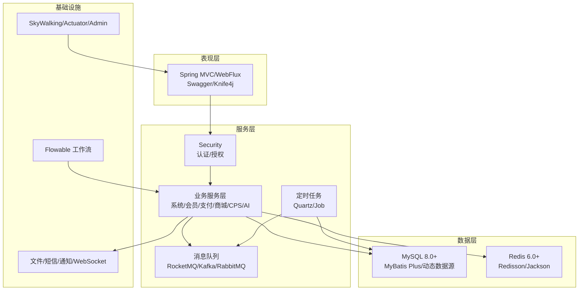
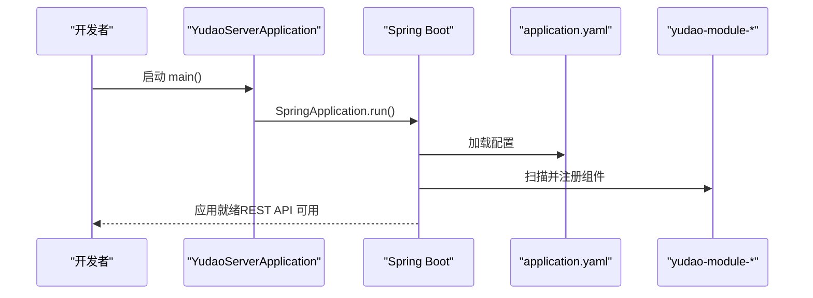
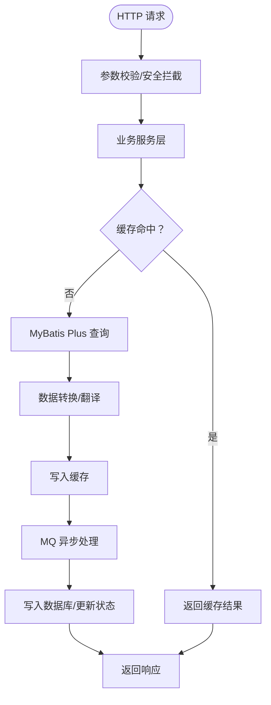
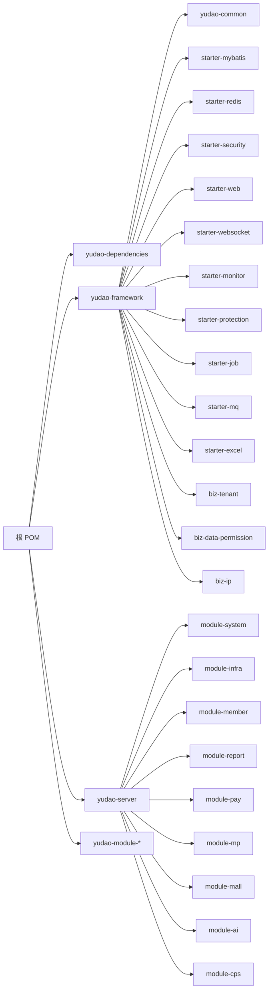

# 系统架构设计

<cite>
**本文引用的文件**
- [根 POM（聚合）](file://pom.xml)
- [依赖管理（BOM）](file://yudao-dependencies/pom.xml)
- [框架聚合 POM](file://yudao-framework/pom.xml)
- [公共模块 POM](file://yudao-framework/yudao-common/pom.xml)
- [MyBatis 启动器 POM](file://yudao-framework/yudao-spring-boot-starter-mybatis/pom.xml)
- [Redis 启动器 POM](file://yudao-framework/yudao-spring-boot-starter-redis/pom.xml)
- [服务端聚合 POM](file://yudao-server/pom.xml)
- [CPS 模块聚合 POM](file://yudao-module-cps/pom.xml)
- [CPS 业务模块 POM](file://yudao-module-cps/yudao-module-cps-biz/pom.xml)
- [系统模块 POM](file://yudao-module-system/pom.xml)
- [启动类](file://yudao-server/src/main/java/cn/iocoder/yudao/server/YudaoServerApplication.java)
- [服务端配置（application.yaml）](file://yudao-server/src/main/resources/application.yaml)
</cite>

## 目录
1. [简介](#简介)
2. [项目结构](#项目结构)
3. [核心组件](#核心组件)
4. [架构总览](#架构总览)
5. [详细组件分析](#详细组件分析)
6. [依赖分析](#依赖分析)
7. [性能考虑](#性能考虑)
8. [故障排查指南](#故障排查指南)
9. [结论](#结论)
10. [附录](#附录)

## 简介
本文件面向 AgenticCPS 系统，基于仓库中的 Ruoyi-Vue-Pro 代码，提供系统架构设计文档。重点阐述：
- Spring Boot 多模块架构与分层设计
- 模块化理念与公共框架组件
- 从 YudaoServerApplication 到各业务模块的依赖关系
- 技术栈选型（Spring Boot 3.x、MySQL 8.0+、Redis 6.0+ 等）的架构考量
- 数据流设计（从用户请求到数据库）
- 系统边界、外部依赖与第三方集成方案
- 架构图与组件交互图，帮助开发者快速理解整体设计

## 项目结构
AgenticCPS 采用 Maven 多模块聚合工程，顶层 POM 负责统一版本与插件管理，yudao-dependencies 提供 BOM 依赖约束，yudao-framework 定义公共框架组件，yudao-server 作为服务端聚合模块，yudao-module-* 为具体业务模块。

```mermaid
graph TB
Root["根 POM<br/>聚合工程"] --> Deps["yudao-dependencies<br/>BOM 依赖管理"]
Root --> Fwk["yudao-framework<br/>公共框架聚合"]
Root --> Srv["yudao-server<br/>服务端聚合"]
Root --> ModSys["yudao-module-system<br/>系统模块"]
Root --> ModInfra["yudao-module-infra<br/>基础设施模块"]
Root --> ModMember["yudao-module-member<br/>会员模块"]
Root --> ModReport["yudao-module-report<br/>报表模块"]
Root --> ModMp["yudao-module-mp<br/>微信公众号模块"]
Root --> ModPay["yudao-module-pay<br/>支付模块"]
Root --> ModMall["yudao-module-mall<br/>商城聚合"]
Root --> ModAi["yudao-module-ai<br/>AI 模块"]
Root --> ModCps["yudao-module-cps<br/>CPS 聚合"]
Fwk --> FwkCommon["yudao-common<br/>公共基础"]
Fwk --> FwkMyBatis["yudao-spring-boot-starter-mybatis<br/>数据库封装"]
Fwk --> FwkRedis["yudao-spring-boot-starter-redis<br/>缓存封装"]
Fwk --> FwkSecurity["yudao-spring-boot-starter-security<br/>安全封装"]
Fwk --> FwkWeb["yudao-spring-boot-starter-web<br/>Web 封装"]
Fwk --> FwkWs["yudao-spring-boot-starter-websocket<br/>WebSocket 封装"]
Fwk --> FwkMonitor["yudao-spring-boot-starter-monitor<br/>监控封装"]
Fwk --> FwkProtection["yudao-spring-boot-starter-protection<br/>防护封装"]
Fwk --> FwkJob["yudao-spring-boot-starter-job<br/>定时任务封装"]
Fwk --> FwkMq["yudao-spring-boot-starter-mq<br/>消息队列封装"]
Fwk --> FwkExcel["yudao-spring-boot-starter-excel<br/>Excel 封装"]
Fwk --> FwkTenant["yudao-spring-boot-starter-biz-tenant<br/>多租户封装"]
Fwk --> FwkDataPerm["yudao-spring-boot-starter-biz-data-permission<br/>数据权限封装"]
Fwk --> FwkIp["yudao-spring-boot-starter-biz-ip<br/>IP 封装"]
Srv --> ModSys
Srv --> ModInfra
Srv --> ModMember
Srv --> ModReport
Srv --> ModPay
Srv --> ModMp
Srv --> ModMall
Srv --> ModAi
Srv --> ModCps
```

图表来源
- [根 POM（聚合）:10-25](file://pom.xml#L10-L25)
- [框架聚合 POM:12-31](file://yudao-framework/pom.xml#L12-L31)
- [服务端聚合 POM:23-99](file://yudao-server/pom.xml#L23-L99)

章节来源
- [根 POM（聚合）:10-25](file://pom.xml#L10-L25)
- [依赖管理（BOM）:84-100](file://yudao-dependencies/pom.xml#L84-L100)
- [框架聚合 POM:12-31](file://yudao-framework/pom.xml#L12-L31)
- [服务端聚合 POM:23-99](file://yudao-server/pom.xml#L23-L99)

## 核心组件
- 公共框架组件（yudao-framework）
  - yudao-common：基础 POJO、枚举、工具类与通用注解
  - yudao-spring-boot-starter-*：围绕 MyBatis、Redis、Web、Security、WebSocket、Monitor、Protection、Job、MQ、Excel、Tenant、DataPermission、IP 等能力的封装
- 业务模块（yudao-module-*）
  - 系统模块（system）：用户、部门、权限、数据字典等通用能力
  - 基础设施模块（infra）：文件、短信、通知、任务调度、WebSocket 等
  - 会员模块（member）、支付模块（pay）、微信公众号模块（mp）、商城模块（product/promotion/trade/statistics）、AI 模块（ai）、CPS 模块（cps）
- 服务端聚合（yudao-server）
  - 作为打包容器，按需引入各业务模块，提供统一的 REST API

章节来源
- [框架聚合 POM:12-31](file://yudao-framework/pom.xml#L12-L31)
- [公共模块 POM:18-147](file://yudao-framework/yudao-common/pom.xml#L18-L147)
- [MyBatis 启动器 POM:18-108](file://yudao-framework/yudao-spring-boot-starter-mybatis/pom.xml#L18-L108)
- [Redis 启动器 POM:18-39](file://yudao-framework/yudao-spring-boot-starter-redis/pom.xml#L18-L39)
- [系统模块 POM:20-122](file://yudao-module-system/pom.xml#L20-L122)
- [服务端聚合 POM:23-99](file://yudao-server/pom.xml#L23-L99)

## 架构总览
AgenticCPS 采用“分层 + 模块化”的架构设计：
- 分层架构：表现层（Web）、领域服务层、数据访问层（MyBatis Plus），配合 Redis 缓存与 MQ 异步解耦
- 模块化：公共能力沉淀于 yudao-framework，业务能力按域拆分至 yudao-module-*，yudao-server 聚合打包
- 技术栈：Spring Boot 3.x（Java 17+）、MySQL 8.0+、Redis 6.0+、MyBatis Plus、动态数据源、Redisson、SkyWalking、Springdoc/Knife4j、Flowable 工作流、RocketMQ/Kafka 等

图表来源
- [服务端配置（application.yaml）:66-89](file://yudao-server/src/main/resources/application.yaml#L66-L89)
- [MyBatis 启动器 POM:72-98](file://yudao-framework/yudao-spring-boot-starter-mybatis/pom.xml#L72-L98)
- [Redis 启动器 POM:24-38](file://yudao-framework/yudao-spring-boot-starter-redis/pom.xml#L24-L38)
- [系统模块 POM:41-121](file://yudao-module-system/pom.xml#L41-L121)

## 详细组件分析

### 启动类与应用装配
- YudaoServerApplication 作为 Spring Boot 启动类，通过扫描 base-packages 引入 server 与 module 包下的组件
- 服务端配置 application.yaml 提供数据库、缓存、接口文档、验证码、消息队列、AI 与业务配置等

图表来源
- [启动类:16-24](file://yudao-server/src/main/java/cn/iocoder/yudao/server/YudaoServerApplication.java#L16-L24)
- [服务端配置（application.yaml）:1-353](file://yudao-server/src/main/resources/application.yaml#L1-L353)

章节来源
- [启动类:16-24](file://yudao-server/src/main/java/cn/iocoder/yudao/server/YudaoServerApplication.java#L16-L24)
- [服务端配置（application.yaml）:1-353](file://yudao-server/src/main/resources/application.yaml#L1-L353)

### 数据流设计（从请求到数据库）
- 请求进入：Spring MVC 接收 HTTP 请求，经 Security 校验与参数校验
- 业务处理：调用 service 层，可能涉及缓存读取/写入、异步消息派发
- 数据持久化：MyBatis Plus 通过动态数据源访问 MySQL，支持逻辑删除、联表查询等
- 缓存与异步：Redis 缓存热点数据，MQ 异步处理耗时任务（如通知、报表统计）

图表来源
- [MyBatis 启动器 POM:72-98](file://yudao-framework/yudao-spring-boot-starter-mybatis/pom.xml#L72-L98)
- [Redis 启动器 POM:24-38](file://yudao-framework/yudao-spring-boot-starter-redis/pom.xml#L24-L38)
- [系统模块 POM:41-121](file://yudao-module-system/pom.xml#L41-L121)
- [服务端配置（application.yaml）:66-89](file://yudao-server/src/main/resources/application.yaml#L66-L89)

章节来源
- [MyBatis 启动器 POM:72-98](file://yudao-framework/yudao-spring-boot-starter-mybatis/pom.xml#L72-L98)
- [Redis 启动器 POM:24-38](file://yudao-framework/yudao-spring-boot-starter-redis/pom.xml#L24-L38)
- [系统模块 POM:41-121](file://yudao-module-system/pom.xml#L41-L121)
- [服务端配置（application.yaml）:66-89](file://yudao-server/src/main/resources/application.yaml#L66-L89)

### 技术栈与架构决策
- Spring Boot 3.x + Java 17：获得更好的性能、模块化与现代化特性，配合 MapStruct、Lombok、JUnit 5 等生态
- MySQL 8.0+：支持 JSON、窗口函数、CTE 等现代 SQL 能力，结合 MyBatis Plus 与动态数据源满足多租户与读写分离
- Redis 6.0+：提供高性能缓存、分布式锁、限流与消息通道，结合 Redisson 与 Jackson
- MyBatis Plus：简化 CRUD、逻辑删除、联表查询、代码生成与多数据源
- 动态数据源：支持多租户场景下的数据隔离与路由
- Redisson：提供高级缓存、分布式对象、分布式集合与锁
- SkyWalking：分布式链路追踪，便于定位性能瓶颈
- Knife4j/Springdoc：OpenAPI 文档，提升前后端协作效率
- Flowable：工作流引擎，支撑复杂业务流程
- RocketMQ/Kafka：高吞吐异步消息，解耦业务与削峰填谷

章节来源
- [根 POM（聚合）:31-45](file://pom.xml#L31-L45)
- [依赖管理（BOM）:84-100](file://yudao-dependencies/pom.xml#L84-L100)
- [MyBatis 启动器 POM:72-98](file://yudao-framework/yudao-spring-boot-starter-mybatis/pom.xml#L72-L98)
- [Redis 启动器 POM:24-38](file://yudao-framework/yudao-spring-boot-starter-redis/pom.xml#L24-L38)
- [系统模块 POM:41-121](file://yudao-module-system/pom.xml#L41-L121)

### 模块化设计原则
- yudao-framework：公共能力抽象，避免重复造轮子，统一配置与扩展点
- yudao-module-*：按业务域划分，低耦合高内聚，跨模块依赖通过接口与 API 层传递
- yudao-server：打包容器，按需装配模块，减少编译与启动时间
- 多租户与数据权限：通过 yudao-spring-boot-starter-biz-tenant 与 yudao-spring-boot-starter-biz-data-permission 统一治理

章节来源
- [框架聚合 POM:12-31](file://yudao-framework/pom.xml#L12-L31)
- [系统模块 POM:27-39](file://yudao-module-system/pom.xml#L27-L39)
- [服务端聚合 POM:23-99](file://yudao-server/pom.xml#L23-L99)

### 外部依赖与第三方集成
- 支付与社交：微信、支付宝 SDK，JustAuth 社交登录
- AI 与向量：OpenAI、文心一言、智谱、Azure OpenAI、Claude、Ollama、DashScope、Minimax、Moonshot、DeepSeek、Gemini、豆包、混元、硅基流动、讯飞星火、百川智能、Midjourney、Suno、Web Search 等
- 消息队列：RocketMQ、Kafka、RabbitMQ
- 监控与可观测性：SkyWalking、Spring Boot Admin、Actuator
- 工作流：Flowable
- 报表：JimuReport、JimuBi

章节来源
- [服务端配置（application.yaml）:120-257](file://yudao-server/src/main/resources/application.yaml#L120-L257)
- [系统模块 POM:93-121](file://yudao-module-system/pom.xml#L93-L121)
- [CPS 业务模块 POM:85-117](file://yudao-module-cps/yudao-module-cps-biz/pom.xml#L85-L117)

## 依赖分析
- 顶层聚合与 BOM：统一版本与插件，确保依赖一致性
- 框架组件依赖：yudao-framework 下各 starter 依赖 yudao-common，并按需引入 Spring、MyBatis、Redis、Security、WebSocket、Monitor、Protection、Job、MQ、Excel 等
- 业务模块依赖：yudao-module-system 依赖 infra 与多个框架组件；yudao-module-cps-biz 依赖 system/member/infra 与框架组件
- 服务端聚合：yudao-server 按需引入各模块，形成最终可执行的 fat jar

图表来源
- [根 POM（聚合）:10-25](file://pom.xml#L10-L25)
- [依赖管理（BOM）:84-100](file://yudao-dependencies/pom.xml#L84-L100)
- [框架聚合 POM:12-31](file://yudao-framework/pom.xml#L12-L31)
- [服务端聚合 POM:23-99](file://yudao-server/pom.xml#L23-L99)
- [CPS 模块聚合 POM:20-22](file://yudao-module-cps/pom.xml#L20-L22)
- [CPS 业务模块 POM:21-38](file://yudao-module-cps/yudao-module-cps-biz/pom.xml#L21-L38)

章节来源
- [根 POM（聚合）:10-25](file://pom.xml#L10-L25)
- [依赖管理（BOM）:84-100](file://yudao-dependencies/pom.xml#L84-L100)
- [框架聚合 POM:12-31](file://yudao-framework/pom.xml#L12-L31)
- [服务端聚合 POM:23-99](file://yudao-server/pom.xml#L23-L99)
- [CPS 模块聚合 POM:20-22](file://yudao-module-cps/pom.xml#L20-L22)
- [CPS 业务模块 POM:21-38](file://yudao-module-cps/yudao-module-cps-biz/pom.xml#L21-L38)

## 性能考虑
- 缓存策略：合理利用 Redis 缓存热点数据，结合逻辑过期与异步刷新，降低数据库压力
- 数据库优化：使用 MyBatis Plus 联表查询与动态数据源，配合索引与分页，避免 N+1 查询
- 异步解耦：通过 MQ 异步处理耗时任务（如通知、报表统计），提升接口响应
- 并发与限流：结合 Redisson 分布式锁与限流，保障高并发场景稳定性
- 监控与追踪：SkyWalking 与 Actuator/ Admin 提供端到端性能观测

## 故障排查指南
- 启动问题：检查 application.yaml 中数据库、Redis、消息队列等连接配置
- 编译问题：确认 Java 版本与 Spring Boot 版本匹配，以及 Lombok/MapStruct 注解处理器配置
- 依赖冲突：通过 yudao-dependencies 的 BOM 管理版本，避免第三方依赖版本不一致
- 安全与权限：核对 yudao.info.base-package 扫描路径与 Security 配置
- AI 与第三方：核对各平台 API Key 与 Base URL，确保网络可达

章节来源
- [服务端配置（application.yaml）:1-353](file://yudao-server/src/main/resources/application.yaml#L1-L353)
- [根 POM（聚合）:31-45](file://pom.xml#L31-L45)
- [依赖管理（BOM）:84-100](file://yudao-dependencies/pom.xml#L84-L100)

## 结论
AgenticCPS 基于成熟的 Spring Boot 生态与模块化设计，实现了高内聚、低耦合的系统架构。通过 yudao-framework 的公共能力沉淀与 yudao-server 的灵活聚合，系统具备良好的扩展性与可维护性。结合 MySQL 8.0+、Redis 6.0+、MyBatis Plus、动态数据源、Redisson、SkyWalking、Knife4j/Springdoc、Flowable、RocketMQ/Kafka 等技术栈，能够支撑复杂的业务场景与高并发需求。

## 附录
- 快速启动建议：确保本地已安装 Java 17+、MySQL 8.0+、Redis 6.0+，拉取代码后执行 mvn clean install，再启动 YudaoServerApplication
- 配置定制：根据实际环境调整 application.yaml 中的数据库、Redis、消息队列、AI 与业务配置