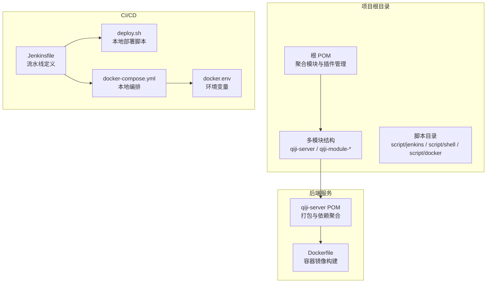
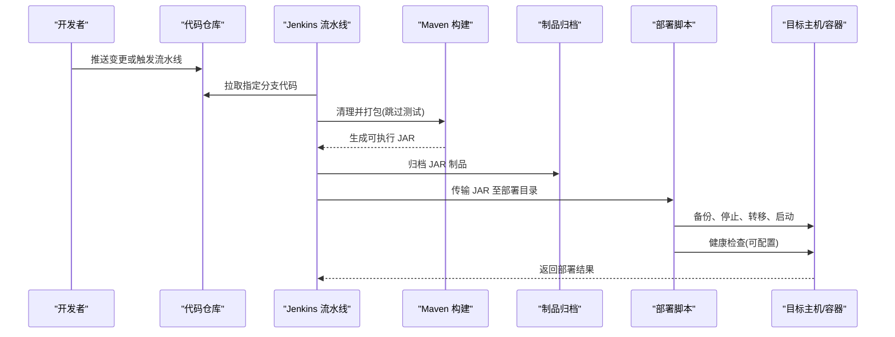
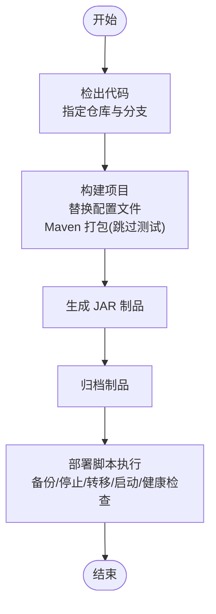
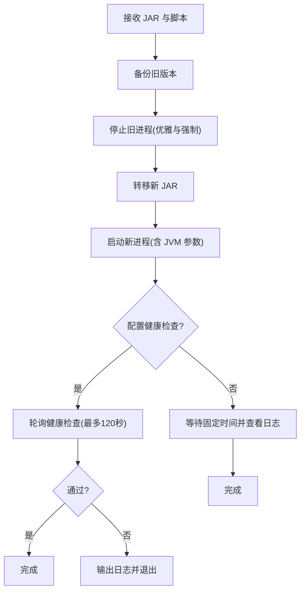

# CI/CD流水线

<cite>
**本文引用的文件**
- [Jenkinsfile](file://script/jenkins/Jenkinsfile)
- [部署脚本](file://script/shell/deploy.sh)
- [Docker Compose 配置](file://script/docker/docker-compose.yml)
- [Docker 环境变量](file://script/docker/docker.env)
- [根 POM 配置](file://pom.xml)
- [服务端 POM 配置](file://qiji-server/pom.xml)
- [Dockerfile](file://qiji-server/Dockerfile)
- [项目说明文档](file://README.md)
</cite>

## 目录
1. [引言](#引言)
2. [项目结构](#项目结构)
3. [核心组件](#核心组件)
4. [架构总览](#架构总览)
5. [详细组件分析](#详细组件分析)
6. [依赖关系分析](#依赖关系分析)
7. [性能考虑](#性能考虑)
8. [故障排查指南](#故障排查指南)
9. [结论](#结论)
10. [附录](#附录)

## 引言
本文件面向 AgenticCPS 系统，提供完整的 CI/CD 流水线文档，涵盖 Jenkins 流水线配置、自动化构建与部署流程、多环境管理策略、最佳实践以及故障回滚与应急处理流程。目标是帮助研发与运维团队理解并高效落地自动化交付。

## 项目结构
AgenticCPS 基于多模块 Maven 工程，后端服务位于 qiji-server 模块，前端包含 Vue3 管理端与 uni-app 移动端。项目提供 Jenkinsfile 用于流水线编排，配合本地部署脚本与 Docker Compose 进行本地/测试环境验证；生产侧可结合容器化与 Kubernetes 集群进行部署。

**图表来源**
- [根 POM 配置:10-25](file://pom.xml#L10-L25)
- [服务端 POM 配置:10-21](file://qiji-server/pom.xml#L10-L21)
- [Jenkinsfile:29-59](file://script/jenkins/Jenkinsfile#L29-L59)
- [部署脚本:1-161](file://script/shell/deploy.sh#L1-L161)
- [Docker Compose 配置:1-85](file://script/docker/docker-compose.yml#L1-L85)
- [Docker 环境变量:1-26](file://script/docker/docker.env#L1-L26)

**章节来源**
- [项目说明文档:1-466](file://README.md#L1-L466)
- [根 POM 配置:10-25](file://pom.xml#L10-L25)

## 核心组件
- Jenkins 流水线：定义检出、构建、部署三个阶段，支持参数化构建与制品归档。
- 部署脚本：负责备份、停止、转移、启动与健康检查的完整部署流程。
- Docker Compose：本地/测试环境一键拉起数据库、缓存与后端服务。
- Dockerfile：定义容器镜像基础环境、工作目录、JVM 参数与暴露端口。
- Maven 配置：统一插件版本、编译参数与仓库源，确保构建一致性。

**章节来源**
- [Jenkinsfile:1-61](file://script/jenkins/Jenkinsfile#L1-L61)
- [部署脚本:1-161](file://script/shell/deploy.sh#L1-L161)
- [Docker Compose 配置:1-85](file://script/docker/docker-compose.yml#L1-L85)
- [Docker 环境变量:1-26](file://script/docker/docker.env#L1-L26)
- [根 POM 配置:31-45](file://pom.xml#L31-L45)
- [服务端 POM 配置:117-135](file://qiji-server/pom.xml#L117-L135)
- [Dockerfile:1-24](file://qiji-server/Dockerfile#L1-L24)

## 架构总览
下图展示了从代码检出到部署的端到端流程，以及本地验证与制品产出的关系。

**图表来源**
- [Jenkinsfile:30-58](file://script/jenkins/Jenkinsfile#L30-L58)
- [部署脚本:29-158](file://script/shell/deploy.sh#L29-L158)

## 详细组件分析

### Jenkins 流水线配置
- Pipeline 语法与阶段
  - 使用 agent any 选择任意可用节点执行。
  - parameters 定义 TAG_NAME 参数，便于版本标记。
  - environment 统一声明凭证 ID、注册表、命名空间、仓库地址、应用名与部署基路径。
  - stages 定义“检出”“构建”“部署”三阶段。
- 阶段详解
  - 检出：从指定仓库与分支拉取代码。
  - 构建：根据 HOME 目录下的资源目录动态替换配置文件，随后执行 Maven 打包（跳过测试）。
  - 部署：复制部署脚本与 JAR 到目标路径，归档制品，赋予执行权限并调用部署脚本。
- 并行与条件
  - 当前流水线为串行阶段；如需扩展可在 stages 内部使用 parallel 定义并行任务。
  - 可在 environment 中增加条件判断，按分支或标签选择不同的构建/部署策略。

**图表来源**
- [Jenkinsfile:30-58](file://script/jenkins/Jenkinsfile#L30-L58)

**章节来源**
- [Jenkinsfile:6-27](file://script/jenkins/Jenkinsfile#L6-L27)
- [Jenkinsfile:29-59](file://script/jenkins/Jenkinsfile#L29-L59)

### 自动化构建流程
- 代码检出：从指定 URL 与分支获取源码。
- 依赖与配置：若存在 HOME 目录下的资源目录，则将 YAML 配置复制到服务端资源目录，实现多环境配置差异化。
- 编译打包：执行 Maven 清理与打包命令，跳过单元测试以加速流水线。
- 制品管理：归档生成的 JAR 文件，便于后续审计与回滚。

**章节来源**
- [Jenkinsfile:30-47](file://script/jenkins/Jenkinsfile#L30-L47)
- [根 POM 配置:59-142](file://pom.xml#L59-L142)
- [服务端 POM 配置:117-135](file://qiji-server/pom.xml#L117-L135)

### 自动化部署流程
- 产物准备：将部署脚本与 JAR 复制到目标部署目录。
- 执行权限：赋予部署脚本可执行权限。
- 部署执行：调用部署脚本完成备份、停止、转移、启动与健康检查。
- 健康检查：支持配置健康检查 URL，若超时则输出日志并退出；否则输出最后若干行日志供人工确认。

**图表来源**
- [部署脚本:29-158](file://script/shell/deploy.sh#L29-L158)

**章节来源**
- [Jenkinsfile:50-58](file://script/jenkins/Jenkinsfile#L50-L58)
- [部署脚本:1-161](file://script/shell/deploy.sh#L1-L161)

### 多环境管理方案
- 开发分支：devops 分支用于日常开发与联调，流水线默认检出该分支。
- 测试环境：可沿用本地部署脚本与 Docker Compose，在独立主机或容器中运行。
- 预发布环境：建议使用容器化部署，结合镜像版本标签与配置文件切换。
- 生产环境：建议迁移到 Kubernetes 集群，使用 Deployment/StatefulSet 管理副本与持久化，结合 ConfigMap/Secret 注入环境变量与密钥。

**章节来源**
- [Jenkinsfile:32-34](file://script/jenkins/Jenkinsfile#L32-L34)
- [Docker Compose 配置:39-56](file://script/docker/docker-compose.yml#L39-L56)
- [Docker 环境变量:1-26](file://script/docker/docker.env#L1-L26)

### 持续集成最佳实践
- 代码审查：在合并前进行代码评审与静态检查。
- 自动化测试：建议在流水线中加入单元测试与集成测试阶段，避免跳过测试。
- 安全扫描：在构建阶段集成依赖漏洞扫描与代码安全扫描。
- 发布审批：对关键分支（如 master/devops）启用流水线审批节点。
- 版本管理：通过 TAG_NAME 参数与制品标签实现可追溯发布。

**章节来源**
- [Jenkinsfile:7-8](file://script/jenkins/Jenkinsfile#L7-L8)
- [根 POM 配置:62-106](file://pom.xml#L62-L106)

### 故障回滚机制与应急处理
- 回滚策略：部署脚本在启动前进行备份，若健康检查失败或启动异常，可基于备份快速回滚至上一个稳定版本。
- 应急处理：健康检查失败时输出最近日志，便于定位问题；必要时强制终止并回滚。
- 建议增强：在生产环境引入蓝绿/金丝雀发布策略，降低回滚成本。

**章节来源**
- [部署脚本:29-158](file://script/shell/deploy.sh#L29-L158)

## 依赖关系分析
- Maven 聚合：根 POM 聚合 qiji-server 与其他模块，统一版本与插件配置。
- 服务端打包：qiji-server 使用 spring-boot-maven-plugin 生成可执行 JAR。
- 容器化：Dockerfile 基于 Eclipse Temurin 21 JRE，设置时区、JVM 参数与暴露端口。
- 本地编排：docker-compose 将后端服务与数据库、缓存组合，支持环境变量注入。

**图表来源**
- [根 POM 配置:10-25](file://pom.xml#L10-L25)
- [服务端 POM 配置:117-135](file://qiji-server/pom.xml#L117-L135)
- [Dockerfile:1-24](file://qiji-server/Dockerfile#L1-L24)
- [Docker Compose 配置:29-56](file://script/docker/docker-compose.yml#L29-L56)

**章节来源**
- [根 POM 配置:10-25](file://pom.xml#L10-L25)
- [服务端 POM 配置:117-135](file://qiji-server/pom.xml#L117-L135)
- [Docker Compose 配置:1-85](file://script/docker/docker-compose.yml#L1-L85)

## 性能考虑
- 构建性能：当前流水线跳过测试以缩短构建时间；建议在 PR 阶段保留测试，主干合并前再做加速构建。
- 依赖下载：根 POM 配置了华为云与阿里云 Maven 源，有助于提升依赖下载速度。
- 容器启动：合理设置 JVM 参数与容器资源限制，避免内存不足导致的频繁 GC 或 OOM。

**章节来源**
- [Jenkinsfile](file://script/jenkins/Jenkinsfile#L46)
- [根 POM 配置:144-173](file://pom.xml#L144-L173)
- [部署脚本](file://script/shell/deploy.sh#L19)

## 故障排查指南
- 健康检查失败
  - 现象：健康检查超时或返回非 200。
  - 排查：查看最近日志，确认端口、上下文路径与 Actuator 配置。
- 进程无法停止
  - 现象：优雅关闭超时后强制 kill。
  - 排查：检查进程占用与监听端口，确认 JVM 参数与守护进程设置。
- 配置文件未生效
  - 现象：环境变量或数据库连接异常。
  - 排查：确认 HOME 目录资源替换逻辑与 docker-compose 环境变量映射。

**章节来源**
- [部署脚本:61-91](file://script/shell/deploy.sh#L61-L91)
- [部署脚本:107-143](file://script/shell/deploy.sh#L107-L143)
- [Jenkinsfile:40-45](file://script/jenkins/Jenkinsfile#L40-L45)
- [Docker Compose 配置:37-56](file://script/docker/docker-compose.yml#L37-L56)

## 结论
本 CI/CD 流水线以 Jenkinsfile 为核心，结合本地部署脚本与 Docker Compose，实现了从代码检出到部署的自动化闭环。建议在现有基础上补充测试、安全扫描与审批节点，并在生产环境引入容器化与蓝绿/金丝雀发布策略，进一步提升交付质量与稳定性。

## 附录
- 关键配置项速览
  - 环境变量：DOCKER_CREDENTIAL_ID、GITHUB_CREDENTIAL_ID、KUBECONFIG_CREDENTIAL_ID、REGISTRY、DOCKERHUB_NAMESPACE、GITHUB_ACCOUNT、APP_NAME、APP_DEPLOY_BASE_DIR。
  - 健康检查：HEALTH_CHECK_URL、超时时间与日志输出。
  - 容器参数：JAVA_OPTS、ARGS、暴露端口 48080。

**章节来源**
- [Jenkinsfile:10-27](file://script/jenkins/Jenkinsfile#L10-L27)
- [部署脚本:12-14](file://script/shell/deploy.sh#L12-L14)
- [Dockerfile:13-20](file://qiji-server/Dockerfile#L13-L20)