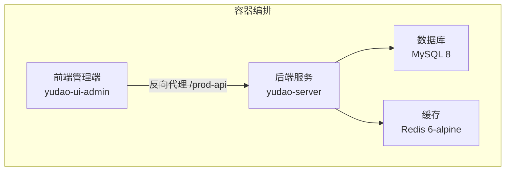
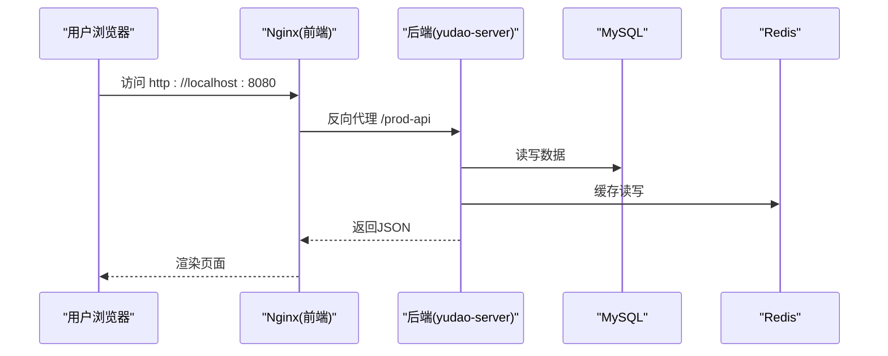
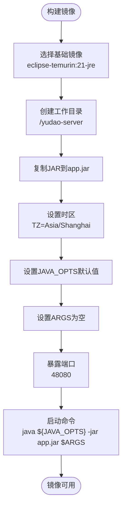
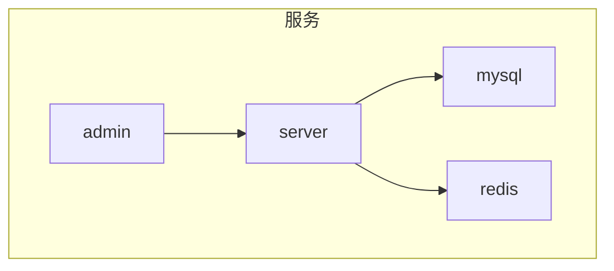
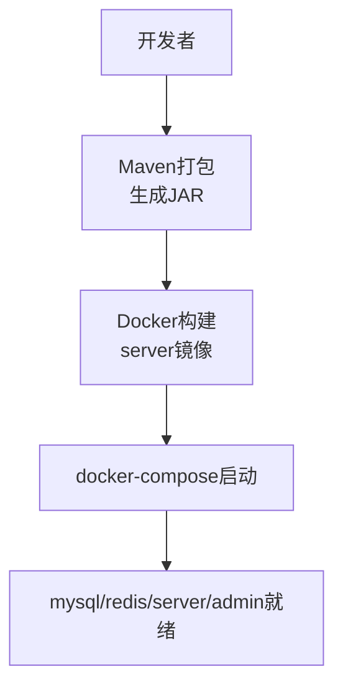
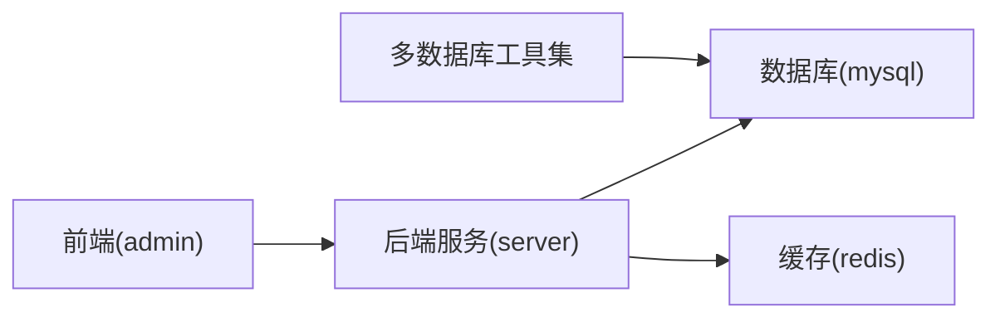

# 容器化部署

<cite>
**本文引用的文件**
- [Dockerfile](file://yudao-server/Dockerfile)
- [docker-compose.yml](file://script/docker/docker-compose.yml)
- [docker.env](file://script/docker/docker.env)
- [Docker-HOWTO.md](file://script/docker/Docker-HOWTO.md)
- [application.yaml](file://yudao-server/src/main/resources/application.yaml)
- [application-dev.yaml](file://yudao-server/src/main/resources/application-dev.yaml)
- [pom.xml](file://yudao-server/pom.xml)
- [deploy.sh](file://script/shell/deploy.sh)
- [ruoyi-vue-pro.sql](file://sql/mysql/ruoyi-vue-pro.sql)
- [docker-compose.yaml](file://sql/tools/docker-compose.yaml)
</cite>

## 目录
1. [简介](#简介)
2. [项目结构](#项目结构)
3. [核心组件](#核心组件)
4. [架构总览](#架构总览)
5. [详细组件分析](#详细组件分析)
6. [依赖关系分析](#依赖关系分析)
7. [性能考量](#性能考量)
8. [故障排查指南](#故障排查指南)
9. [结论](#结论)
10. [附录](#附录)

## 简介
本文件面向AgenticCPS系统的容器化部署，围绕Dockerfile与docker-compose.yml展开，系统性阐述基础镜像选择、工作目录与环境变量配置、镜像构建流程、容器运行参数、多环境部署策略、健康检查与日志输出、资源监控等最佳实践。文档同时结合项目现有配置，给出可落地的部署步骤与运维建议。

## 项目结构
AgenticCPS系统采用前后端分离的容器化方案：
- 后端服务：yudao-server，使用Spring Boot打包为可执行JAR，通过Dockerfile构建镜像并暴露48080端口。
- 数据库：MySQL 8与Redis 6-alpine，通过docker-compose统一编排。
- 前端管理端：yudao-ui-admin，独立容器，通过Nginx提供静态资源与API反向代理。
- 辅助工具：提供多数据库环境的docker-compose，便于本地开发与测试。

图表来源
- [docker-compose.yml:5-78](file://script/docker/docker-compose.yml#L5-L78)
- [Dockerfile:1-24](file://yudao-server/Dockerfile#L1-L24)

章节来源
- [docker-compose.yml:1-85](file://script/docker/docker-compose.yml#L1-L85)
- [Dockerfile:1-24](file://yudao-server/Dockerfile#L1-L24)

## 核心组件
- 后端镜像构建与运行
  - 基础镜像：eclipse-temurin:21-jre，兼顾稳定性和安全性。
  - 工作目录：/yudao-server，便于隔离与权限控制。
  - 环境变量：TZ=Asia/Shanghai、JAVA_OPTS、ARGS（透传Spring参数）。
  - 端口暴露：48080。
  - 启动命令：java ${JAVA_OPTS} -jar app.jar $ARGS。
- 数据库与缓存
  - MySQL 8：初始化ruoyi-vue-pro.sql，持久化数据卷。
  - Redis 6-alpine：持久化数据卷，端口6379。
- 前端管理端
  - Nginx反向代理，静态资源与API转发，端口80。
- 多数据库工具集
  - 提供MySQL、PostgreSQL、Oracle、SQLServer、达梦、人大金仓、openGauss等数据库的docker-compose，便于不同环境验证。

章节来源
- [Dockerfile:1-24](file://yudao-server/Dockerfile#L1-L24)
- [docker-compose.yml:5-78](file://script/docker/docker-compose.yml#L5-L78)
- [docker-compose.yaml:1-134](file://sql/tools/docker-compose.yaml#L1-L134)

## 架构总览
容器化部署采用“单机多服务”的编排方式，后端服务依赖MySQL与Redis，前端管理端通过Nginx反向代理访问后端API。

图表来源
- [docker-compose.yml:58-78](file://script/docker/docker-compose.yml#L58-L78)
- [application.yaml:1-353](file://yudao-server/src/main/resources/application.yaml#L1-L353)

## 详细组件分析

### Dockerfile解析
- 基础镜像选择
  - eclipse-temurin:21-jre，提供长期支持与稳定性，适合作为生产JRE基础。
- 工作目录与文件复制
  - 在镜像内创建/yudao-server目录并设置为工作目录，将打包好的JAR复制到app.jar。
- 环境变量
  - TZ=Asia/Shanghai，确保容器内时区一致。
  - JAVA_OPTS默认值，可通过docker run -e覆盖。
  - ARGS为空，用于透传Spring Boot参数（如数据源、Redis地址等）。
- 端口与启动
  - EXPOSE 48080，CMD使用JAVA_OPTS与ARGS启动JAR。

图表来源
- [Dockerfile:1-24](file://yudao-server/Dockerfile#L1-L24)

章节来源
- [Dockerfile:1-24](file://yudao-server/Dockerfile#L1-L24)

### docker-compose.yml配置详解
- 服务定义
  - mysql：MySQL 8，初始化ruoyi-vue-pro.sql，持久化卷，端口3306。
  - redis：Redis 6-alpine，持久化卷，端口6379。
  - server：后端服务，基于yudao-server目录构建，端口48080，传递JAVA_OPTS与ARGS。
  - admin：前端管理端，基于yudao-ui-admin构建，端口80，反向代理后端API。
- 网络与卷
  - 使用默认网络，定义本地卷驱动，持久化数据库与缓存数据。
- 环境变量传递
  - SPRING_PROFILES_ACTIVE=local，JAVA_OPTS默认值，ARGS透传数据源与Redis地址。
  - 通过环境变量覆盖默认值，实现不同环境差异化配置。
- 依赖关系
  - server依赖mysql与redis，admin依赖server。

图表来源
- [docker-compose.yml:5-78](file://script/docker/docker-compose.yml#L5-L78)

章节来源
- [docker-compose.yml:1-85](file://script/docker/docker-compose.yml#L1-L85)
- [docker.env:1-26](file://script/docker/docker.env#L1-L26)

### 镜像构建流程（Maven到Docker）
- Maven打包
  - 使用maven:mvn命令在Docker容器中执行clean install package，跳过测试，生成JAR。
  - 使用maven-repo卷缓存依赖，提升构建效率。
- Docker镜像构建
  - docker-compose基于yudao-server/Dockerfile构建后端镜像。
  - docker-compose基于yudao-ui-admin/Dockerfile构建前端镜像。
- 启动服务
  - docker compose --env-file docker.env up -d，按顺序启动mysql、redis、server、admin。

图表来源
- [Docker-HOWTO.md:21-42](file://script/docker/Docker-HOWTO.md#L21-L42)
- [pom.xml:117-135](file://yudao-server/pom.xml#L117-L135)

章节来源
- [Docker-HOWTO.md:1-50](file://script/docker/Docker-HOWTO.md#L1-L50)
- [pom.xml:1-138](file://yudao-server/pom.xml#L1-L138)

### 容器运行参数配置
- 内存限制
  - 通过JAVA_OPTS设置-Xms与-Xmx，建议在生产环境根据业务峰值调整。
- 端口映射
  - admin:8080->80，server:48080->48080，mysql:3306->3306，redis:6379->6379。
- 环境变量覆盖
  - 通过docker-compose.yml或--env-file docker.env覆盖默认值，如MASTER_DATASOURCE_URL、REDIS_HOST等。
- 透传Spring参数
  - ARGS用于透传--spring.datasource.*与--spring.data.redis.*等参数，实现动态配置。

章节来源
- [docker-compose.yml:37-56](file://script/docker/docker-compose.yml#L37-L56)
- [docker.env:1-26](file://script/docker/docker.env#L1-L26)

### 多环境部署方案
- 开发环境
  - SPRING_PROFILES_ACTIVE=local，使用本地数据库与Redis，便于调试。
  - 可通过ARGS透传数据源URL与凭据，或通过docker.env覆盖。
- 测试环境
  - 使用独立的测试数据库与Redis，通过环境变量隔离。
  - 可在docker-compose中为server增加资源限制与健康检查。
- 生产环境
  - 使用稳定的镜像版本与固定JAVA_OPTS，开启资源限制与健康检查。
  - 数据库与Redis使用高可用部署，持久化卷配置为本地或云盘。

章节来源
- [application-dev.yaml:1-212](file://yudao-server/src/main/resources/application-dev.yaml#L1-L212)
- [docker-compose.yml:37-56](file://script/docker/docker-compose.yml#L37-L56)

### 健康检查、日志输出与资源监控
- 健康检查
  - 后端提供/actuator/health端点，可在部署脚本中进行健康检查。
  - 建议在docker-compose中增加healthcheck，定期探测该端点。
- 日志输出
  - 后端日志文件路径由application-dev.yaml配置，建议在容器中挂载到宿主机或集中化日志系统。
- 资源监控
  - 可集成SkyWalking Agent，通过JAVA_AGENT注入，采集链路与指标。
  - 建议在生产环境开启JVM堆转储与慢查询监控。

章节来源
- [application-dev.yaml:146-150](file://yudao-server/src/main/resources/application-dev.yaml#L146-L150)
- [deploy.sh:106-143](file://script/shell/deploy.sh#L106-L143)

## 依赖关系分析
- 后端依赖
  - MySQL与Redis为必需依赖，通过docker-compose统一管理。
  - 前端管理端依赖后端API，通过Nginx反向代理。
- 多数据库支持
  - 提供多数据库docker-compose，便于在不同环境下验证兼容性。

图表来源
- [docker-compose.yml:5-78](file://script/docker/docker-compose.yml#L5-L78)
- [docker-compose.yaml:1-134](file://sql/tools/docker-compose.yaml#L1-L134)

章节来源
- [docker-compose.yml:1-85](file://script/docker/docker-compose.yml#L1-L85)
- [docker-compose.yaml:1-134](file://sql/tools/docker-compose.yaml#L1-L134)

## 性能考量
- JVM参数
  - 合理设置-Xms与-Xmx，避免频繁GC与内存抖动。
  - 开启HeapDumpOnOutOfMemoryError，定位内存泄漏。
- 数据库连接池
  - 根据并发量调整连接池大小与超时参数，避免连接饥饿。
- 缓存策略
  - 合理设置Redis TTL与淘汰策略，避免内存膨胀。
- 端口与网络
  - 仅暴露必要端口，减少攻击面；使用内部网络隔离敏感服务。

## 故障排查指南
- 启动失败
  - 检查后端日志与/actuator/health端点状态。
  - 确认数据库与Redis连通性，检查ARGS透传的连接参数。
- 数据库初始化
  - 确认ruoyi-vue-pro.sql已正确挂载并执行。
- 前端无法访问
  - 检查Nginx配置与后端API可达性，确认反向代理路径。
- 资源不足
  - 调整JAVA_OPTS与容器资源限制，观察GC与CPU使用率。

章节来源
- [deploy.sh:106-143](file://script/shell/deploy.sh#L106-L143)
- [ruoyi-vue-pro.sql:1-200](file://sql/mysql/ruoyi-vue-pro.sql#L1-L200)

## 结论
通过eclipse-temurin:21-jre基础镜像、清晰的环境变量与ARGS透传机制、以及完善的docker-compose编排，AgenticCPS系统实现了可重复、可扩展的容器化部署。结合多数据库工具集与多环境配置，能够满足开发、测试与生产的多样化需求。建议在生产环境中进一步完善健康检查、日志与监控体系，确保系统稳定运行。

## 附录
- 快速部署步骤
  - 构建JAR：使用Docker运行maven命令打包。
  - 启动服务：docker compose --env-file docker.env up -d。
  - 访问地址：admin UI http://localhost:8080，后端API http://localhost:48080。
- 常用命令
  - docker compose build [service]：单独构建镜像。
  - docker compose logs -f [service]：实时查看日志。
  - docker compose down：停止并清理容器。

章节来源
- [Docker-HOWTO.md:21-49](file://script/docker/Docker-HOWTO.md#L21-L49)