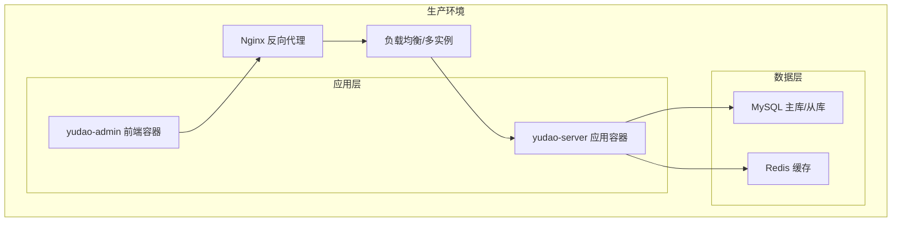
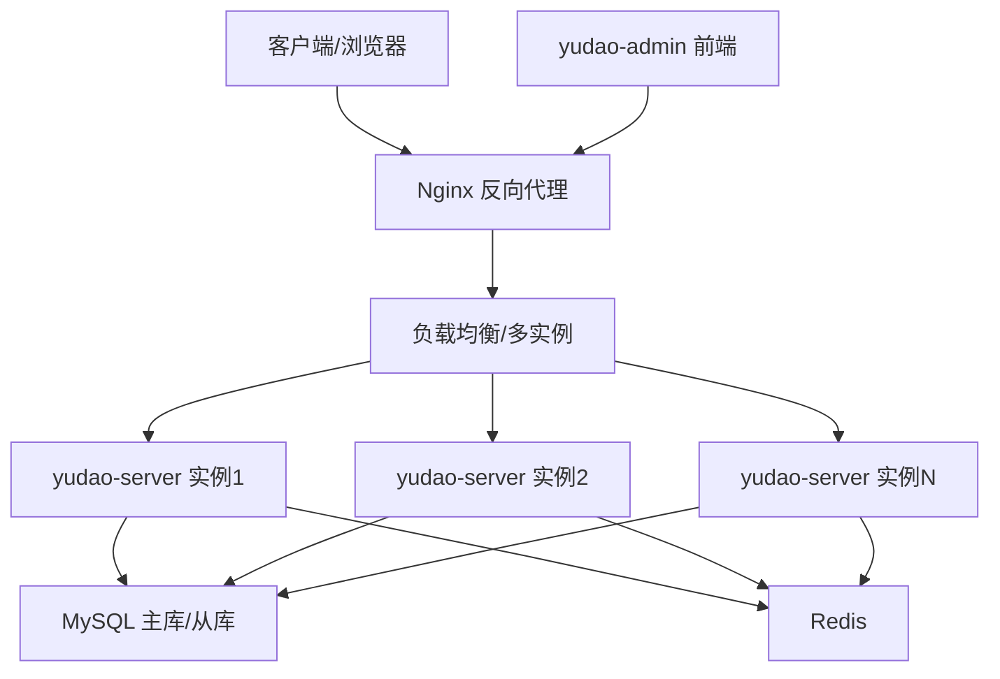
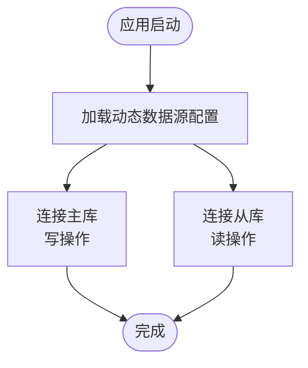
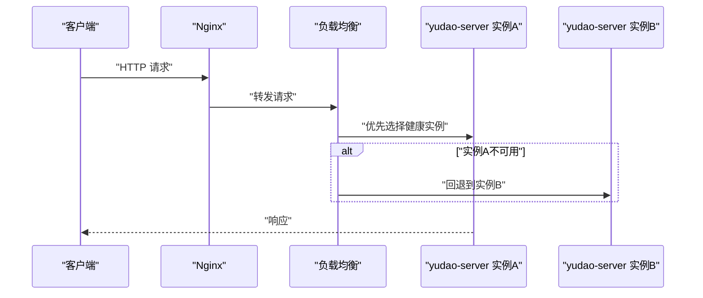
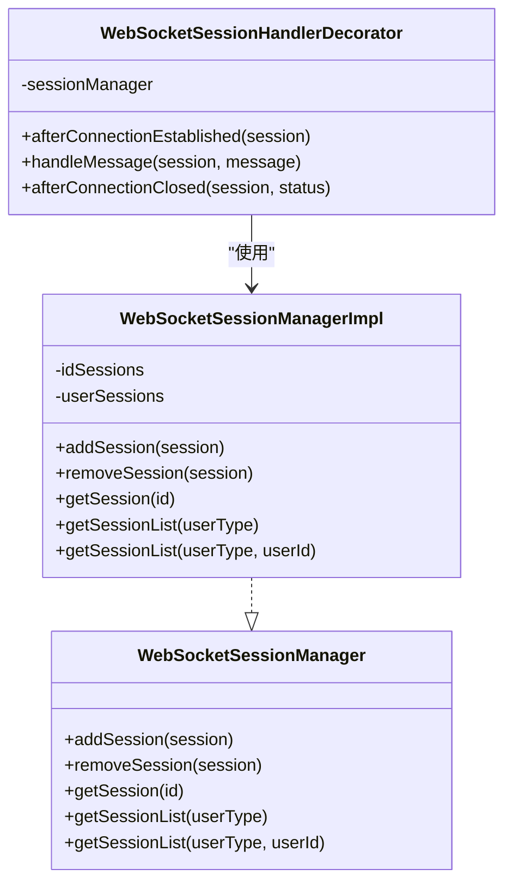
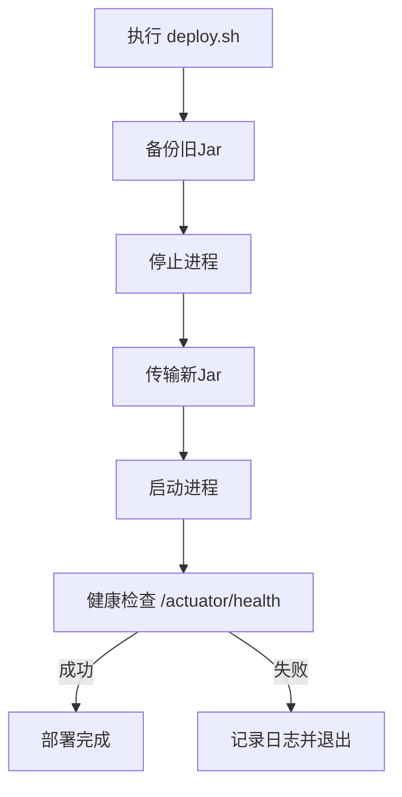
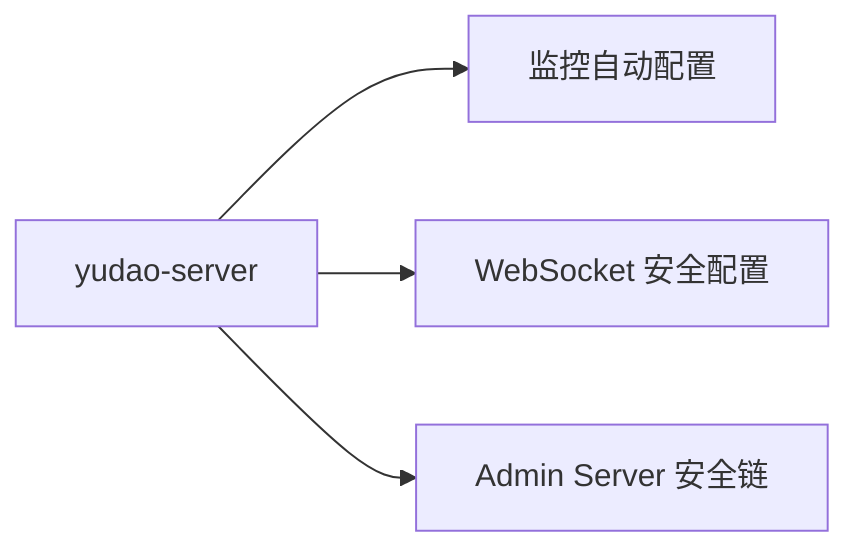

# 生产环境部署

<cite>
**本文引用的文件**   
- [application.yaml](file://yudao-server/src/main/resources/application.yaml)
- [application-dev.yaml](file://yudao-server/src/main/resources/application-dev.yaml)
- [docker-compose.yml](file://script/docker/docker-compose.yml)
- [docker.env](file://script/docker/docker.env)
- [Dockerfile](file://yudao-server/Dockerfile)
- [deploy.sh](file://script/shell/deploy.sh)
- [ruoyi-vue-pro.sql](file://sql/mysql/ruoyi-vue-pro.sql)
- [WebSocketAuthorizeRequestsCustomizer.java](file://yudao-framework/yudao-spring-boot-starter-websocket/src/main/java/cn/iocoder/yudao/framework/websocket/core/security/WebSocketAuthorizeRequestsCustomizer.java)
- [AdminServerConfiguration.java](file://yudao-module-infra/src/main/java/cn/iocoder/yudao/module/infra/framework/monitor/config/AdminServerConfiguration.java)
- [WebSocketSessionManager.java](file://yudao-framework/yudao-spring-boot-starter-websocket/src/main/java/cn/iocoder/yudao/framework/websocket/core/session/WebSocketSessionManager.java)
- [WebSocketSessionManagerImpl.java](file://yudao-framework/yudao-spring-boot-starter-websocket/src/main/java/cn/iocoder/yudao/framework/websocket/core/session/WebSocketSessionManagerImpl.java)
- [WebSocketSessionHandlerDecorator.java](file://yudao-framework/yudao-spring-boot-starter-websocket/src/main/java/cn/iocoder/yudao/framework/websocket/core/session/WebSocketSessionHandlerDecorator.java)
- [org.springframework.boot.autoconfigure.AutoConfiguration.imports](file://yudao-framework/yudao-spring-boot-starter-monitor/src/main/resources/META-INF/spring/org.springframework.boot.autoconfigure.AutoConfiguration.imports)
</cite>

## 目录
1. [简介](#简介)
2. [项目结构](#项目结构)
3. [核心组件](#核心组件)
4. [架构总览](#架构总览)
5. [详细组件分析](#详细组件分析)
6. [依赖分析](#依赖分析)
7. [性能考虑](#性能考虑)
8. [故障排查指南](#故障排查指南)
9. [结论](#结论)
10. [附录](#附录)

## 简介
本指南面向AgenticCPS系统生产环境部署，围绕服务器环境准备、JDK与数据库、缓存与消息队列、Nginx反向代理、配置文件、高可用与负载均衡、数据库主从与读写分离、网络安全、性能调优以及部署验证与验收标准等方面，提供完整可执行的步骤与最佳实践。文中所有技术要点均来源于仓库中的实际配置与脚本，确保可落地、可追溯。

## 项目结构
AgenticCPS基于Spring Boot微服务架构，后端服务容器化部署，配合MySQL与Redis，提供Admin管理端与前端工程。生产部署推荐使用容器编排（如docker-compose）或Kubernetes，结合Nginx实现反向代理与静态资源分发。

图表来源
- [docker-compose.yml:1-85](file://script/docker/docker-compose.yml#L1-L85)
- [Dockerfile:1-24](file://yudao-server/Dockerfile#L1-L24)

章节来源
- [docker-compose.yml:1-85](file://script/docker/docker-compose.yml#L1-L85)
- [Dockerfile:1-24](file://yudao-server/Dockerfile#L1-L24)

## 核心组件
- 应用服务：yudao-server，提供REST API、定时任务、消息队列集成、WebSocket推送、AI向量存储与多模型接入等能力。
- 数据库：MySQL 8，初始化脚本包含大量业务表结构与字典数据。
- 缓存：Redis，用于会话、验证码、分布式锁、消息总线等。
- 消息队列：RocketMQ、RabbitMQ、Kafka（按需启用），用于异步解耦与事件驱动。
- 监控与链路追踪：Actuator、Spring Boot Admin、SkyWalking（可选Agent）。
- WebSocket：基于Redis实现跨节点会话广播与消息分发。

章节来源
- [application.yaml:1-353](file://yudao-server/src/main/resources/application.yaml#L1-L353)
- [application-dev.yaml:1-212](file://yudao-server/src/main/resources/application-dev.yaml#L1-L212)
- [ruoyi-vue-pro.sql:1-200](file://sql/mysql/ruoyi-vue-pro.sql#L1-L200)

## 架构总览
生产环境建议采用“Nginx + 多实例应用 + 缓存 + 数据库主从”的高可用架构。应用通过环境变量注入数据库与Redis连接信息，容器编排统一管理服务生命周期与端口映射。

图表来源
- [docker-compose.yml:29-78](file://script/docker/docker-compose.yml#L29-L78)
- [application-dev.yaml:48-66](file://yudao-server/src/main/resources/application-dev.yaml#L48-L66)

章节来源
- [docker-compose.yml:1-85](file://script/docker/docker-compose.yml#L1-L85)
- [application-dev.yaml:1-212](file://yudao-server/src/main/resources/application-dev.yaml#L1-L212)

## 详细组件分析

### 服务器环境准备
- 操作系统：Linux（CentOS/Ubuntu），建议使用长期支持版本。
- JDK：使用Eclipse Temurin 21 JRE（容器镜像已内置）。
- 系统资源：CPU≥4核、内存≥8GB（根据业务峰值调整），磁盘容量满足数据库与日志空间。
- 防火墙：开放应用端口（默认48080）、MySQL（3306）、Redis（6379）、Nginx（80/443）。
- 时间与时区：确保系统时区与JAVA_OPTS一致（Asia/Shanghai）。

章节来源
- [Dockerfile:1-24](file://yudao-server/Dockerfile#L1-L24)
- [docker-compose.yml:11-12](file://script/docker/docker-compose.yml#L11-L12)

### JDK与容器化部署
- 容器镜像：基于eclipse-temurin:21-jre，工作目录/yudao-server，暴露48080端口。
- JVM参数：通过JAVA_OPTS注入，建议在生产环境提升堆大小并开启堆转储。
- 启动方式：容器内以java -jar app.jar $ARGS方式启动。

章节来源
- [Dockerfile:1-24](file://yudao-server/Dockerfile#L1-L24)
- [docker-compose.yml:39-46](file://script/docker/docker-compose.yml#L39-L46)

### 数据库配置（MySQL）
- 版本：MySQL 8。
- 初始化：首次启动挂载SQL脚本，自动导入ruoyi-vue-pro.sql。
- 连接池：Druid，连接池参数在开发配置中给出，生产需结合QPS与事务特性调优。
- 主从与读写分离：配置dynamic数据源的master/slave，开发配置中已演示从库配置，生产需替换为真实地址与凭据。

图表来源
- [application-dev.yaml:32-57](file://yudao-server/src/main/resources/application-dev.yaml#L32-L57)

章节来源
- [application-dev.yaml:1-212](file://yudao-server/src/main/resources/application-dev.yaml#L1-L212)
- [ruoyi-vue-pro.sql:1-200](file://sql/mysql/ruoyi-vue-pro.sql#L1-L200)

### Redis部署与配置
- 用途：缓存、验证码、分布式锁、消息总线、WebSocket会话广播。
- 开启认证：生产环境建议配置password。
- 集群/哨兵：建议使用Redis Sentinel或Redis Cluster以提升可用性。
- 键空间清理：结合业务设置合理TTL，避免无限增长。

章节来源
- [application-dev.yaml:59-66](file://yudao-server/src/main/resources/application-dev.yaml#L59-L66)
- [application.yaml:90-96](file://yudao-server/src/main/resources/application.yaml#L90-L96)

### Nginx反向代理
- 作用：统一入口、静态资源分发、HTTPS终止、健康检查与限流。
- 建议：将yudao-admin前端容器映射到80端口，后端yudao-server映射到48080端口；配置域名与证书。
- 负载均衡：后端多实例部署时，Nginx配置upstream指向多个yudao-server实例。

章节来源
- [docker-compose.yml:58-78](file://script/docker/docker-compose.yml#L58-L78)

### 配置文件生产化改造
- 环境切换：通过SPRING_PROFILES_ACTIVE切换至生产配置（本地示例为local）。
- 数据库：替换master/slave连接串、用户名与密码。
- Redis：替换host/port/password/database。
- Actuator与Spring Boot Admin：生产环境建议限制暴露端点与访问权限。
- WebSocket：sender-type可选择local/redis等，跨节点需使用Redis。

章节来源
- [application.yaml:1-353](file://yudao-server/src/main/resources/application.yaml#L1-L353)
- [application-dev.yaml:1-212](file://yudao-server/src/main/resources/application-dev.yaml#L1-L212)
- [docker-compose.yml:39-56](file://script/docker/docker-compose.yml#L39-L56)

### 高可用与负载均衡
- 多实例：docker-compose示例展示了多服务编排，生产环境建议使用Kubernetes或Docker Swarm。
- 会话管理：WebSocket跨节点推送依赖Redis，确保会话一致性。
- 数据同步：主从复制与读写分离需配合数据库中间件或ORM路由策略。

图表来源
- [docker-compose.yml:29-56](file://script/docker/docker-compose.yml#L29-L56)

章节来源
- [WebSocketSessionManager.java:1-53](file://yudao-framework/yudao-spring-boot-starter-websocket/src/main/java/cn/iocoder/yudao/framework/websocket/core/session/WebSocketSessionManager.java#L1-L53)
- [WebSocketSessionManagerImpl.java:1-42](file://yudao-framework/yudao-spring-boot-starter-websocket/src/main/java/cn/iocoder/yudao/framework/websocket/core/session/WebSocketSessionManagerImpl.java#L1-L42)

### WebSocket跨节点会话管理
- 会话装饰器：对并发发送与缓冲进行限制，防止风暴。
- 会话管理器：基于用户类型与用户ID维护会话列表，支持跨节点查找与广播。

图表来源
- [WebSocketSessionManager.java:1-53](file://yudao-framework/yudao-spring-boot-starter-websocket/src/main/java/cn/iocoder/yudao/framework/websocket/core/session/WebSocketSessionManager.java#L1-L53)
- [WebSocketSessionManagerImpl.java:1-42](file://yudao-framework/yudao-spring-boot-starter-websocket/src/main/java/cn/iocoder/yudao/framework/websocket/core/session/WebSocketSessionManagerImpl.java#L1-L42)
- [WebSocketSessionHandlerDecorator.java:1-37](file://yudao-framework/yudao-spring-boot-starter-websocket/src/main/java/cn/iocoder/yudao/framework/websocket/core/session/WebSocketSessionHandlerDecorator.java#L1-L37)

章节来源
- [WebSocketAuthorizeRequestsCustomizer.java:1-24](file://yudao-framework/yudao-spring-boot-starter-websocket/src/main/java/cn/iocoder/yudao/framework/websocket/core/security/WebSocketAuthorizeRequestsCustomizer.java#L1-L24)
- [AdminServerConfiguration.java:59-80](file://yudao-module-infra/src/main/java/cn/iocoder/yudao/module/infra/framework/monitor/config/AdminServerConfiguration.java#L59-L80)

### 部署脚本与健康检查
- 自动化部署：deploy.sh负责备份、停止、传输、启动与健康检查。
- 健康检查：通过/actuator/health轮询，超时或非200视为失败。
- JVM参数：支持在脚本中调整-Xms/-Xmx与堆转储路径。

图表来源
- [deploy.sh:146-160](file://script/shell/deploy.sh#L146-L160)

章节来源
- [deploy.sh:1-161](file://script/shell/deploy.sh#L1-L161)

## 依赖分析
- 监控自动装配：引入Tracer与Metrics自动配置，便于生产监控。
- WebSocket安全：WebSocket路径授权配置，结合Spring Security进行权限控制。
- Admin Server：独立的SecurityFilterChain，保护Spring Boot Admin界面。

图表来源
- [org.springframework.boot.autoconfigure.AutoConfiguration.imports:1-2](file://yudao-framework/yudao-spring-boot-starter-monitor/src/main/resources/META-INF/spring/org.springframework.boot.autoconfigure.AutoConfiguration.imports#L1-L2)
- [WebSocketAuthorizeRequestsCustomizer.java:1-24](file://yudao-framework/yudao-spring-boot-starter-websocket/src/main/java/cn/iocoder/yudao/framework/websocket/core/security/WebSocketAuthorizeRequestsCustomizer.java#L1-L24)
- [AdminServerConfiguration.java:59-80](file://yudao-module-infra/src/main/java/cn/iocoder/yudao/module/infra/framework/monitor/config/AdminServerConfiguration.java#L59-L80)

章节来源
- [org.springframework.boot.autoconfigure.AutoConfiguration.imports:1-2](file://yudao-framework/yudao-spring-boot-starter-monitor/src/main/resources/META-INF/spring/org.springframework.boot.autoconfigure.AutoConfiguration.imports#L1-L2)
- [WebSocketAuthorizeRequestsCustomizer.java:1-24](file://yudao-framework/yudao-spring-boot-starter-websocket/src/main/java/cn/iocoder/yudao/framework/websocket/core/security/WebSocketAuthorizeRequestsCustomizer.java#L1-L24)
- [AdminServerConfiguration.java:59-80](file://yudao-module-infra/src/main/java/cn/iocoder/yudao/module/infra/framework/monitor/config/AdminServerConfiguration.java#L59-L80)

## 性能考虑
- JVM参数优化：根据QPS与GC行为调整-Xms/-Xmx、新生代比例、GC策略与堆转储路径。
- 数据库优化：连接池参数、慢查询日志、索引与分区策略；读写分离与只读副本。
- 缓存策略：热点数据预热、合理TTL、多级缓存（本地+Redis）；禁用不必要的全局翻译。
- CDN加速：静态资源走CDN，减少后端压力。
- 线程池与队列：消息队列生产者/消费者并发与重试策略，避免阻塞与堆积。

章节来源
- [application-dev.yaml:117-121](file://yudao-server/src/main/resources/application-dev.yaml#L117-L121)
- [application.yaml:98-119](file://yudao-server/src/main/resources/application.yaml#L98-L119)

## 故障排查指南
- 健康检查失败：检查/actuator/health返回码，查看nohup.out日志尾部输出。
- 数据库连接异常：核对master/slave连接串、用户名密码、网络连通性与SSL参数。
- Redis连接异常：核对host/port/password/database，确认网络与ACL。
- WebSocket消息丢失：确认sender-type为redis，检查Redis订阅与发布通道。
- 监控与链路追踪：确认Actuator端点暴露与Spring Boot Admin访问凭证。

章节来源
- [deploy.sh:106-143](file://script/shell/deploy.sh#L106-L143)
- [application-dev.yaml:124-150](file://yudao-server/src/main/resources/application-dev.yaml#L124-L150)

## 结论
通过容器化与编排工具，AgenticCPS可在生产环境中实现高可用、可扩展与易运维的部署形态。建议结合Nginx、多实例、Redis与MySQL主从/读写分离，配合完善的监控与安全策略，确保系统稳定运行与快速恢复。

## 附录

### 生产环境配置清单
- 操作系统与JDK：Linux + Eclipse Temurin 21
- 数据库：MySQL 8，初始化脚本已提供
- 缓存：Redis（建议开启认证与持久化）
- 反向代理：Nginx（域名、证书、upstream）
- 容器编排：docker-compose或Kubernetes
- 监控：Actuator + Spring Boot Admin（限制暴露）

章节来源
- [docker-compose.yml:1-85](file://script/docker/docker-compose.yml#L1-L85)
- [Dockerfile:1-24](file://yudao-server/Dockerfile#L1-L24)
- [ruoyi-vue-pro.sql:1-200](file://sql/mysql/ruoyi-vue-pro.sql#L1-L200)