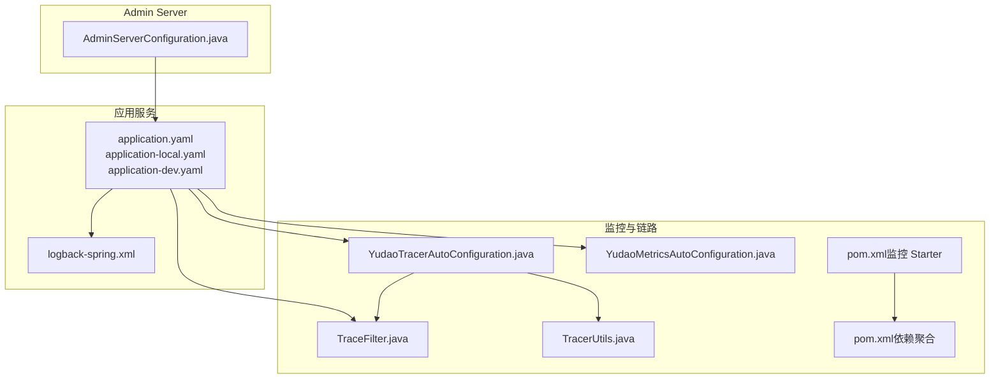
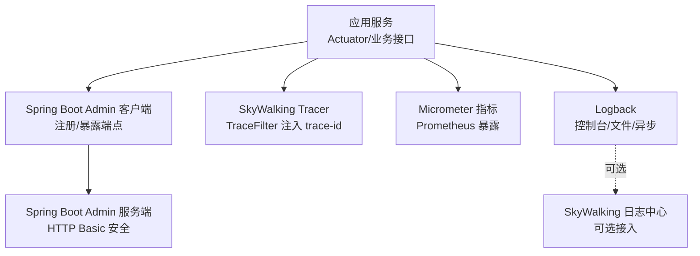
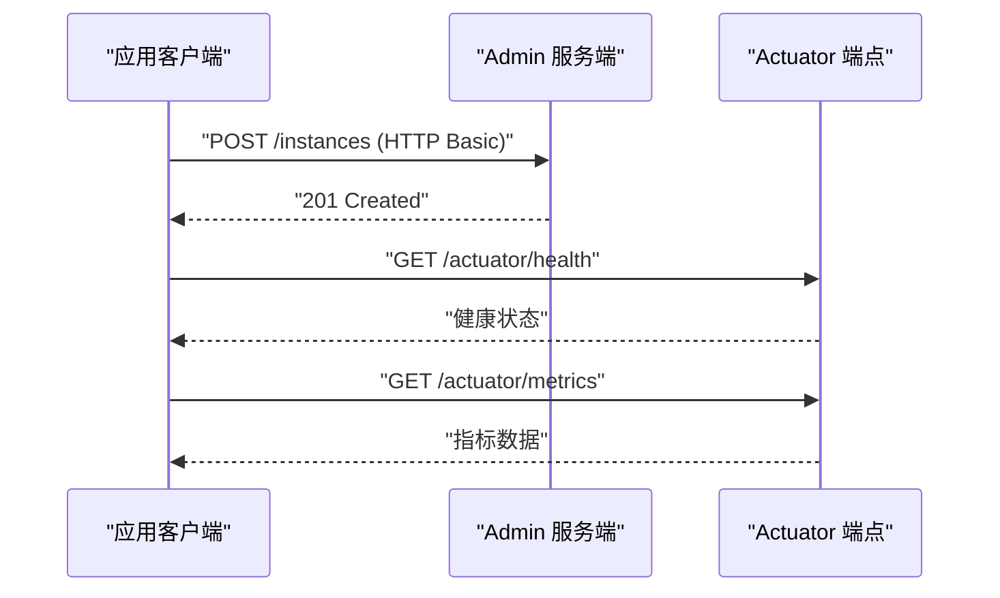
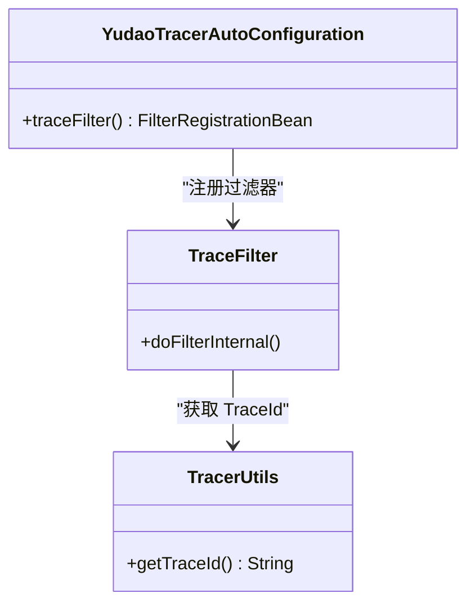
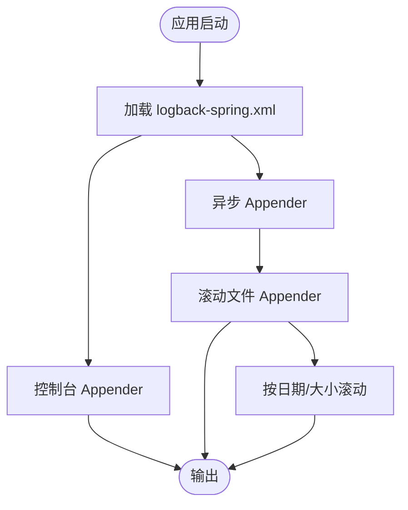
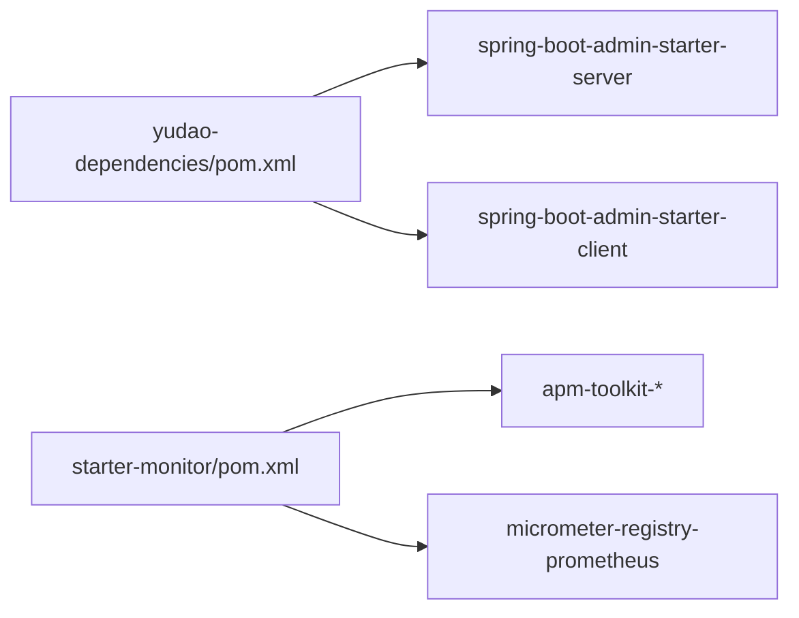

# 监控与日志

<cite>
**本文引用的文件**
- [application.yaml](file://yudao-server/src/main/resources/application.yaml)
- [application-local.yaml](file://yudao-server/src/main/resources/application-local.yaml)
- [application-dev.yaml](file://yudao-server/src/main/resources/application-dev.yaml)
- [logback-spring.xml](file://yudao-server/src/main/resources/logback-spring.xml)
- [AdminServerConfiguration.java](file://yudao-module-infra/src/main/java/cn/iocoder/yudao/module/infra/framework/monitor/config/AdminServerConfiguration.java)
- [YudaoTracerAutoConfiguration.java](file://yudao-framework/yudao-spring-boot-starter-monitor/src/main/java/cn/iocoder/yudao/framework/tracer/config/YudaoTracerAutoConfiguration.java)
- [YudaoMetricsAutoConfiguration.java](file://yudao-framework/yudao-spring-boot-starter-monitor/src/main/java/cn/iocoder/yudao/framework/tracer/config/YudaoMetricsAutoConfiguration.java)
- [TraceFilter.java](file://yudao-framework/yudao-spring-boot-starter-monitor/src/main/java/cn/iocoder/yudao/framework/tracer/core/filter/TraceFilter.java)
- [TracerUtils.java](file://yudao-framework/yudao-common/src/main/java/cn/iocoder/yudao/framework/common/util/monitor/TracerUtils.java)
- [pom.xml（监控 Starter）](file://yudao-framework/yudao-spring-boot-starter-monitor/pom.xml)
- [pom.xml（依赖聚合）](file://yudao-dependencies/pom.xml)
</cite>

## 目录
1. [简介](#简介)
2. [项目结构](#项目结构)
3. [核心组件](#核心组件)
4. [架构总览](#架构总览)
5. [详细组件分析](#详细组件分析)
6. [依赖分析](#依赖分析)
7. [性能考虑](#性能考虑)
8. [故障排查指南](#故障排查指南)
9. [结论](#结论)
10. [附录](#附录)

## 简介
本文件面向 AgenticCPS 系统，提供一套完整的监控与日志管理方案，覆盖以下方面：
- Spring Boot Admin 监控系统：应用注册、健康检查、指标暴露、客户端集成与安全配置
- SkyWalking 链路追踪：探针依赖、链路采集、日志中心对接、工具包使用
- 日志管理：Logback 配置、日志级别控制、格式化、异步与滚动、集中化日志收集
- 性能监控指标：系统资源（CPU、内存、磁盘、网络）与应用层指标（QPS、响应时间、错误率）
- 告警机制：阈值与规则设计、通知方式与集成思路
- 故障排查：日志分析、性能分析、问题定位方法与工具

## 项目结构
围绕监控与日志的关键模块与文件如下：
- 服务端配置与运行：application.yaml、application-local.yaml、application-dev.yaml
- 日志配置：logback-spring.xml
- 监控与链路追踪自动装配：YudaoTracerAutoConfiguration、YudaoMetricsAutoConfiguration、TraceFilter
- Admin Server 安全与注册：AdminServerConfiguration
- Tracer 工具与依赖：TracerUtils、监控 Starter 与依赖聚合 POM

**图表来源**
- [application.yaml:1-353](file://yudao-server/src/main/resources/application.yaml#L1-L353)
- [application-local.yaml:143-195](file://yudao-server/src/main/resources/application-local.yaml#L143-L195)
- [application-dev.yaml:122-150](file://yudao-server/src/main/resources/application-dev.yaml#L122-L150)
- [logback-spring.xml:1-57](file://yudao-server/src/main/resources/logback-spring.xml#L1-L57)
- [YudaoTracerAutoConfiguration.java:1-54](file://yudao-framework/yudao-spring-boot-starter-monitor/src/main/java/cn/iocoder/yudao/framework/tracer/config/YudaoTracerAutoConfiguration.java#L1-L54)
- [YudaoMetricsAutoConfiguration.java:1-27](file://yudao-framework/yudao-spring-boot-starter-monitor/src/main/java/cn/iocoder/yudao/framework/tracer/config/YudaoMetricsAutoConfiguration.java#L1-L27)
- [TraceFilter.java:1-34](file://yudao-framework/yudao-spring-boot-starter-monitor/src/main/java/cn/iocoder/yudao/framework/tracer/core/filter/TraceFilter.java#L1-L34)
- [TracerUtils.java:1-30](file://yudao-framework/yudao-common/src/main/java/cn/iocoder/yudao/framework/common/util/monitor/TracerUtils.java#L1-L30)
- [pom.xml（监控 Starter）:34-78](file://yudao-framework/yudao-spring-boot-starter-monitor/pom.xml#L34-L78)
- [pom.xml（依赖聚合）:369-399](file://yudao-dependencies/pom.xml#L369-L399)
- [AdminServerConfiguration.java:1-107](file://yudao-module-infra/src/main/java/cn/iocoder/yudao/module/infra/framework/monitor/config/AdminServerConfiguration.java#L1-L107)

**章节来源**
- [application.yaml:1-353](file://yudao-server/src/main/resources/application.yaml#L1-L353)
- [application-local.yaml:143-195](file://yudao-server/src/main/resources/application-local.yaml#L143-L195)
- [application-dev.yaml:122-150](file://yudao-server/src/main/resources/application-dev.yaml#L122-L150)
- [logback-spring.xml:1-57](file://yudao-server/src/main/resources/logback-spring.xml#L1-L57)
- [YudaoTracerAutoConfiguration.java:1-54](file://yudao-framework/yudao-spring-boot-starter-monitor/src/main/java/cn/iocoder/yudao/framework/tracer/config/YudaoTracerAutoConfiguration.java#L1-L54)
- [YudaoMetricsAutoConfiguration.java:1-27](file://yudao-framework/yudao-spring-boot-starter-monitor/src/main/java/cn/iocoder/yudao/framework/tracer/config/YudaoMetricsAutoConfiguration.java#L1-L27)
- [TraceFilter.java:1-34](file://yudao-framework/yudao-spring-boot-starter-monitor/src/main/java/cn/iocoder/yudao/framework/tracer/core/filter/TraceFilter.java#L1-L34)
- [TracerUtils.java:1-30](file://yudao-framework/yudao-common/src/main/java/cn/iocoder/yudao/framework/common/util/monitor/TracerUtils.java#L1-L30)
- [pom.xml（监控 Starter）:34-78](file://yudao-framework/yudao-spring-boot-starter-monitor/pom.xml#L34-L78)
- [pom.xml（依赖聚合）:369-399](file://yudao-dependencies/pom.xml#L369-L399)
- [AdminServerConfiguration.java:1-107](file://yudao-module-infra/src/main/java/cn/iocoder/yudao/module/infra/framework/monitor/config/AdminServerConfiguration.java#L1-L107)

## 核心组件
- Spring Boot Admin 客户端与服务端
  - 客户端：通过 application-local.yaml、application-dev.yaml 中的 spring.boot.admin.client 配置，向 Admin Server 注册自身，暴露 Actuator 端点，支持 HTTP Basic 认证
  - 服务端：AdminServerConfiguration 提供独立的安全链路，使用内存用户与 HTTP Basic 保护 Admin Server 端点，不影响现有 Token 认证
- SkyWalking 链路追踪与日志
  - 依赖：apm-toolkit-trace、apm-toolkit-logback-1.x、apm-toolkit-opentracing、micrometer-registry-prometheus
  - 自动装配：YudaoTracerAutoConfiguration 注册 TraceFilter，响应头注入 trace-id；YudaoMetricsAutoConfiguration 为 Micrometer 注入通用标签
  - 工具：TracerUtils 提供获取 TraceId 的便捷方法
- 日志管理
  - Logback：控制台与异步文件输出，支持基于时间和大小的滚动策略；预留 SkyWalking 日志 Appender 注释，便于接入日志中心
  - 级别与格式：通过 application-local.yaml、application-dev.yaml 的 logging.level 调整模块日志级别；logback-spring.xml 定义控制台与文件格式

**章节来源**
- [application-local.yaml:153-166](file://yudao-server/src/main/resources/application-local.yaml#L153-L166)
- [application-dev.yaml:132-145](file://yudao-server/src/main/resources/application-dev.yaml#L132-L145)
- [AdminServerConfiguration.java:29-107](file://yudao-module-infra/src/main/java/cn/iocoder/yudao/module/infra/framework/monitor/config/AdminServerConfiguration.java#L29-L107)
- [YudaoTracerAutoConfiguration.java:17-51](file://yudao-framework/yudao-spring-boot-starter-monitor/src/main/java/cn/iocoder/yudao/framework/tracer/config/YudaoTracerAutoConfiguration.java#L17-L51)
- [YudaoMetricsAutoConfiguration.java:16-25](file://yudao-framework/yudao-spring-boot-starter-monitor/src/main/java/cn/iocoder/yudao/framework/tracer/config/YudaoMetricsAutoConfiguration.java#L16-L25)
- [TraceFilter.java:17-33](file://yudao-framework/yudao-spring-boot-starter-monitor/src/main/java/cn/iocoder/yudao/framework/tracer/core/filter/TraceFilter.java#L17-L33)
- [TracerUtils.java:12-28](file://yudao-framework/yudao-common/src/main/java/cn/iocoder/yudao/framework/common/util/monitor/TracerUtils.java#L12-L28)
- [logback-spring.xml:1-57](file://yudao-server/src/main/resources/logback-spring.xml#L1-L57)
- [pom.xml（监控 Starter）:43-70](file://yudao-framework/yudao-spring-boot-starter-monitor/pom.xml#L43-L70)

## 架构总览
下图展示监控与日志在系统中的交互关系：应用通过 Admin 客户端注册到 Admin 服务端，Actuator 暴露健康与指标；链路追踪通过 TraceFilter 注入 trace-id，SkyWalking 工具包与 Micrometer 配合实现观测；日志通过 Logback 输出并可接入 SkyWalking 日志中心。

**图表来源**
- [application-local.yaml:153-166](file://yudao-server/src/main/resources/application-local.yaml#L153-L166)
- [application-dev.yaml:132-145](file://yudao-server/src/main/resources/application-dev.yaml#L132-L145)
- [AdminServerConfiguration.java:57-105](file://yudao-module-infra/src/main/java/cn/iocoder/yudao/module/infra/framework/monitor/config/AdminServerConfiguration.java#L57-L105)
- [YudaoTracerAutoConfiguration.java:45-51](file://yudao-framework/yudao-spring-boot-starter-monitor/src/main/java/cn/iocoder/yudao/framework/tracer/config/YudaoTracerAutoConfiguration.java#L45-L51)
- [YudaoMetricsAutoConfiguration.java:21-25](file://yudao-framework/yudao-spring-boot-starter-monitor/src/main/java/cn/iocoder/yudao/framework/tracer/config/YudaoMetricsAutoConfiguration.java#L21-L25)
- [logback-spring.xml:37-54](file://yudao-server/src/main/resources/logback-spring.xml#L37-L54)

## 详细组件分析

### Spring Boot Admin 监控系统
- 客户端注册与端点暴露
  - 在 application-local.yaml、application-dev.yaml 中配置 spring.boot.admin.client.url、context-path、instance.service-host-type、用户名与密码
  - management.endpoints.web.exposure.include 设置为 *，确保 Actuator 所有端点可用
- 服务端安全与认证
  - AdminServerConfiguration 使用独立的 SecurityFilterChain，启用 HTTP Basic 认证与表单登录，忽略 Admin Client 注册与 Actuator 端点的 CSRF
  - 内存用户管理器 adminUserDetailsManager 提供独立的管理员账户

**图表来源**
- [application-local.yaml:153-166](file://yudao-server/src/main/resources/application-local.yaml#L153-L166)
- [application-dev.yaml:132-145](file://yudao-server/src/main/resources/application-dev.yaml#L132-L145)
- [AdminServerConfiguration.java:57-105](file://yudao-module-infra/src/main/java/cn/iocoder/yudao/module/infra/framework/monitor/config/AdminServerConfiguration.java#L57-L105)

**章节来源**
- [application-local.yaml:146-166](file://yudao-server/src/main/resources/application-local.yaml#L146-L166)
- [application-dev.yaml:124-145](file://yudao-server/src/main/resources/application-dev.yaml#L124-L145)
- [AdminServerConfiguration.java:29-107](file://yudao-module-infra/src/main/java/cn/iocoder/yudao/module/infra/framework/monitor/config/AdminServerConfiguration.java#L29-L107)

### SkyWalking 链路追踪
- 依赖与工具
  - 监控 Starter 引入 apm-toolkit-trace、apm-toolkit-logback-1.x、apm-toolkit-opentracing、micrometer-registry-prometheus
  - YudaoTracerAutoConfiguration 条件装配，注册 TraceFilter，并注入响应头 trace-id
  - TracerUtils 提供获取 TraceId 的静态方法，便于业务侧记录
- 日志中心
  - logback-spring.xml 预留 SkyWalking GRPC 日志 Appender，可通过取消注释启用

**图表来源**
- [YudaoTracerAutoConfiguration.java:45-51](file://yudao-framework/yudao-spring-boot-starter-monitor/src/main/java/cn/iocoder/yudao/framework/tracer/config/YudaoTracerAutoConfiguration.java#L45-L51)
- [TraceFilter.java:24-31](file://yudao-framework/yudao-spring-boot-starter-monitor/src/main/java/cn/iocoder/yudao/framework/tracer/core/filter/TraceFilter.java#L24-L31)
- [TracerUtils.java:26-28](file://yudao-framework/yudao-common/src/main/java/cn/iocoder/yudao/framework/common/util/monitor/TracerUtils.java#L26-L28)
- [pom.xml（监控 Starter）:43-70](file://yudao-framework/yudao-spring-boot-starter-monitor/pom.xml#L43-L70)
- [logback-spring.xml:37-46](file://yudao-server/src/main/resources/logback-spring.xml#L37-L46)

**章节来源**
- [pom.xml（监控 Starter）:43-70](file://yudao-framework/yudao-spring-boot-starter-monitor/pom.xml#L43-L70)
- [YudaoTracerAutoConfiguration.java:17-51](file://yudao-framework/yudao-spring-boot-starter-monitor/src/main/java/cn/iocoder/yudao/framework/tracer/config/YudaoTracerAutoConfiguration.java#L17-L51)
- [TraceFilter.java:17-33](file://yudao-framework/yudao-spring-boot-starter-monitor/src/main/java/cn/iocoder/yudao/framework/tracer/core/filter/TraceFilter.java#L17-L33)
- [TracerUtils.java:12-28](file://yudao-framework/yudao-common/src/main/java/cn/iocoder/yudao/framework/common/util/monitor/TracerUtils.java#L12-L28)
- [logback-spring.xml:37-54](file://yudao-server/src/main/resources/logback-spring.xml#L37-L54)

### 日志管理方案
- Logback 配置要点
  - 控制台输出：ConsoleAppender，高亮日志级别与类名行号
  - 文件输出：RollingFileAppender，按日期与大小滚动，保留 30 天
  - 异步写入：AsyncAppender，避免阻塞业务线程
  - SkyWalking 日志中心：预留 GRPC Appender，可选启用
- 日志级别控制
  - application-local.yaml、application-dev.yaml 的 logging.level 可针对模块精细调整
- 日志格式化
  - 通过 PatternLayoutEncoder 的 pattern 控制时间、线程、级别、类名行号与消息

**图表来源**
- [logback-spring.xml:1-57](file://yudao-server/src/main/resources/logback-spring.xml#L1-L57)
- [application-local.yaml:167-195](file://yudao-server/src/main/resources/application-local.yaml#L167-L195)
- [application-dev.yaml:146-150](file://yudao-server/src/main/resources/application-dev.yaml#L146-L150)

**章节来源**
- [logback-spring.xml:1-57](file://yudao-server/src/main/resources/logback-spring.xml#L1-L57)
- [application-local.yaml:167-195](file://yudao-server/src/main/resources/application-local.yaml#L167-L195)
- [application-dev.yaml:146-150](file://yudao-server/src/main/resources/application-dev.yaml#L146-L150)

### 性能监控指标
- 系统资源指标
  - 通过 Micrometer 与 Prometheus 暴露 JVM 与系统指标，结合 Admin Server 查看
- 应用层指标
  - QPS、响应时间、错误率：由 Actuator 暴露的 HTTP 指标与 Micrometer 自定义指标共同构成
- 配置要点
  - management.endpoints.web.exposure.include=* 暴露 Actuator 端点
  - micrometer-registry-prometheus 依赖用于 Prometheus 暴露

**章节来源**
- [application-local.yaml:146-151](file://yudao-server/src/main/resources/application-local.yaml#L146-L151)
- [application-dev.yaml:124-130](file://yudao-server/src/main/resources/application-dev.yaml#L124-L130)
- [YudaoMetricsAutoConfiguration.java:21-25](file://yudao-framework/yudao-spring-boot-starter-monitor/src/main/java/cn/iocoder/yudao/framework/tracer/config/YudaoMetricsAutoConfiguration.java#L21-L25)
- [pom.xml（监控 Starter）:65-70](file://yudao-framework/yudao-spring-boot-starter-monitor/pom.xml#L65-L70)

### 告警机制配置
- 阈值与规则
  - 基于 Admin Server 的健康与指标页面，结合外部监控系统（如 Prometheus + Alertmanager 或云监控）设定阈值与规则
- 通知方式
  - 可通过 Admin Server 的通知集成或外部告警系统实现邮件、IM、短信等通知
- 集成思路
  - Admin Server 作为统一入口，Prometheus 抓取指标，Alertmanager 触发告警，最终落地到通知通道

[本节为通用配置指导，不直接分析具体文件，故无章节来源]

## 依赖分析
- 监控 Starter 依赖
  - apm-toolkit-trace、apm-toolkit-logback-1.x、apm-toolkit-opentracing、micrometer-registry-prometheus
  - spring-boot-admin-starter-client
- 依赖聚合
  - yudao-dependencies 中包含 spring-boot-admin-starter-server 与 spring-boot-admin-starter-client 的版本管理

**图表来源**
- [pom.xml（依赖聚合）:369-399](file://yudao-dependencies/pom.xml#L369-L399)
- [pom.xml（监控 Starter）:43-78](file://yudao-framework/yudao-spring-boot-starter-monitor/pom.xml#L43-L78)

**章节来源**
- [pom.xml（依赖聚合）:369-399](file://yudao-dependencies/pom.xml#L369-L399)
- [pom.xml（监控 Starter）:43-78](file://yudao-framework/yudao-spring-boot-starter-monitor/pom.xml#L43-L78)

## 性能考虑
- 日志性能
  - 使用 AsyncAppender 降低 I/O 阻塞风险；合理设置队列大小与丢弃阈值
  - 滚动策略选择“按大小+按时间”，避免单文件过大影响读写
- 指标与链路
  - Micrometer 指标按需暴露，避免过度采样造成 CPU 压力
  - TraceFilter 仅注入 trace-id，开销极低
- Admin 客户端
  - Actuator 端点暴露范围按环境调整，生产环境可限制暴露范围

[本节为通用性能建议，不直接分析具体文件，故无章节来源]

## 故障排查指南
- 日志分析
  - 通过 application-local.yaml、application-dev.yaml 的 logging.level 调整模块日志级别，定位问题模块
  - 使用 logback-spring.xml 的控制台输出与异步文件输出，结合 SkyWalking 日志中心进行集中检索
- 性能分析
  - 在 Admin Server 查看 Actuator 指标，结合 Micrometer 暴露的 JVM 与业务指标定位瓶颈
- 问题定位
  - 使用 TraceFilter 注入的 trace-id 在链路追踪系统中检索请求全链路，快速定位异常环节
  - 若启用 SkyWalking 日志中心，可在日志界面按 trace-id 过滤日志

**章节来源**
- [application-local.yaml:167-195](file://yudao-server/src/main/resources/application-local.yaml#L167-L195)
- [application-dev.yaml:146-150](file://yudao-server/src/main/resources/application-dev.yaml#L146-L150)
- [logback-spring.xml:37-54](file://yudao-server/src/main/resources/logback-spring.xml#L37-L54)
- [TraceFilter.java:24-31](file://yudao-framework/yudao-spring-boot-starter-monitor/src/main/java/cn/iocoder/yudao/framework/tracer/core/filter/TraceFilter.java#L24-L31)

## 结论
本方案基于现有工程配置，提供了完整的监控与日志能力：Admin Server 用于应用注册与健康检查，Actuator 暴露指标，SkyWalking 提供链路追踪与日志中心，Logback 支持高性能异步日志与集中化收集。通过合理的阈值与规则配置，可构建完善的告警体系；配合 trace-id 与日志中心，能够高效完成故障排查与性能分析。

[本节为总结性内容，不直接分析具体文件，故无章节来源]

## 附录
- 关键配置清单
  - Admin 客户端：spring.boot.admin.client.url、context-path、instance.service-host-type、用户名与密码
  - Actuator：management.endpoints.web.exposure.include
  - 日志：logging.level、logback-spring.xml 的 Appender 与 Pattern
  - SkyWalking：apm-toolkit-*、apm-toolkit-logback-1.x、micrometer-registry-prometheus
- 建议实践
  - 生产环境限制 Actuator 暴露范围，仅开放必要端点
  - 启用 SkyWalking 日志中心，统一检索 trace-id 对应日志
  - 结合 Admin Server 与外部监控系统，建立多层告警与通知

[本节为补充说明，不直接分析具体文件，故无章节来源]