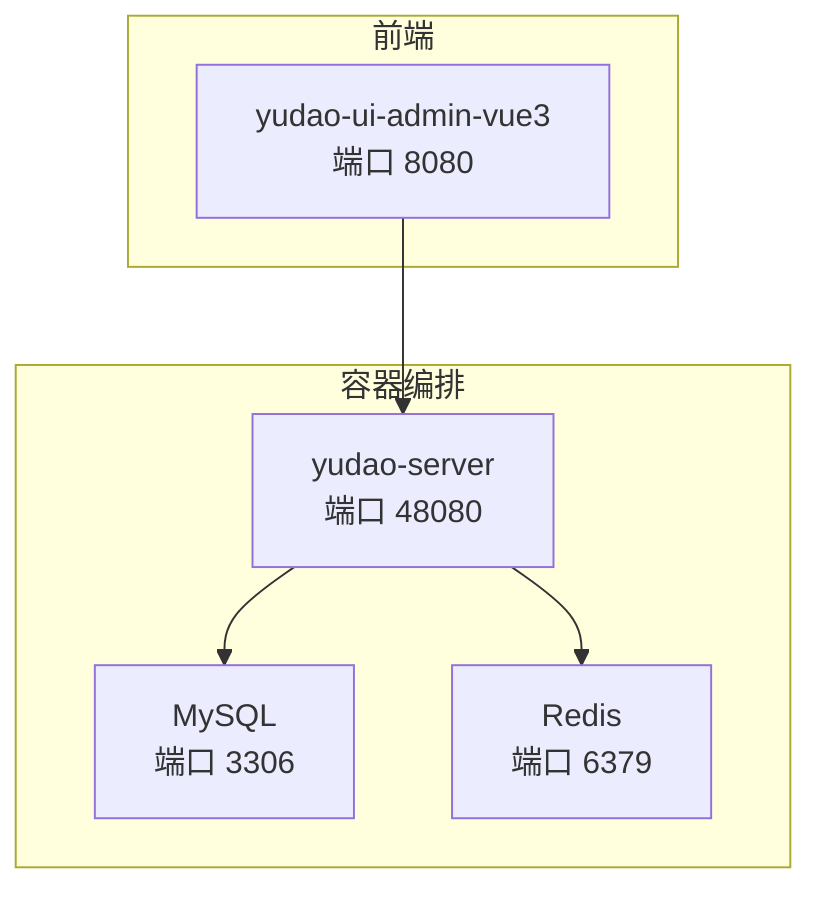
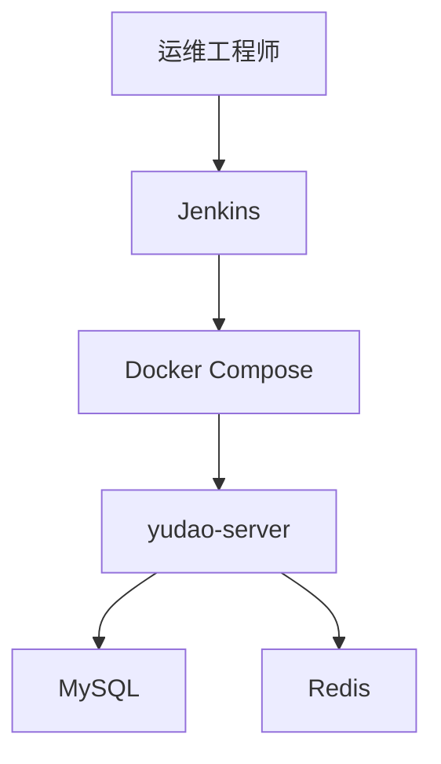
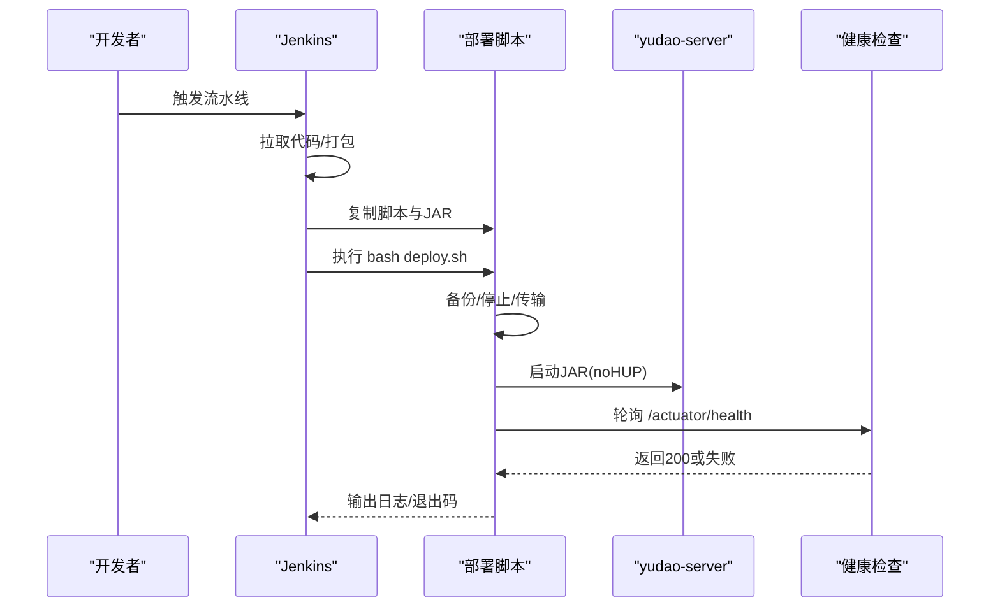
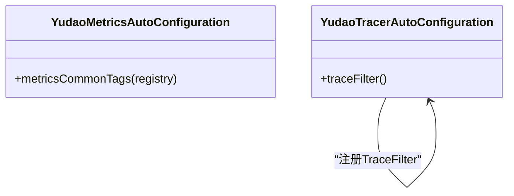
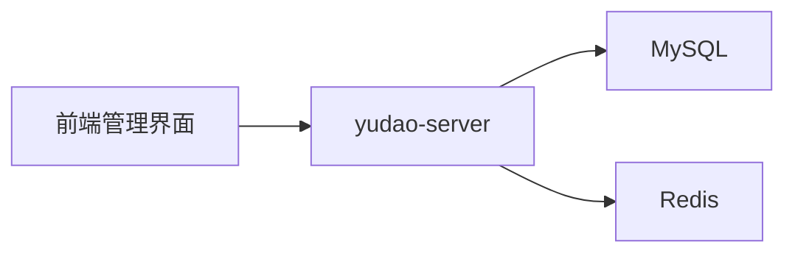

# 运维管理

<cite>
**本文引用的文件**
- [deploy.sh](file://script/shell/deploy.sh)
- [docker-compose.yml](file://script/docker/docker-compose.yml)
- [Dockerfile](file://yudao-server/Dockerfile)
- [application.yaml](file://yudao-server/src/main/resources/application.yaml)
- [logback-spring.xml](file://yudao-server/src/main/resources/logback-spring.xml)
- [Jenkinsfile](file://script/jenkins/Jenkinsfile)
- [ruoyi-vue-pro.sql](file://sql/mysql/ruoyi-vue-pro.sql)
- [YudaoTracerAutoConfiguration.java](file://yudao-framework/yudao-spring-boot-starter-monitor/src/main/java/cn/iocoder/yudao/framework/tracer/config/YudaoTracerAutoConfiguration.java)
- [YudaoMetricsAutoConfiguration.java](file://yudao-framework/yudao-spring-boot-starter-monitor/src/main/java/cn/iocoder/yudao/framework/tracer/config/YudaoMetricsAutoConfiguration.java)
</cite>

## 目录
1. [简介](#简介)
2. [项目结构](#项目结构)
3. [核心组件](#核心组件)
4. [架构总览](#架构总览)
5. [详细组件分析](#详细组件分析)
6. [依赖分析](#依赖分析)
7. [性能考虑](#性能考虑)
8. [故障排除指南](#故障排除指南)
9. [结论](#结论)
10. [附录](#附录)

## 简介
本运维管理文档面向AgenticCPS系统，聚焦于日常运维操作与规范，涵盖系统监控、日志分析、性能调优、容量规划、备份与恢复、故障排除、系统升级与版本管理、运维工具与脚本使用、最佳实践以及团队协作与知识管理。文档以仓库中的实际配置与脚本为依据，结合Spring Boot与容器化部署特性，提供可落地的操作指南。

## 项目结构
AgenticCPS采用前后端分离与容器化部署方式：
- 后端服务：yudao-server，提供REST API与业务能力
- 前端管理界面：yudao-ui-admin-vue3
- 数据库：MySQL（容器化）
- 缓存：Redis（容器化）
- CI/CD：Jenkins流水线
- 部署：Shell脚本与Docker Compose

图表来源
- [docker-compose.yml:1-85](file://script/docker/docker-compose.yml#L1-L85)
- [Dockerfile:1-24](file://yudao-server/Dockerfile#L1-L24)

章节来源
- [docker-compose.yml:1-85](file://script/docker/docker-compose.yml#L1-L85)
- [Dockerfile:1-24](file://yudao-server/Dockerfile#L1-L24)

## 核心组件
- 部署与发布
  - Shell部署脚本：负责备份、停止、传输、启动与健康检查
  - Jenkins流水线：拉取代码、打包、复制部署脚本并触发部署
- 运行时配置
  - Spring Boot配置：数据库、缓存、AI模型、安全、Web等
  - 日志配置：控制台与文件滚动日志，支持异步写入
  - 监控与链路追踪：指标与过滤器配置
- 数据与持久化
  - MySQL初始化SQL与多数据库方言脚本
  - Redis作为缓存与会话存储

章节来源
- [deploy.sh:1-161](file://script/shell/deploy.sh#L1-L161)
- [Jenkinsfile:1-61](file://script/jenkins/Jenkinsfile#L1-L61)
- [application.yaml:1-353](file://yudao-server/src/main/resources/application.yaml#L1-L353)
- [logback-spring.xml:1-57](file://yudao-server/src/main/resources/logback-spring.xml#L1-L57)
- [YudaoTracerAutoConfiguration.java:1-54](file://yudao-framework/yudao-spring-boot-starter-monitor/src/main/java/cn/iocoder/yudao/framework/tracer/config/YudaoTracerAutoConfiguration.java#L1-L54)
- [YudaoMetricsAutoConfiguration.java:1-27](file://yudao-framework/yudao-spring-boot-starter-monitor/src/main/java/cn/iocoder/yudao/framework/tracer/config/YudaoMetricsAutoConfiguration.java#L1-L27)

## 架构总览
系统采用容器化微服务风格，后端通过Docker Compose统一编排，前端独立部署并通过反向代理访问后端API。数据库与缓存均以容器形式提供，便于快速部署与扩展。

图表来源
- [docker-compose.yml:1-85](file://script/docker/docker-compose.yml#L1-L85)
- [Jenkinsfile:1-61](file://script/jenkins/Jenkinsfile#L1-L61)

## 详细组件分析

### 部署与发布流程
- Jenkins流水线
  - 拉取指定分支代码
  - 替换配置文件（如存在）
  - Maven打包生成JAR
  - 复制部署脚本与JAR至目标服务器
  - 执行部署脚本
- Shell部署脚本
  - 备份：若存在旧JAR则复制到backup目录并带时间戳
  - 停机：查找进程并优雅关闭，超时后强制kill
  - 传输：删除旧JAR并复制新JAR
  - 启动：设置JVM参数、Agent与profile，nohup后台启动
  - 健康检查：轮询Actuator健康端点，超时输出日志并退出
- 容器化启动
  - Dockerfile定义JRE基础镜像、工作目录、暴露端口与启动命令
  - docker-compose定义服务、环境变量、卷挂载与依赖关系

图表来源
- [Jenkinsfile:1-61](file://script/jenkins/Jenkinsfile#L1-L61)
- [deploy.sh:146-161](file://script/shell/deploy.sh#L146-L161)

章节来源
- [Jenkinsfile:1-61](file://script/jenkins/Jenkinsfile#L1-L61)
- [deploy.sh:1-161](file://script/shell/deploy.sh#L1-L161)
- [Dockerfile:1-24](file://yudao-server/Dockerfile#L1-L24)
- [docker-compose.yml:1-85](file://script/docker/docker-compose.yml#L1-L85)

### 监控与可观测性
- 指标与标签
  - 自动配置公共标签，统一标识应用名，便于Prometheus/Micrometer采集
- 链路追踪过滤
  - 注册TraceFilter，设置过滤顺序，便于在响应头注入traceId
- 日志
  - 控制台高亮输出
  - 文件滚动：按日期与大小滚动，保留30天
  - 异步写入：减少IO阻塞，提升吞吐

图表来源
- [YudaoMetricsAutoConfiguration.java:1-27](file://yudao-framework/yudao-spring-boot-starter-monitor/src/main/java/cn/iocoder/yudao/framework/tracer/config/YudaoMetricsAutoConfiguration.java#L1-L27)
- [YudaoTracerAutoConfiguration.java:1-54](file://yudao-framework/yudao-spring-boot-starter-monitor/src/main/java/cn/iocoder/yudao/framework/tracer/config/YudaoTracerAutoConfiguration.java#L1-L54)

章节来源
- [YudaoMetricsAutoConfiguration.java:1-27](file://yudao-framework/yudao-spring-boot-starter-monitor/src/main/java/cn/iocoder/yudao/framework/tracer/config/YudaoMetricsAutoConfiguration.java#L1-L27)
- [YudaoTracerAutoConfiguration.java:1-54](file://yudao-framework/yudao-spring-boot-starter-monitor/src/main/java/cn/iocoder/yudao/framework/tracer/config/YudaoTracerAutoConfiguration.java#L1-L54)
- [logback-spring.xml:1-57](file://yudao-server/src/main/resources/logback-spring.xml#L1-L57)

### 日志分析与清理
- 日志滚动策略
  - 按日期与大小滚动，保留30天
  - 异步写入，避免阻塞业务线程
- 日志清理
  - 建议结合系统crontab定期清理过期日志文件，避免磁盘占满
- 建议
  - 在生产环境启用集中日志（如SkyWalking日志采集），便于跨服务检索

章节来源
- [logback-spring.xml:1-57](file://yudao-server/src/main/resources/logback-spring.xml#L1-L57)

### 数据库与备份恢复
- 初始化脚本
  - 提供MySQL完整schema与数据初始化脚本
  - 提供多数据库方言脚本（Oracle、PostgreSQL、SQLServer、达梦、金仓、openGauss等）
- 备份策略
  - 逻辑备份：mysqldump导出SQL，配合定时任务
  - 物理备份：数据库数据目录快照（需停止写入或使用一致性快照）
  - 增量备份：基于binlog的增量备份与恢复
- 恢复策略
  - 全量恢复：先导入SQL，再执行业务数据修复
  - 时间点恢复：结合binlog定位到具体时间点
- 灾难恢复
  - 多地容灾：异地部署与数据同步
  - RTO/RPO：根据业务SLA设定恢复目标

章节来源
- [ruoyi-vue-pro.sql:1-200](file://sql/mysql/ruoyi-vue-pro.sql#L1-L200)

### 性能调优
- JVM参数
  - 初始堆与最大堆、OOM Dump路径与目录
  - 建议根据业务峰值QPS与GC行为调整
- 线程与连接
  - 数据库连接池大小、超时时间
  - Redis连接池与序列化策略
- 缓存策略
  - 合理设置TTL与淘汰策略，避免雪崩
- IO与网络
  - 异步日志、批量写入、压缩传输
- 监控指标
  - 关注CPU、内存、GC、连接池、慢查询、错误率、P99延迟

章节来源
- [deploy.sh:18-19](file://script/shell/deploy.sh#L18-L19)
- [application.yaml:1-353](file://yudao-server/src/main/resources/application.yaml#L1-L353)
- [logback-spring.xml:1-57](file://yudao-server/src/main/resources/logback-spring.xml#L1-L57)

### 容量规划
- 评估维度
  - QPS、并发连接、数据量、索引与查询复杂度
  - 缓存命中率、热点数据分布
- 规划步骤
  - 基准测试：压测工具模拟业务流量
  - 扩展性测试：逐步增加负载观察瓶颈
  - 资源预留：CPU、内存、磁盘、网络带宽
- 建议
  - 读写分离、分库分表、CDN与静态资源分离

章节来源
- [docker-compose.yml:1-85](file://script/docker/docker-compose.yml#L1-L85)
- [application.yaml:1-353](file://yudao-server/src/main/resources/application.yaml#L1-L353)

### 故障排除指南
- 常见问题
  - 启动失败：查看nohup.out与日志文件，检查JVM参数与端口占用
  - 健康检查失败：确认Actuator端点可用与网络连通
  - OOM：增大堆或优化对象生命周期与缓存策略
  - 数据库连接异常：检查连接池配置与网络连通
- 紧急响应
  - 快速回滚：使用备份的JAR与数据库快照
  - 降级策略：关闭非关键功能、限流与熔断
- 问题定位
  - 采集指标与日志，结合链路追踪ID定位请求路径
  - 分阶段排查：网络、容器、服务、数据库、缓存
- 修复步骤
  - 临时修复：参数调整、缓存清空、重启服务
  - 永久修复：代码修复、索引优化、架构调整

章节来源
- [deploy.sh:107-143](file://script/shell/deploy.sh#L107-L143)
- [logback-spring.xml:1-57](file://yudao-server/src/main/resources/logback-spring.xml#L1-L57)
- [YudaoTracerAutoConfiguration.java:1-54](file://yudao-framework/yudao-spring-boot-starter-monitor/src/main/java/cn/iocoder/yudao/framework/tracer/config/YudaoTracerAutoConfiguration.java#L1-L54)

### 系统升级与版本管理
- 平滑升级
  - 蓝绿/红黑发布：双实例或多实例切换
  - 渐进式发布：灰度流量
- 版本回退
  - 保留上一版本JAR与数据库快照
  - 回滚脚本自动化
- 兼容性检查
  - 数据库DDL变更与索引影响评估
  - 接口兼容性与客户端适配
- 数据迁移
  - 使用 Liquibase 或 Flyway 管理迁移脚本
  - 迁移前备份，迁移后校验

章节来源
- [Jenkinsfile:1-61](file://script/jenkins/Jenkinsfile#L1-L61)
- [deploy.sh:146-161](file://script/shell/deploy.sh#L146-L161)

### 运维工具与脚本使用
- 部署脚本
  - 功能：备份、停止、传输、启动、健康检查
  - 使用：在目标服务器执行，确保JAR与脚本在同一目录
- 监控脚本
  - 建议：基于Actuator端点与系统指标编写告警脚本
- 数据库维护脚本
  - 建议：定期执行OPTIMIZE TABLE、统计信息更新
- 日志清理脚本
  - 建议：基于日期与大小清理过期日志

章节来源
- [deploy.sh:1-161](file://script/shell/deploy.sh#L1-L161)

### 运维最佳实践
- 变更管理
  - 变更评审、变更窗口、回滚预案
- 发布流程
  - 自动化流水线、灰度发布、自动健康检查
- 安全加固
  - 端口最小化暴露、弱口令治理、TLS与WAF
- 合规检查
  - 数据分类分级、审计日志、隐私保护

章节来源
- [application.yaml:1-353](file://yudao-server/src/main/resources/application.yaml#L1-L353)

### 运维团队协作与知识管理
- 规范化
  - 统一日志格式、统一监控指标、统一告警阈值
- 知识沉淀
  - SOP文档、故障案例库、变更记录
- 协作工具
  - 问题跟踪、知识库、在线文档

## 依赖分析
- 组件耦合
  - yudao-server依赖MySQL与Redis
  - 前端依赖后端API
- 外部依赖
  - Docker镜像、Jenkins、数据库驱动
- 潜在风险
  - 单点故障：数据库、缓存、Nginx
  - 网络分区：跨机房容灾

图表来源
- [docker-compose.yml:1-85](file://script/docker/docker-compose.yml#L1-L85)

章节来源
- [docker-compose.yml:1-85](file://script/docker/docker-compose.yml#L1-L85)

## 性能考虑
- JVM与GC
  - 合理设置堆大小，关注Full GC频率
- 数据库
  - 索引优化、慢查询分析、连接池调优
- 缓存
  - 命中率与失效策略，避免缓存穿透
- 日志
  - 异步写入与滚动策略，避免IO瓶颈

章节来源
- [deploy.sh:18-19](file://script/shell/deploy.sh#L18-L19)
- [application.yaml:1-353](file://yudao-server/src/main/resources/application.yaml#L1-L353)
- [logback-spring.xml:1-57](file://yudao-server/src/main/resources/logback-spring.xml#L1-L57)

## 故障排除指南
- 启动失败
  - 检查JVM参数、端口占用、依赖服务状态
- 健康检查失败
  - 检查Actuator端点、网络连通性
- OOM
  - 增大堆、优化对象与缓存
- 数据库异常
  - 检查连接池、慢查询、锁等待

章节来源
- [deploy.sh:107-143](file://script/shell/deploy.sh#L107-L143)
- [logback-spring.xml:1-57](file://yudao-server/src/main/resources/logback-spring.xml#L1-L57)

## 结论
本文基于仓库中的实际配置与脚本，给出了AgenticCPS系统的运维管理全景：从部署发布、监控可观测性、日志与备份恢复，到性能调优、容量规划、故障排除、升级与版本管理、工具脚本使用与最佳实践。建议在生产环境中进一步完善集中日志、链路追踪与告警体系，并持续进行容量与性能压测，确保系统稳定可靠。

## 附录
- 关键配置位置
  - Spring Boot配置：application.yaml
  - 日志配置：logback-spring.xml
  - 容器编排：docker-compose.yml
  - 部署脚本：deploy.sh
  - CI/CD：Jenkinsfile
- 数据库脚本
  - MySQL初始化脚本：ruoyi-vue-pro.sql
  - 多数据库方言脚本：位于sql目录下

章节来源
- [application.yaml:1-353](file://yudao-server/src/main/resources/application.yaml#L1-L353)
- [logback-spring.xml:1-57](file://yudao-server/src/main/resources/logback-spring.xml#L1-L57)
- [docker-compose.yml:1-85](file://script/docker/docker-compose.yml#L1-L85)
- [deploy.sh:1-161](file://script/shell/deploy.sh#L1-L161)
- [Jenkinsfile:1-61](file://script/jenkins/Jenkinsfile#L1-L61)
- [ruoyi-vue-pro.sql:1-200](file://sql/mysql/ruoyi-vue-pro.sql#L1-L200)