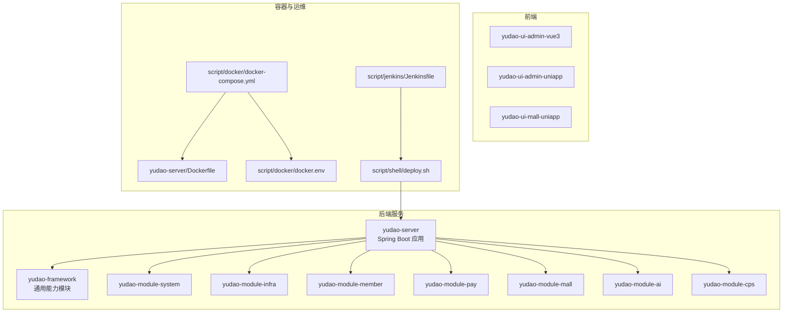
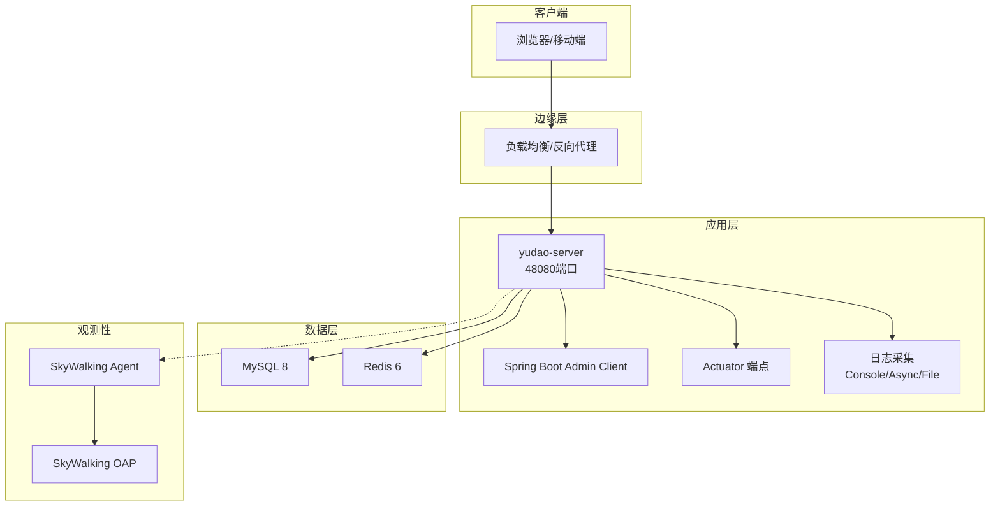
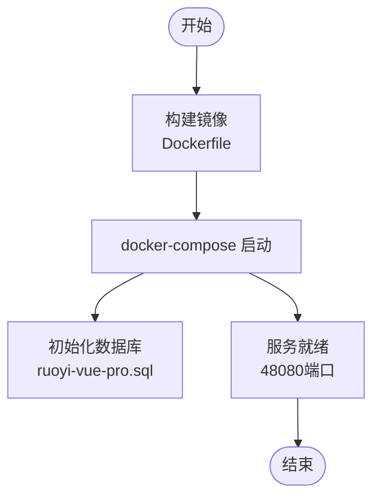
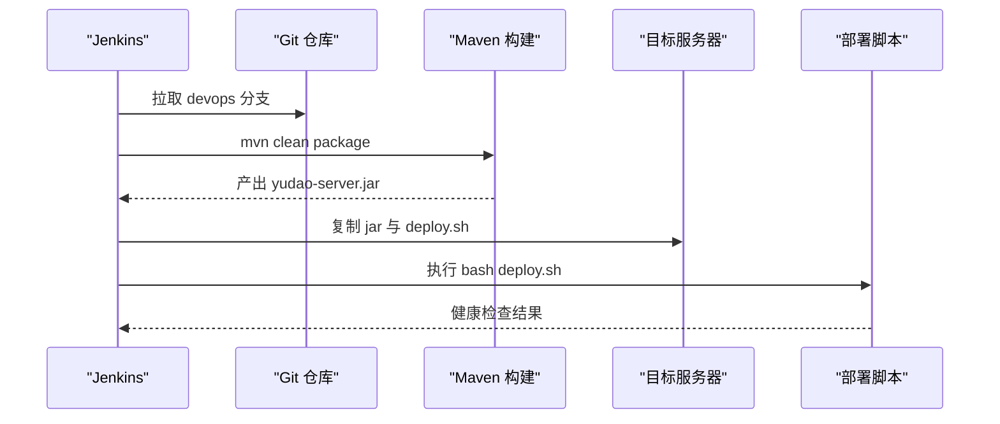
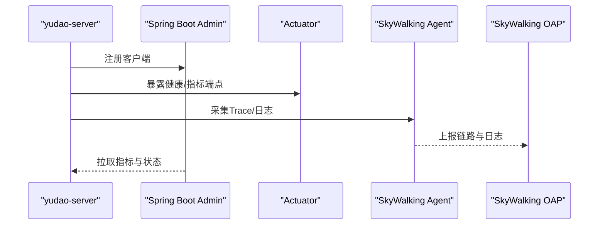
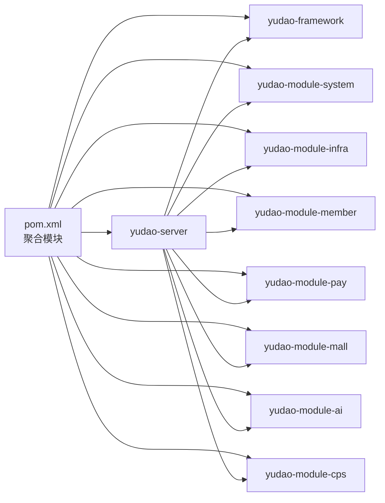

# 部署与运维

<cite>
**本文引用的文件**
- [docker-compose.yml](file://script/docker/docker-compose.yml)
- [docker.env](file://script/docker/docker.env)
- [Dockerfile](file://yudao-server/Dockerfile)
- [Jenkinsfile](file://script/jenkins/Jenkinsfile)
- [deploy.sh](file://script/shell/deploy.sh)
- [application.yaml](file://yudao-server/src/main/resources/application.yaml)
- [application-dev.yaml](file://yudao-server/src/main/resources/application-dev.yaml)
- [logback-spring.xml](file://yudao-server/src/main/resources/logback-spring.xml)
- [ruoyi-vue-pro.sql](file://sql/mysql/ruoyi-vue-pro.sql)
- [pom.xml](file://pom.xml)
- [YudaoServerApplication.java](file://yudao-server/src/main/java/cn/iocoder/yudao/server/YudaoServerApplication.java)
</cite>

## 目录
1. [简介](#简介)
2. [项目结构](#项目结构)
3. [核心组件](#核心组件)
4. [架构总览](#架构总览)
5. [详细组件分析](#详细组件分析)
6. [依赖分析](#依赖分析)
7. [性能考虑](#性能考虑)
8. [故障排除指南](#故障排除指南)
9. [结论](#结论)
10. [附录](#附录)

## 简介
本文件面向AgenticCPS系统（基于ruoyi-vue-pro）的部署与运维，提供从容器化到CI/CD、从监控日志到性能优化、从运维脚本到应急响应的完整实践指南。内容覆盖：
- Docker容器化部署方案（含Dockerfile、docker-compose.yml、镜像构建与发布）
- CI/CD流水线（Jenkinsfile、自动化测试、构建与部署、环境管理）
- 生产环境部署（服务器准备、数据库初始化、负载均衡与反向代理）
- 监控与日志（Spring Boot Admin、SkyWalking链路追踪、日志收集与分析）
- 性能优化（数据库、缓存、负载均衡、CDN）
- 运维工具与脚本（部署、监控、备份恢复）
- 故障排除与应急响应、系统升级与版本管理策略

## 项目结构
AgenticCPS为多模块Maven工程，核心后端位于yudao-server，前端位于yudao-ui-*，容器化与运维脚本集中在script目录。

**图表来源**
- [pom.xml:10-25](file://pom.xml#L10-L25)
- [docker-compose.yml:1-85](file://script/docker/docker-compose.yml#L1-L85)
- [Dockerfile:1-24](file://yudao-server/Dockerfile#L1-L24)
- [Jenkinsfile:1-61](file://script/jenkins/Jenkinsfile#L1-L61)
- [deploy.sh:1-161](file://script/shell/deploy.sh#L1-L161)

**章节来源**
- [pom.xml:10-25](file://pom.xml#L10-L25)
- [docker-compose.yml:1-85](file://script/docker/docker-compose.yml#L1-L85)
- [Dockerfile:1-24](file://yudao-server/Dockerfile#L1-L24)
- [Jenkinsfile:1-61](file://script/jenkins/Jenkinsfile#L1-L61)
- [deploy.sh:1-161](file://script/shell/deploy.sh#L1-L161)

## 核心组件
- 容器编排：使用docker-compose定义MySQL、Redis、后端服务、前端管理界面四类服务，统一网络与卷管理。
- 镜像构建：后端服务基于Eclipse Temurin 21 JRE，暴露48080端口，通过环境变量JAVA_OPTS与ARGS注入运行参数。
- CI/CD：Jenkins流水线拉取代码、打包构建、复制产物到目标机、执行部署脚本。
- 部署脚本：提供备份、优雅停机、转移、启动、健康检查的完整流程。
- 配置与日志：application.yaml集中配置，logback-spring.xml定义控制台与文件异步日志，支持SkyWalking日志采集占位。

**章节来源**
- [docker-compose.yml:5-85](file://script/docker/docker-compose.yml#L5-L85)
- [Dockerfile:1-24](file://yudao-server/Dockerfile#L1-L24)
- [Jenkinsfile:1-61](file://script/jenkins/Jenkinsfile#L1-L61)
- [deploy.sh:28-161](file://script/shell/deploy.sh#L28-L161)
- [application.yaml:1-353](file://yudao-server/src/main/resources/application.yaml#L1-L353)
- [logback-spring.xml:1-57](file://yudao-server/src/main/resources/logback-spring.xml#L1-L57)

## 架构总览
系统采用“容器化 + CI/CD + 监控日志”的运维体系，后端服务通过Spring Boot Admin与Actuator暴露监控端点，SkyWalking提供链路追踪与日志中心能力。

**图表来源**
- [docker-compose.yml:5-85](file://script/docker/docker-compose.yml#L5-L85)
- [application-dev.yaml:122-150](file://yudao-server/src/main/resources/application-dev.yaml#L122-L150)
- [logback-spring.xml:37-54](file://yudao-server/src/main/resources/logback-spring.xml#L37-L54)

## 详细组件分析

### Docker容器化部署
- Dockerfile要点
  - 基于eclipse-temurin:21-jre，设置Asia/Shanghai时区与JAVA_OPTS默认值
  - 暴露48080端口，CMD启动JAR并支持外部ARGS注入
- docker-compose.yml要点
  - 服务：mysql、redis、server、admin
  - 环境变量：通过环境文件与环境变量注入数据库、Redis、JVM参数
  - 依赖：server依赖mysql与redis，admin依赖server
  - 卷：持久化MySQL与Redis数据
- 镜像构建与发布
  - 本地构建：在yudao-server目录执行docker build
  - 发布：结合CI/CD将镜像推送到镜像仓库（Jenkinsfile中定义了REGISTRY与命名空间）

**图表来源**
- [Dockerfile:1-24](file://yudao-server/Dockerfile#L1-L24)
- [docker-compose.yml:29-78](file://script/docker/docker-compose.yml#L29-L78)
- [ruoyi-vue-pro.sql:1-200](file://sql/mysql/ruoyi-vue-pro.sql#L1-L200)

**章节来源**
- [Dockerfile:1-24](file://yudao-server/Dockerfile#L1-L24)
- [docker-compose.yml:1-85](file://script/docker/docker-compose.yml#L1-L85)
- [docker.env:1-26](file://script/docker/docker.env#L1-L26)
- [ruoyi-vue-pro.sql:1-200](file://sql/mysql/ruoyi-vue-pro.sql#L1-L200)

### CI/CD流水线（Jenkins）
- 流水线阶段
  - 拉取代码：devops分支
  - 构建：替换环境配置（如存在）后执行mvn clean package
  - 部署：复制jar到目标目录、归档制品、赋予执行权限、执行部署脚本
- 环境变量
  - DOCKER_CREDENTIAL_ID、GITHUB_CREDENTIAL_ID、KUBECONFIG_CREDENTIAL_ID
  - REGISTRY、DOCKERHUB_NAMESPACE、GITHUB_ACCOUNT
  - APP_NAME、APP_DEPLOY_BASE_DIR

**图表来源**
- [Jenkinsfile:1-61](file://script/jenkins/Jenkinsfile#L1-L61)
- [deploy.sh:50-161](file://script/shell/deploy.sh#L50-L161)

**章节来源**
- [Jenkinsfile:1-61](file://script/jenkins/Jenkinsfile#L1-L61)
- [deploy.sh:1-161](file://script/shell/deploy.sh#L1-L161)

### 生产环境部署指南
- 服务器环境准备
  - 安装Docker与Docker Compose
  - 配置防火墙放行：3306、6379、80、48080
  - 准备持久化磁盘与挂载点
- 数据库配置
  - 使用docker-compose内置MySQL 8，初始化ruoyi-vue-pro.sql
  - 如需外部数据库，可在环境变量中替换MASTER/SLAVE连接串
- 负载均衡与反向代理
  - 前端管理界面通过nginx对外提供静态资源服务
  - 后端服务通过反向代理转发到48080端口
- 环境变量管理
  - 使用docker.env集中管理数据库、Redis、JVM参数
  - 通过环境变量覆盖ARGS中的数据源与Redis主机

**章节来源**
- [docker-compose.yml:1-85](file://script/docker/docker-compose.yml#L1-L85)
- [docker.env:1-26](file://script/docker/docker.env#L1-L26)
- [ruoyi-vue-pro.sql:1-200](file://sql/mysql/ruoyi-vue-pro.sql#L1-L200)

### 监控与日志管理
- Spring Boot Admin
  - application-dev.yaml中开启Actuator端点与Admin Client配置
  - 通过/actuator与/admin路径暴露监控与管理界面
- SkyWalking
  - logback-spring.xml预留SkyWalking日志Appender占位
  - 部署脚本中可按需启用JAVA_AGENT与环境变量
- 日志收集与分析
  - 控制台与异步文件日志，按天滚动，最大10MB
  - 建议配合SkyWalking OAP实现日志中心

**图表来源**
- [application-dev.yaml:122-150](file://yudao-server/src/main/resources/application-dev.yaml#L122-L150)
- [logback-spring.xml:37-54](file://yudao-server/src/main/resources/logback-spring.xml#L37-L54)
- [deploy.sh:21-26](file://script/shell/deploy.sh#L21-L26)

**章节来源**
- [application-dev.yaml:122-150](file://yudao-server/src/main/resources/application-dev.yaml#L122-L150)
- [logback-spring.xml:1-57](file://yudao-server/src/main/resources/logback-spring.xml#L1-L57)
- [deploy.sh:21-26](file://script/shell/deploy.sh#L21-L26)

### 性能优化实施方案
- 数据库优化
  - 使用MySQL 8，结合ruoyi-vue-pro.sql初始化表结构
  - 启用Druid监控与慢SQL记录，合理设置连接池参数
- 缓存策略
  - Spring Cache集成Redis，TTL默认1小时
  - 业务侧结合本地缓存与分布式缓存，降低热点数据延迟
- 负载均衡
  - 前端静态资源与后端API分别做LB，后端多实例水平扩展
- CDN加速
  - 前端静态资源走CDN，减少带宽与延迟

**章节来源**
- [application.yaml:26-31](file://yudao-server/src/main/resources/application.yaml#L26-L31)
- [application-dev.yaml:13-58](file://yudao-server/src/main/resources/application-dev.yaml#L13-L58)
- [ruoyi-vue-pro.sql:1-200](file://sql/mysql/ruoyi-vue-pro.sql#L1-L200)

### 运维工具与脚本
- 部署脚本deploy.sh
  - 备份：存在则复制为带时间戳的备份文件
  - 停止：优雅关闭（15信号），最多等待120秒，超时强制kill
  - 转移：删除旧jar并复制新jar
  - 启动：nohup后台启动，支持JAVA_OPTS与JAVA_AGENT
  - 健康检查：轮询/actuator/health，超时输出最近日志并退出
- 监控脚本
  - 可在脚本中启用SkyWalking Agent相关环境变量
- 备份恢复脚本
  - 建议基于docker volume与数据库dump实现定期备份与恢复演练

**章节来源**
- [deploy.sh:28-161](file://script/shell/deploy.sh#L28-L161)

### 故障排除与应急响应
- 健康检查失败
  - 检查/actuator/health返回码，查看nohup.out最后10行
  - 核对数据库连通性与Redis可用性
- 启动卡顿
  - 查看启动日志，关注扫描包与初始化耗时
  - 调整JAVA_OPTS与JVM参数
- 链路追踪缺失
  - 确认SkyWalking Agent已启用并指向正确的Collector
- 日志异常
  - 检查日志滚动策略与磁盘空间
  - 启用SkyWalking日志采集以统一收集

**章节来源**
- [deploy.sh:106-143](file://script/shell/deploy.sh#L106-L143)
- [logback-spring.xml:37-54](file://yudao-server/src/main/resources/logback-spring.xml#L37-L54)

## 依赖分析
- 模块依赖
  - yudao-server聚合yudao-framework与各业务模块
  - yudao-framework提供监控、消息队列、安全、Redis、MyBatis等通用能力
- 运行时依赖
  - MySQL、Redis、JVM参数、Actuator与Admin Client
  - SkyWalking Agent（可选）

**图表来源**
- [pom.xml:10-25](file://pom.xml#L10-L25)

**章节来源**
- [pom.xml:10-25](file://pom.xml#L10-L25)

## 性能考虑
- JVM与容器
  - 通过JAVA_OPTS设置堆大小与安全熵源，容器内建议固定JVM参数
- 数据库
  - 合理设置连接池初始/最大连接数、空闲检测与慢SQL阈值
- 缓存
  - 使用Redis作为一级缓存，结合TTL与异步刷新策略
- 观测性
  - 启用Actuator与Admin，结合SkyWalking进行端到端性能分析

**章节来源**
- [Dockerfile:11-18](file://yudao-server/Dockerfile#L11-L18)
- [application-dev.yaml:13-58](file://yudao-server/src/main/resources/application-dev.yaml#L13-L58)
- [application.yaml:26-31](file://yudao-server/src/main/resources/application.yaml#L26-L31)

## 故障排除指南
- 启动失败
  - 检查YudaoServerApplication启动类与扫描包配置
  - 核对application.yaml与profile激活
- 数据库连接
  - 校验MASTER/SLAVE数据源URL、用户名与密码
  - 确认MySQL初始化SQL已执行
- Redis连接
  - 校验host/port/database与网络连通性
- 健康检查
  - 若未配置HEALTH_CHECK_URL，脚本会sleep等待

**章节来源**
- [YudaoServerApplication.java:16-32](file://yudao-server/src/main/java/cn/iocoder/yudao/server/YudaoServerApplication.java#L16-L32)
- [application.yaml:5-10](file://yudao-server/src/main/resources/application.yaml#L5-L10)
- [docker-compose.yml:46-56](file://script/docker/docker-compose.yml#L46-L56)
- [deploy.sh:106-143](file://script/shell/deploy.sh#L106-L143)

## 结论
AgenticCPS系统提供了完善的容器化与CI/CD基础设施，结合Spring Boot Admin与SkyWalking实现了可观测性闭环。通过规范的部署脚本、环境变量管理与数据库初始化流程，可快速在生产环境落地。建议持续完善监控告警、日志中心与压测演练，确保系统在高并发场景下的稳定性与可维护性。

## 附录
- 关键配置位置
  - 后端配置：application.yaml、application-dev.yaml
  - 日志配置：logback-spring.xml
  - 容器编排：docker-compose.yml、Dockerfile、docker.env
  - CI/CD：Jenkinsfile
  - 部署脚本：deploy.sh
  - 数据库初始化：ruoyi-vue-pro.sql