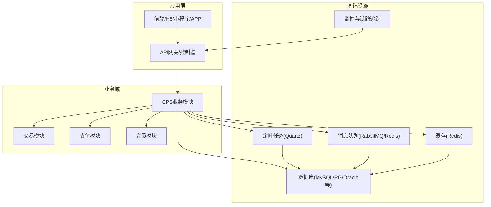
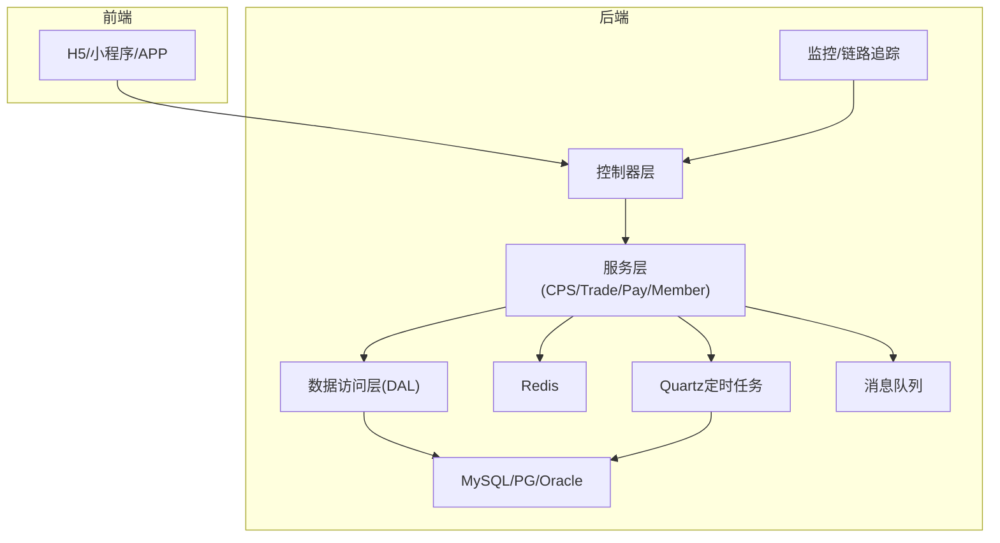
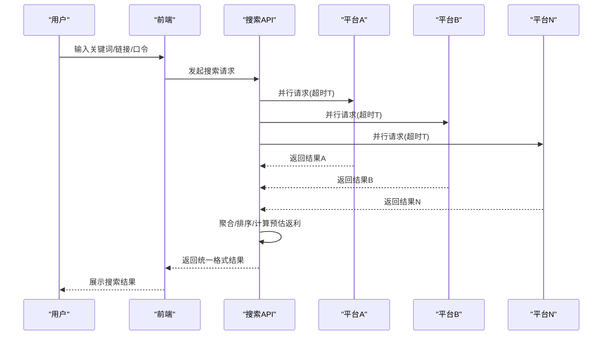
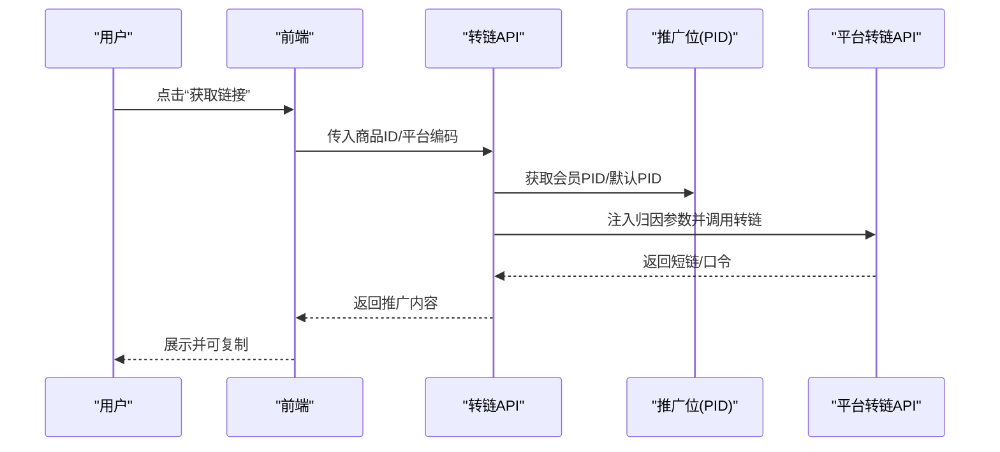
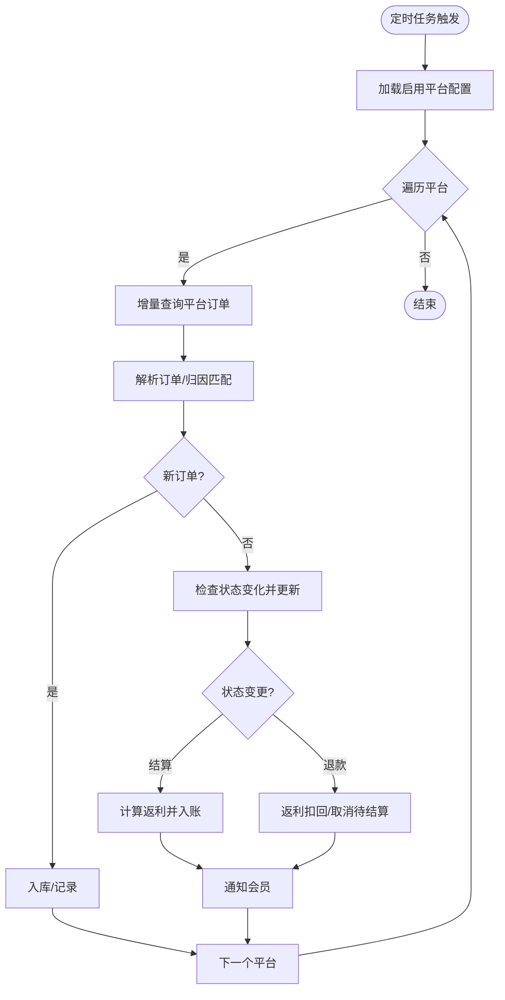
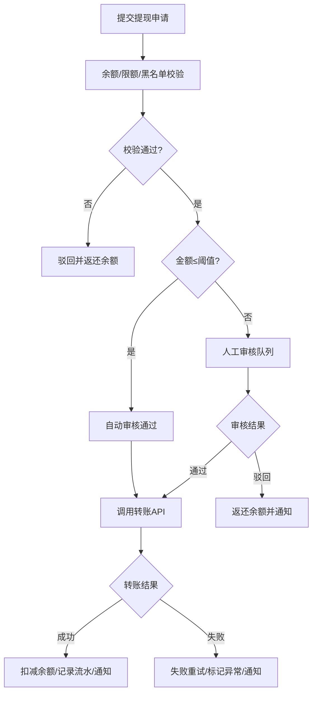
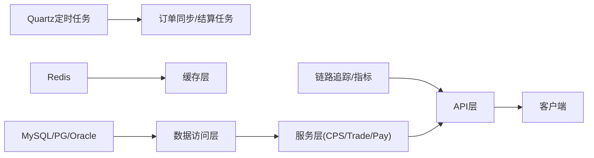

# 性能要求与指标

<cite>
**本文引用的文件**   
- [CPS系统PRD文档.md](file://docs/CPS系统PRD文档.md)
- [org.springframework.boot.autoconfigure.AutoConfiguration.imports](file://yudao-framework/yudao-spring-boot-starter-job/src/main/resources/META-INF/spring/org.springframework.boot.autoconfigure.AutoConfiguration.imports)
- [org.springframework.boot.autoconfigure.AutoConfiguration.imports](file://yudao-framework/yudao-spring-boot-starter-monitor/src/main/resources/META-INF/spring/org.springframework.boot.autoconfigure.AutoConfiguration.imports)
- [cps-schema.sql](file://sql/module/cps-schema.sql)
- [pay-2025-07-27.sql](file://sql/module/pay-2025-7-27.sql)
- [ruoyi-vue-pro.sql](file://sql/mysql/ruoyi-vue-pro.sql)
</cite>

## 目录
1. [引言](#引言)
2. [项目结构](#项目结构)
3. [核心组件](#核心组件)
4. [架构总览](#架构总览)
5. [详细组件分析](#详细组件分析)
6. [依赖分析](#依赖分析)
7. [性能考虑](#性能考虑)
8. [故障排查指南](#故障排查指南)
9. [结论](#结论)
10. [附录](#附录)

## 引言
本文件面向AgenticCPS系统，围绕其CPS（按成交计费）业务特性，制定系统级性能基准与监控指标，并结合现有PRD与工程化能力，给出可落地的优化实践与扩展性设计方案。重点指标包括：
- 单平台搜索响应时间（P99 < 2秒）
- 多平台比价处理时间（P99 < 5秒）
- 转链生成延迟（< 1秒）
- 订单同步延迟（< 30分钟）
- 返利入账时效（平台结算后24小时内）

这些指标直接关系到用户体验、转化效率与运营成本，需要在前端交互、后端接口、数据库与缓存、异步任务调度、链路追踪与监控等多个层面协同保障。

## 项目结构
AgenticCPS系统采用模块化分层架构，核心模块包括：
- yudao-module-cps：CPS业务域（商品搜索、比价、转链、订单同步、返利结算等）
- yudao-module-trade / yudao-module-pay：交易与支付域（订单、钱包、转账）
- yudao-module-member：会员域（用户、等级、积分等）
- yudao-framework：通用基础设施（定时任务、消息队列、监控、Redis、MyBatis等）
- yudao-server：应用启动与配置
- sql：数据库脚本（包含CPS与支付相关schema）

**章节来源**
- [CPS系统PRD文档.md:80-120](file://docs/CPS系统PRD文档.md#L80-L120)

## 核心组件
- 商品搜索与多平台比价：支持关键词、链接、口令识别，单平台优先展示，多平台并发查询后聚合排序。
- 推广链接生成：依据会员PID与平台归因参数，调用平台转链API生成短链/口令。
- 订单同步与结算：定时任务（每5分钟）增量拉取平台订单，匹配会员并进行返利结算与入账。
- 提现流程：余额校验、自动/人工审核、转账打款与异常处理。
- MCP（AI Agent）：通过MCP工具与资源提供搜索、比价、转链、订单状态查询等能力。

上述流程均体现高并发、低延迟与强一致性的平衡需求，是制定性能指标与优化策略的关键依据。

**章节来源**
- [CPS系统PRD文档.md:121-261](file://docs/CPS系统PRD文档.md#L121-L261)

## 架构总览
系统整体采用“微服务/模块化”组织，结合定时任务、消息队列与缓存，实现高吞吐与低延迟的协同：
- 前端通过API网关调用后端服务
- CPS域负责核心业务编排（搜索、比价、转链、订单同步、结算）
- 交易与支付域提供订单与钱包能力
- 基础设施提供任务调度、缓存与监控

**章节来源**
- [CPS系统PRD文档.md:80-120](file://docs/CPS系统PRD文档.md#L80-L120)
- [org.springframework.boot.autoconfigure.AutoConfiguration.imports:1-2](file://yudao-framework/yudao-spring-boot-starter-job/src/main/resources/META-INF/spring/org.springframework.boot.autoconfigure.AutoConfiguration.imports#L1-L2)
- [org.springframework.boot.autoconfigure.AutoConfiguration.imports:1-2](file://yudao-framework/yudao-spring-boot-starter-monitor/src/main/resources/META-INF/spring/org.springframework.boot.autoconfigure.AutoConfiguration.imports#L1-L2)

## 详细组件分析

### 单平台搜索与多平台比价（P99响应时间 < 2秒；P99处理时间 < 5秒）
- 业务要点
  - 单平台优先返回，提升首屏体验；多平台并发查询后聚合排序。
  - 比价需对各平台结果进行统一格式化与排序（价格/返利/销量）。
- 性能挑战
  - 平台API响应差异大，网络抖动与限流风险高。
  - 聚合与排序逻辑复杂度随平台数量增加而上升。
- 优化建议
  - 前端骨架屏与渐进式渲染，减少感知等待。
  - 并行调用平台API，设置合理超时与重试策略。
  - 结果缓存与排序结果缓存，降低重复计算。
  - 服务端限流与熔断，避免雪崩效应。
  - 链路追踪定位慢调用来源，持续优化热点路径。

**章节来源**
- [CPS系统PRD文档.md:121-150](file://docs/CPS系统PRD文档.md#L121-L150)

### 推广链接生成（转链延迟 < 1秒）
- 业务要点
  - 依据会员PID与平台归因参数，调用平台转链API生成短链/口令。
  - 需要注入adzone_id、subUnionId、custom_parameters等参数。
- 性能挑战
  - 平台转链API稳定性与响应时间波动较大。
  - 参数注入与签名/加密可能带来额外开销。
- 优化建议
  - 预热常用PID与参数模板，减少动态拼装。
  - 平台侧限流与重试策略，避免瞬时峰值。
  - 结果落库并缓存，支持快速复用与回放。
  - 链路追踪定位慢调用，优化参数注入与签名流程。

**章节来源**
- [CPS系统PRD文档.md:152-181](file://docs/CPS系统PRD文档.md#L152-L181)

### 订单同步与结算（同步延迟 < 30分钟；入账时效 < 24小时）
- 业务要点
  - 定时任务每5分钟增量拉取平台订单，解析归因并入库。
  - 订单状态变更（结算/退款）触发返利结算/扣回。
  - 返利入账后通知会员，余额可提现。
- 性能挑战
  - 平台API限流与数据量增长导致同步窗口压力。
  - 结算与入账涉及多表事务与幂等处理。
- 优化建议
  - 增量查询与分页拉取，避免全量扫描。
  - 并行处理不同平台的任务，设置平台级限流。
  - 异步化结算与入账，结合消息队列削峰填谷。
  - 严格幂等设计，确保重复执行不产生副作用。
  - 监控同步窗口与结算队列长度，及时扩容。

**章节来源**
- [CPS系统PRD文档.md:183-223](file://docs/CPS系统PRD文档.md#L183-L223)

### 提现流程（自动/人工审核、转账与通知）
- 业务要点
  - 余额校验、限额与黑名单检查。
  - 金额≤阈值自动审核，否则进入人工队列。
  - 转账成功/失败分别处理余额与异常标记。
- 性能挑战
  - 审核与转账环节串行化可能成为瓶颈。
  - 大促期间并发量激增，需弹性扩容。
- 优化建议
  - 审核阈值与规则可配置，支持灰度调整。
  - 转账异步化，失败重试与补偿。
  - 限流与排队，避免瞬时峰值。

**章节来源**
- [CPS系统PRD文档.md:225-261](file://docs/CPS系统PRD文档.md#L225-L261)

## 依赖分析
- 定时任务与异步
  - 通过Quartz自动配置启用定时任务与异步任务支持，用于订单同步与结算等周期性任务。
- 监控与链路追踪
  - 通过自动配置启用链路追踪与指标埋点，便于定位慢调用与异常。
- 数据库与缓存
  - CPS域与支付域均有独立schema与表结构，需关注跨域一致性与性能。
- 模块耦合
  - CPS域依赖交易与支付域的订单与钱包能力；需保证接口契约稳定与版本兼容。

**章节来源**
- [org.springframework.boot.autoconfigure.AutoConfiguration.imports:1-2](file://yudao-framework/yudao-spring-boot-starter-job/src/main/resources/META-INF/spring/org.springframework.boot.autoconfigure.AutoConfiguration.imports#L1-L2)
- [org.springframework.boot.autoconfigure.AutoConfiguration.imports:1-2](file://yudao-framework/yudao-spring-boot-starter-monitor/src/main/resources/META-INF/spring/org.springframework.boot.autoconfigure.AutoConfiguration.imports#L1-L2)

## 性能考虑
- 指标与基线
  - 单平台搜索P99 < 2秒；多平台比价P99 < 5秒；转链生成<1秒；订单同步<30分钟；平台结算后24小时内入账。
- 优化策略
  - 前端：骨架屏、渐进式渲染、结果缓存、懒加载。
  - 服务端：限流/熔断、超时与重试、幂等设计、异步化与消息队列削峰。
  - 数据库：索引优化、读写分离、分库分表、慢查询治理。
  - 缓存：热点数据预热、TTL与失效策略、缓存穿透防护。
  - 监控：端到端链路追踪、指标采集、告警阈值与根因分析。
- 扩展性设计
  - 垂直扩展：CPU/内存/IO升级，数据库主从与分片。
  - 水平扩展：服务拆分与限流、多实例部署、负载均衡。
  - 异步化：订单同步、结算、通知等流程异步化，提高吞吐。

[本节为通用指导，无需具体文件来源]

## 故障排查指南
- 常见问题
  - 搜索/比价超时：检查平台API连通性、限流与重试策略。
  - 转链失败：核对PID、归因参数与平台签名。
  - 订单未同步：检查定时任务配置、增量时间窗与平台返回。
  - 返利未入账：核对结算规则、平台结算状态与入账延迟。
  - 提现失败：检查余额、转账通道与风控策略。
- 排查步骤
  - 通过链路追踪定位慢调用与异常节点。
  - 查看定时任务执行日志与队列积压。
  - 核对缓存命中率与热点键。
  - 检查数据库慢查询与锁竞争。
- 监控建议
  - 关键指标：请求时延P99/P95、错误率、超时率、队列长度、缓存命中率。
  - 告警阈值：针对P99时延、错误率、队列堆积与数据库慢查询设置分级告警。

[本节为通用指导，无需具体文件来源]

## 结论
AgenticCPS系统在CPS业务场景下，需在“低延迟、高并发、强一致”之间取得平衡。通过明确的性能指标、完善的监控体系与系统化的优化策略，可在保证用户体验的同时，持续提升系统的稳定性与扩展性。建议以定时任务、缓存与异步化为核心抓手，配合限流与熔断、链路追踪与指标监控，形成闭环的性能治理体系。

[本节为总结性内容，无需具体文件来源]

## 附录
- 数据库脚本参考
  - CPS域schema与表结构：[cps-schema.sql](file://sql/module/cps-schema.sql)
  - 支付域相关脚本：[pay-2025-07-27.sql](file://sql/module/pay-2025-7-27.sql)
  - 主库初始化脚本：[ruoyi-vue-pro.sql](file://sql/mysql/ruoyi-vue-pro.sql)

**章节来源**
- [cps-schema.sql](file://sql/module/cps-schema.sql)
- [pay-2025-07-27.sql](file://sql/module/pay-2025-7-27.sql)
- [ruoyi-vue-pro.sql](file://sql/mysql/ruoyi-vue-pro.sql)