# 技术栈概览

<cite>
**本文引用的文件**
- [pom.xml](file://pom.xml)
- [qiji-server/pom.xml](file://qiji-server/pom.xml)
- [qiji-dependencies/pom.xml](file://qiji-dependencies/pom.xml)
- [qiji-server/src/main/resources/application.yaml](file://qiji-server/src/main/resources/application.yaml)
- [qiji-framework/qiji-spring-boot-starter-web/pom.xml](file://qiji-framework/qiji-spring-boot-starter-web/pom.xml)
- [qiji-framework/qiji-spring-boot-starter-security/pom.xml](file://qiji-framework/qiji-spring-boot-starter-security/pom.xml)
- [qiji-framework/qiji-spring-boot-starter-mybatis/pom.xml](file://qiji-framework/qiji-spring-boot-starter-mybatis/pom.xml)
- [qiji-framework/qiji-spring-boot-starter-redis/pom.xml](file://qiji-framework/qiji-spring-boot-starter-redis/pom.xml)
- [qiji-framework/qiji-spring-boot-starter-mq/pom.xml](file://qiji-framework/qiji-spring-boot-starter-mq/pom.xml)
- [qiji-ui-admin-vue3/README.md](file://qiji-ui/qiji-ui-admin-vue3/README.md)
- [qiji-ui-admin-uniapp/README.md](file://qiji-ui/qiji-ui-admin-uniapp/README.md)
- [qiji-module-cps/pom.xml](file://qiji-module-cps/pom.xml)
</cite>

## 目录
1. [简介](#简介)
2. [项目结构](#项目结构)
3. [核心组件](#核心组件)
4. [架构总览](#架构总览)
5. [详细组件分析](#详细组件分析)
6. [依赖分析](#依赖分析)
7. [性能考虑](#性能考虑)
8. [故障排查指南](#故障排查指南)
9. [结论](#结论)
10. [附录](#附录)

## 简介
AgenticCPS 项目基于统一的后端技术栈（Spring Boot 3.x + MyBatis Plus）与现代化前端技术（Vue3 + Element Plus + UniApp），结合多数据库与多消息队列支持，以及完善的缓存与安全体系，形成高扩展、高性能、易维护的企业级应用架构。本文档从技术选型、组件职责、依赖关系、性能与安全等方面进行全面梳理，并提供学习路径与参考资料，帮助开发者快速掌握项目所需技能。

## 项目结构
项目采用多模块聚合工程组织方式，后端主工程通过模块化拆分实现功能域隔离与复用，前端提供管理后台（Vue3 + Element Plus）与跨端应用（UniApp）两套实现。

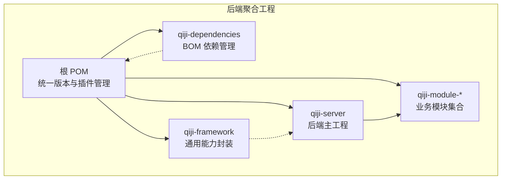

**图表来源**
- [pom.xml:10-25](file://pom.xml#L10-L25)
- [qiji-server/pom.xml:23-99](file://qiji-server/pom.xml#L23-L99)

**章节来源**
- [pom.xml:10-25](file://pom.xml#L10-L25)
- [qiji-server/pom.xml:23-99](file://qiji-server/pom.xml#L23-L99)

## 核心组件
- 后端技术栈
  - 框架：Spring Boot 3.5.9（Java 17）
  - ORM：MyBatis Plus 3.5.15（含联表查询、动态数据源、代码生成）
  - 缓存：Redis + Redisson（分布式锁、限流、缓存）
  - 安全：Spring Security + Token + Redis（会话与鉴权）
  - 消息队列：Event（本地事件）、Redis（Pub/Sub/Stream）、RabbitMQ、Kafka、RocketMQ
  - 监控与可观测性：SkyWalking、Spring Boot Admin
  - 接口文档：Knife4j + SpringDoc OpenAPI
  - 工具库：Hutool、MapStruct、Guava、OkHttp、JustAuth 等
- 前端技术栈
  - 管理后台：Vue3 + Element Plus
  - 跨端应用：Vue + UniApp
- 数据库与中间件
  - 数据库：MySQL 8.0+（含多方言驱动）
  - 缓存：Redis 6.0+
  - 消息队列：Event、Redis、RabbitMQ、Kafka、RocketMQ

**章节来源**
- [qiji-dependencies/pom.xml:16-82](file://qiji-dependencies/pom.xml#L16-L82)
- [qiji-server/src/main/resources/application.yaml:120-145](file://qiji-server/src/main/resources/application.yaml#L120-L145)
- [qiji-framework/qiji-spring-boot-starter-web/pom.xml:18-49](file://qiji-framework/qiji-spring-boot-starter-web/pom.xml#L18-L49)
- [qiji-framework/qiji-spring-boot-starter-security/pom.xml:21-48](file://qiji-framework/qiji-spring-boot-starter-security/pom.xml#L21-L48)
- [qiji-framework/qiji-spring-boot-starter-mybatis/pom.xml:32-98](file://qiji-framework/qiji-spring-boot-starter-mybatis/pom.xml#L32-L98)
- [qiji-framework/qiji-spring-boot-starter-redis/pom.xml:24-38](file://qiji-framework/qiji-spring-boot-starter-redis/pom.xml#L24-L38)
- [qiji-framework/qiji-spring-boot-starter-mq/pom.xml:18-41](file://qiji-framework/qiji-spring-boot-starter-mq/pom.xml#L18-L41)
- [qiji-ui-admin-vue3/README.md:1-5](file://qiji-ui/qiji-ui-admin-vue3/README.md#L1-L5)
- [qiji-ui-admin-uniapp/README.md:1-5](file://qiji-ui/qiji-ui-admin-uniapp/README.md#L1-L5)

## 架构总览
后端通过 qiji-server 聚合各业务模块，统一对外提供 REST API；前端分别对接管理后台与跨端应用。消息队列支持多种实现，满足不同场景的异步与解耦需求；缓存与安全框架贯穿服务层，保障性能与访问控制。

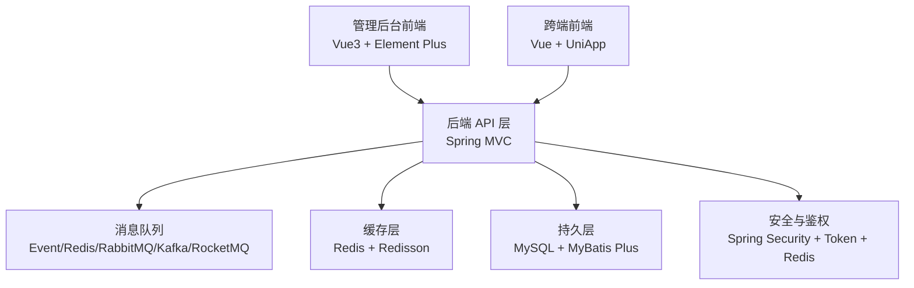

**图表来源**
- [qiji-server/src/main/resources/application.yaml:120-145](file://qiji-server/src/main/resources/application.yaml#L120-L145)
- [qiji-framework/qiji-spring-boot-starter-mq/pom.xml:18-41](file://qiji-framework/qiji-spring-boot-starter-mq/pom.xml#L18-L41)
- [qiji-framework/qiji-spring-boot-starter-redis/pom.xml:24-38](file://qiji-framework/qiji-spring-boot-starter-redis/pom.xml#L24-L38)
- [qiji-framework/qiji-spring-boot-starter-mybatis/pom.xml:32-98](file://qiji-framework/qiji-spring-boot-starter-mybatis/pom.xml#L32-L98)
- [qiji-framework/qiji-spring-boot-starter-security/pom.xml:21-48](file://qiji-framework/qiji-spring-boot-starter-security/pom.xml#L21-L48)

## 详细组件分析

### 后端框架与模块化
- 聚合工程与版本管理
  - 根 POM 定义模块清单与统一版本属性，qiji-dependencies 作为 BOM 管理依赖版本，确保一致性与升级便捷性。
- qiji-server
  - 作为后端主工程，按需引入各业务模块依赖，打包为可执行的 Spring Boot 应用。
- qiji-framework
  - 提供通用能力封装（Web、Security、MyBatis、Redis、MQ、监控、保护等），降低模块重复实现成本。

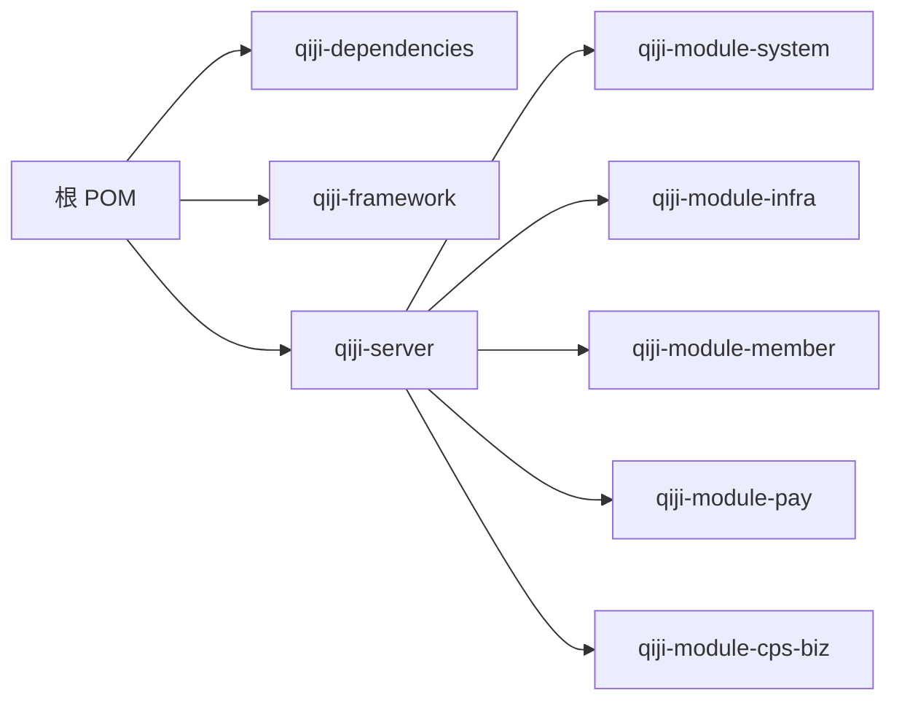

**图表来源**
- [pom.xml:10-25](file://pom.xml#L10-L25)
- [qiji-server/pom.xml:23-99](file://qiji-server/pom.xml#L23-L99)
- [qiji-dependencies/pom.xml:84-100](file://qiji-dependencies/pom.xml#L84-L100)

**章节来源**
- [pom.xml:10-25](file://pom.xml#L10-L25)
- [qiji-server/pom.xml:23-99](file://qiji-server/pom.xml#L23-L99)
- [qiji-dependencies/pom.xml:84-100](file://qiji-dependencies/pom.xml#L84-L100)

### Web 与接口文档
- Web 框架
  - 基于 Spring Boot Starter Web，集成 Knife4j 与 SpringDoc OpenAPI，提供在线接口文档与调试体验。
- 全局异常、日志、脱敏与错误码
  - 通过 qiji-common 与 Web Starter 提供统一处理，减少重复代码。

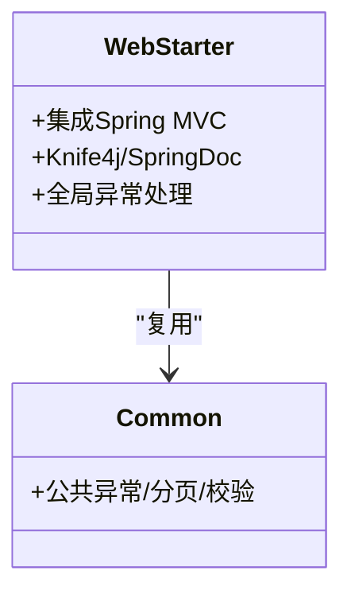

**图表来源**
- [qiji-framework/qiji-spring-boot-starter-web/pom.xml:18-49](file://qiji-framework/qiji-spring-boot-starter-web/pom.xml#L18-L49)

**章节来源**
- [qiji-framework/qiji-spring-boot-starter-web/pom.xml:18-49](file://qiji-framework/qiji-spring-boot-starter-web/pom.xml#L18-L49)

### 安全与鉴权
- 安全框架
  - Spring Security + Token + Redis 实现会话与鉴权，支持操作日志记录与权限控制。
- 配置要点
  - application.yaml 中包含安全放行列表、API 加密开关与算法等配置项。

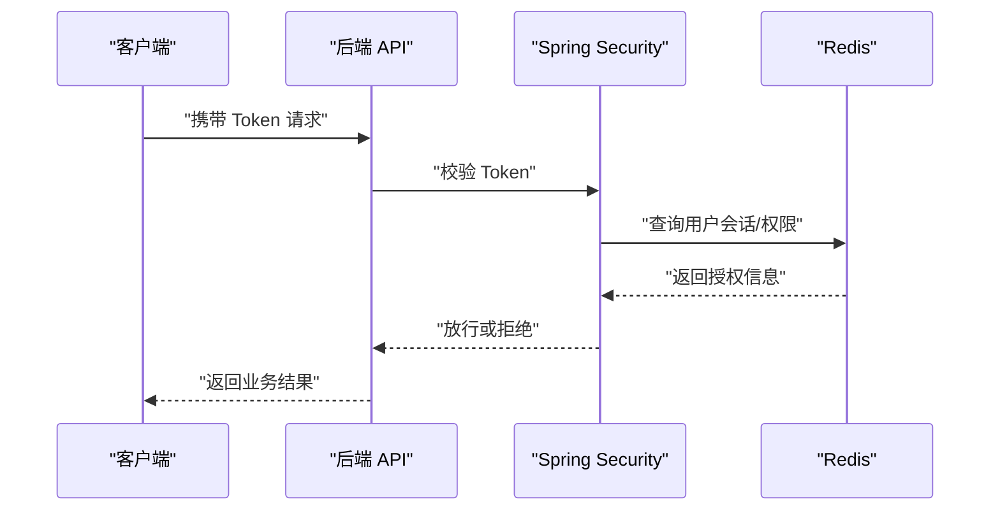

**图表来源**
- [qiji-server/src/main/resources/application.yaml:272-281](file://qiji-server/src/main/resources/application.yaml#L272-L281)

**章节来源**
- [qiji-framework/qiji-spring-boot-starter-security/pom.xml:21-48](file://qiji-framework/qiji-spring-boot-starter-security/pom.xml#L21-L48)
- [qiji-server/src/main/resources/application.yaml:272-281](file://qiji-server/src/main/resources/application.yaml#L272-L281)

### 数据库与 ORM
- MyBatis Plus
  - 提供代码生成、多数据源、动态表关联查询、逻辑删除等能力，适配 MySQL 8.0+ 与多数据库方言。
- 连接池与监控
  - Druid 连接池与监控，配合 MyBatis Plus 全局配置优化 SQL 性能。

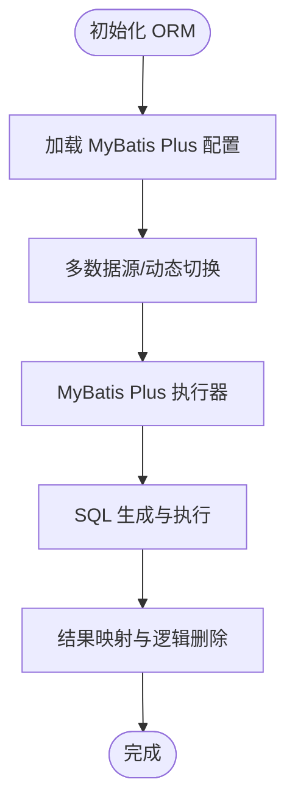

**图表来源**
- [qiji-framework/qiji-spring-boot-starter-mybatis/pom.xml:32-98](file://qiji-framework/qiji-spring-boot-starter-mybatis/pom.xml#L32-L98)
- [qiji-server/src/main/resources/application.yaml:66-82](file://qiji-server/src/main/resources/application.yaml#L66-L82)

**章节来源**
- [qiji-framework/qiji-spring-boot-starter-mybatis/pom.xml:32-98](file://qiji-framework/qiji-spring-boot-starter-mybatis/pom.xml#L32-L98)
- [qiji-server/src/main/resources/application.yaml:66-82](file://qiji-server/src/main/resources/application.yaml#L66-L82)

### 缓存与分布式能力
- Redis 与 Redisson
  - 提供缓存、分布式锁、限流、布隆过滤器等能力，支撑高并发场景。
- 配置要点
  - Cache 类型为 REDIS，TTL 为 1 小时；Redisson Starter 提供自动装配。

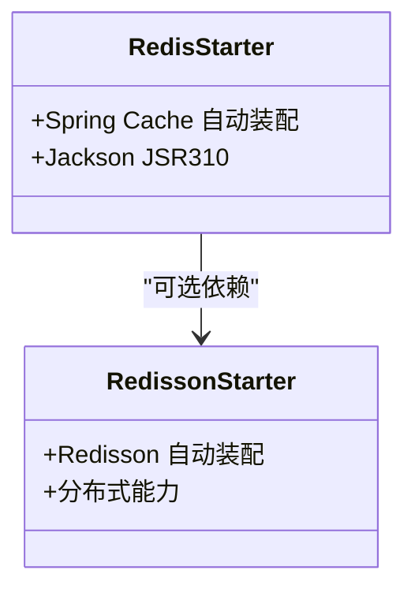

**图表来源**
- [qiji-framework/qiji-spring-boot-starter-redis/pom.xml:18-38](file://qiji-framework/qiji-spring-boot-starter-redis/pom.xml#L18-L38)

**章节来源**
- [qiji-framework/qiji-spring-boot-starter-redis/pom.xml:18-38](file://qiji-framework/qiji-spring-boot-starter-redis/pom.xml#L18-L38)
- [qiji-server/src/main/resources/application.yaml:26-31](file://qiji-server/src/main/resources/application.yaml#L26-L31)

### 消息队列支持
- 多实现支持
  - Event（本地事件）、Redis（Pub/Sub/Stream）、RabbitMQ、Kafka、RocketMQ。
- 配置要点
  - application.yaml 中包含 RocketMQ、Kafka 的生产者/消费者配置示例。

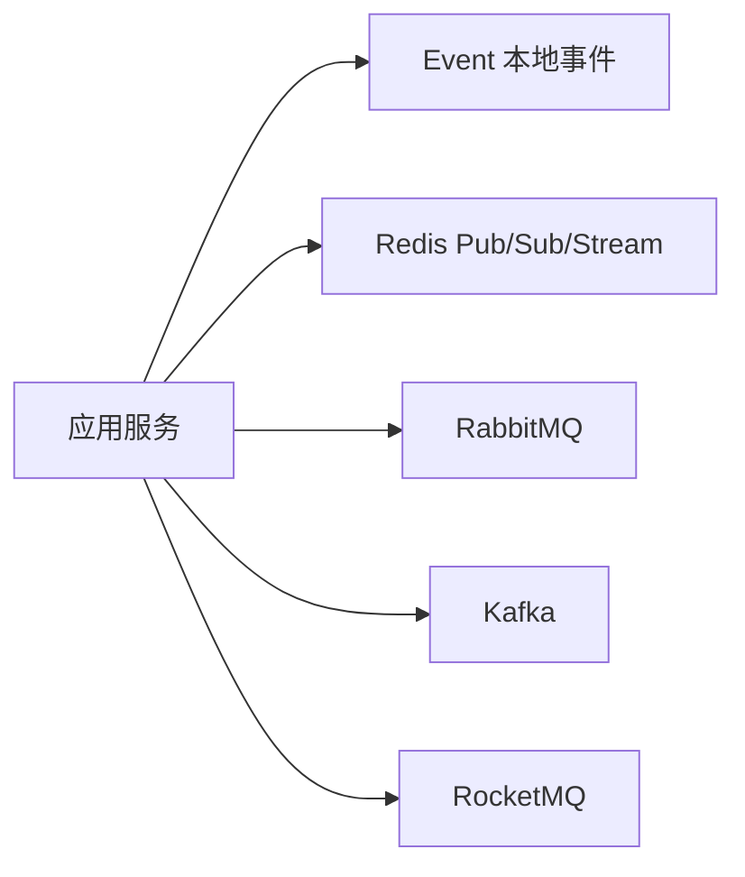

**图表来源**
- [qiji-framework/qiji-spring-boot-starter-mq/pom.xml:18-41](file://qiji-framework/qiji-spring-boot-starter-mq/pom.xml#L18-L41)
- [qiji-server/src/main/resources/application.yaml:120-145](file://qiji-server/src/main/resources/application.yaml#L120-L145)

**章节来源**
- [qiji-framework/qiji-spring-boot-starter-mq/pom.xml:18-41](file://qiji-framework/qiji-spring-boot-starter-mq/pom.xml#L18-L41)
- [qiji-server/src/main/resources/application.yaml:120-145](file://qiji-server/src/main/resources/application.yaml#L120-L145)

### 前端架构
- 管理后台
  - Vue3 + Element Plus，提供现代化管理界面。
- 跨端应用
  - Vue + UniApp，一套代码多端运行（H5、小程序、App）。
- 项目定位
  - qiji-ui 下包含管理后台与跨端两个独立仓库地址。

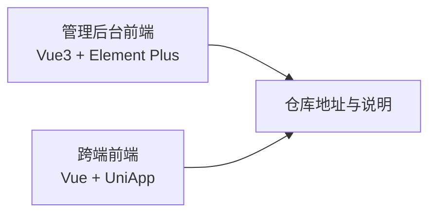

**图表来源**
- [qiji-ui-admin-vue3/README.md:1-5](file://qiji-ui/qiji-ui-admin-vue3/README.md#L1-L5)
- [qiji-ui-admin-uniapp/README.md:1-5](file://qiji-ui/qiji-ui-admin-uniapp/README.md#L1-L5)

**章节来源**
- [qiji-ui-admin-vue3/README.md:1-5](file://qiji-ui/qiji-ui-admin-vue3/README.md#L1-L5)
- [qiji-ui-admin-uniapp/README.md:1-5](file://qiji-ui/qiji-ui-admin-uniapp/README.md#L1-L5)

### 业务模块：CPS 联盟返利系统
- 模块定位
  - qiji-module-cps 提供多平台 CPS 联盟接入、商品搜索比价、返利管理、提现等功能。
- 结构
  - 聚合模块，包含 qiji-module-cps-biz 子模块。

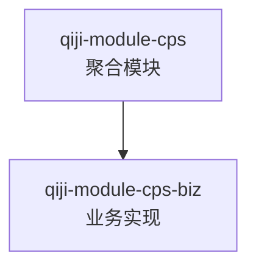

**图表来源**
- [qiji-module-cps/pom.xml:20-22](file://qiji-module-cps/pom.xml#L20-L22)

**章节来源**
- [qiji-module-cps/pom.xml:20-22](file://qiji-module-cps/pom.xml#L20-L22)

## 依赖分析
- 版本与依赖管理
  - qiji-dependencies 作为 BOM，集中管理 Spring Boot、MyBatis Plus、Redisson、RocketMQ、SkyWalking 等关键依赖版本。
- 模块间依赖
  - qiji-server 通过引入 qiji-module-* 依赖聚合业务能力；qiji-framework 为各模块提供通用能力封装。

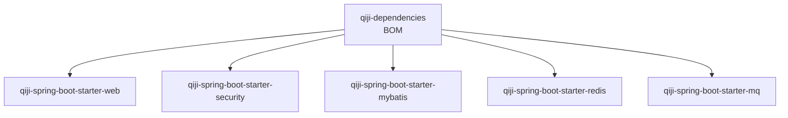

**图表来源**
- [qiji-dependencies/pom.xml:84-100](file://qiji-dependencies/pom.xml#L84-L100)
- [qiji-framework/qiji-spring-boot-starter-web/pom.xml:18-49](file://qiji-framework/qiji-spring-boot-starter-web/pom.xml#L18-L49)
- [qiji-framework/qiji-spring-boot-starter-security/pom.xml:21-48](file://qiji-framework/qiji-spring-boot-starter-security/pom.xml#L21-L48)
- [qiji-framework/qiji-spring-boot-starter-mybatis/pom.xml:32-98](file://qiji-framework/qiji-spring-boot-starter-mybatis/pom.xml#L32-L98)
- [qiji-framework/qiji-spring-boot-starter-redis/pom.xml:18-38](file://qiji-framework/qiji-spring-boot-starter-redis/pom.xml#L18-L38)
- [qiji-framework/qiji-spring-boot-starter-mq/pom.xml:18-41](file://qiji-framework/qiji-spring-boot-starter-mq/pom.xml#L18-L41)

**章节来源**
- [qiji-dependencies/pom.xml:84-100](file://qiji-dependencies/pom.xml#L84-L100)
- [qiji-framework/qiji-spring-boot-starter-web/pom.xml:18-49](file://qiji-framework/qiji-spring-boot-starter-web/pom.xml#L18-L49)
- [qiji-framework/qiji-spring-boot-starter-security/pom.xml:21-48](file://qiji-framework/qiji-spring-boot-starter-security/pom.xml#L21-L48)
- [qiji-framework/qiji-spring-boot-starter-mybatis/pom.xml:32-98](file://qiji-framework/qiji-spring-boot-starter-mybatis/pom.xml#L32-L98)
- [qiji-framework/qiji-spring-boot-starter-redis/pom.xml:18-38](file://qiji-framework/qiji-spring-boot-starter-redis/pom.xml#L18-L38)
- [qiji-framework/qiji-spring-boot-starter-mq/pom.xml:18-41](file://qiji-framework/qiji-spring-boot-starter-mq/pom.xml#L18-L41)

## 性能考虑
- ORM 与 SQL
  - 使用 MyBatis Plus 与联表查询增强器，合理设计索引与分页，避免 N+1 查询。
- 缓存策略
  - 利用 Redis 缓存热点数据，结合 Redisson 分布式锁与限流，降低数据库压力。
- 消息队列
  - 根据场景选择 Event（本地）、Redis（轻量广播/流）、RabbitMQ/Kafka/RocketMQ（高吞吐/可靠投递）。
- 并发与限流
  - 借助 Redisson 与网关/服务端限流策略，控制突发流量。
- 监控与追踪
  - SkyWalking 与 Spring Boot Admin 提供链路追踪与运行态监控，便于性能瓶颈定位。

## 故障排查指南
- 接口文档不可用
  - 检查 Knife4j 与 SpringDoc 开关与路径配置。
- 缓存异常
  - 核对 Redis 连接、TTL、序列化配置。
- 安全相关问题
  - 检查 Token 校验、Redis 会话状态、放行 URL 列表。
- 消息队列收发异常
  - 根据配置核对 RocketMQ/Kafka/RabbitMQ 的 Topic/Group、序列化器与信任包配置。
- 数据库连接与 SQL
  - 检查 Druid 连接池配置、MyBatis Plus 全局配置与逻辑删除字段。

**章节来源**
- [qiji-server/src/main/resources/application.yaml:40-54](file://qiji-server/src/main/resources/application.yaml#L40-L54)
- [qiji-server/src/main/resources/application.yaml:90-119](file://qiji-server/src/main/resources/application.yaml#L90-L119)
- [qiji-server/src/main/resources/application.yaml:120-145](file://qiji-server/src/main/resources/application.yaml#L120-L145)
- [qiji-server/src/main/resources/application.yaml:26-31](file://qiji-server/src/main/resources/application.yaml#L26-L31)
- [qiji-server/src/main/resources/application.yaml:272-281](file://qiji-server/src/main/resources/application.yaml#L272-L281)

## 结论
AgenticCPS 项目通过 Spring Boot 3.x + MyBatis Plus 的稳定组合，配合 Redis/Redisson 的高性能缓存与分布式能力，以及多消息队列与安全框架，构建了高可用、可扩展的企业级后端技术栈。前端采用 Vue3 + Element Plus 与 UniApp，覆盖管理后台与跨端场景。整体架构清晰、模块化程度高，适合团队协作与长期演进。

## 附录
- 学习路径建议
  - 后端：Spring Boot 入门 → MyBatis Plus 实战 → Redis/Redisson 实战 → 消息队列实战（Event/Redis/RabbitMQ/Kafka/RocketMQ）→ 安全与鉴权 → 监控与可观测性
  - 前端：Vue3 + Element Plus 基础 → 组件化与状态管理 → 跨端开发（UniApp）→ 接口对接与调试
- 参考资料
  - Spring Boot 官方文档
  - MyBatis Plus 官方文档
  - Redis 官方文档与 Redisson 官方文档
  - 各消息队列官方文档（RabbitMQ、Kafka、RocketMQ）
  - Vue3 官方文档与 Element Plus 官方文档
  - UniApp 官方文档