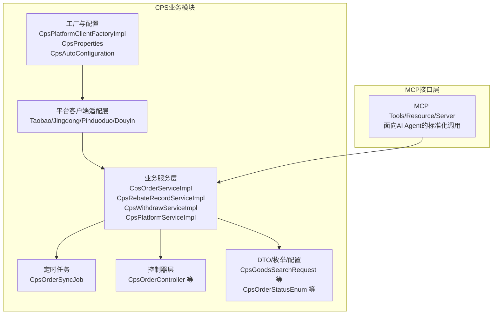
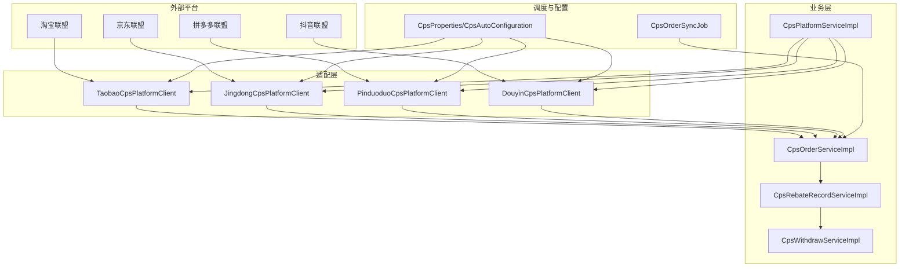
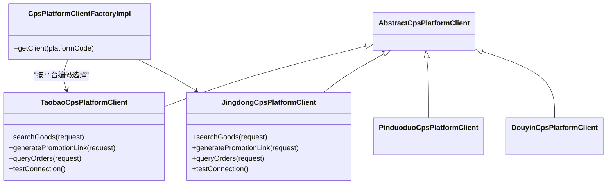
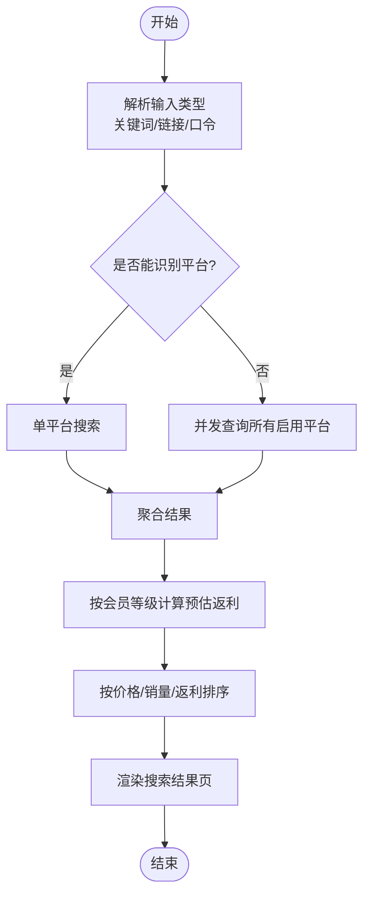
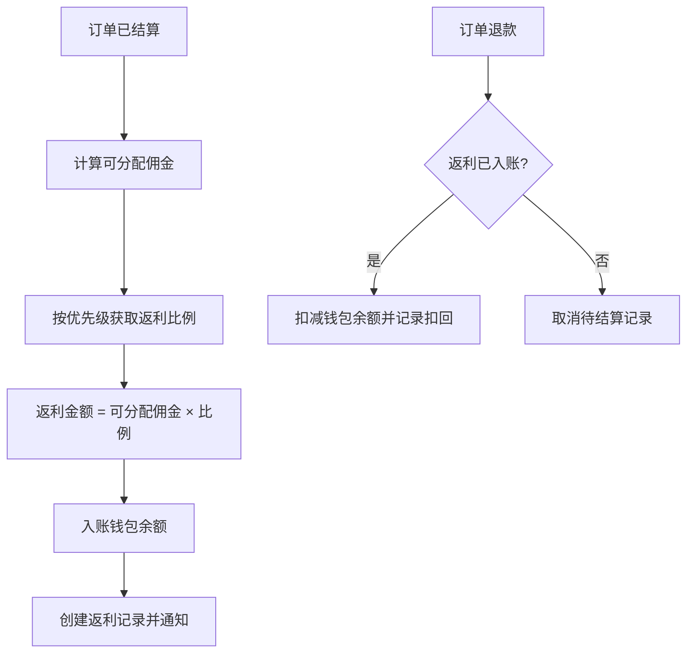
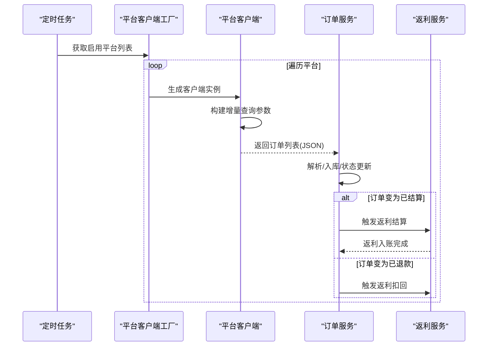
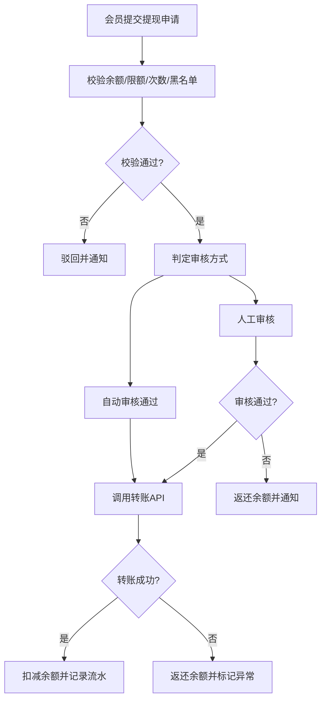
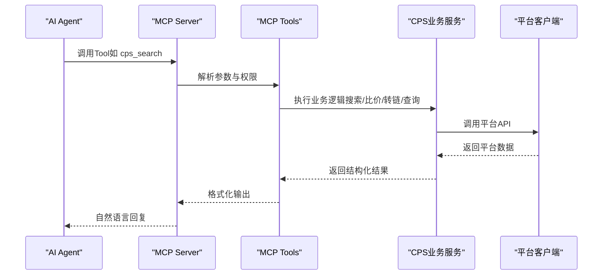
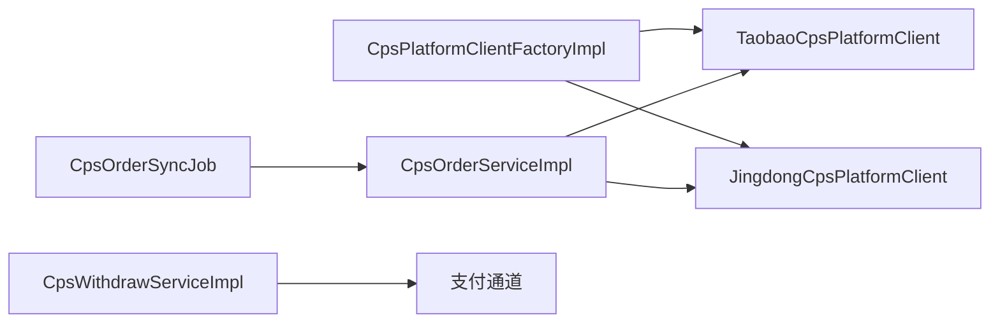

# 核心功能特性

<cite>
**本文引用的文件**
- [CPS系统PRD文档.md](file://docs/CPS系统PRD文档.md)
- [TaobaoCpsPlatformClient.java](file://yudao-module-cps/yudao-module-cps-biz/src/main/java/cn/zhijian/cps/client/TaobaoCpsPlatformClient.java)
- [JingdongCpsPlatformClient.java](file://yudao-module-cps/yudao-module-cps-biz/src/main/java/cn/zhijian/cps/client/JingdongCpsPlatformClient.java)
- [PinduoduoCpsPlatformClient.java](file://yudao-module-cps/yudao-module-cps-biz/src/main/java/cn/zhijian/cps/client/PinduoduoCpsPlatformClient.java)
- [DouyinCpsPlatformClient.java](file://yudao-module-cps/yudao-module-cps-biz/src/main/java/cn/zhijian/cps/client/DouyinCpsPlatformClient.java)
- [CpsPlatformClientFactoryImpl.java](file://yudao-module-cps/yudao-module-cps-biz/src/main/java/cn/zhijian/cps/CpsPlatformClientFactoryImpl.java)
- [CpsOrderSyncJob.java](file://yudao-module-cps/yudao-module-cps-biz/src/main/java/cn/zhijian/cps/job/CpsOrderSyncJob.java)
- [CpsAdzoneServiceImpl.java](file://yudao-module-cps/yudao-module-cps-biz/src/main/java/cn/zhijian/cps/service/CpsAdzoneServiceImpl.java)
- [CpsOrderServiceImpl.java](file://yudao-module-cps/yudao-module-cps-biz/src/main/java/cn/zhijian/cps/service/CpsOrderServiceImpl.java)
- [CpsRebateRecordServiceImpl.java](file://yudao-module-cps/yudao-module-cps-biz/src/main/java/cn/zhijian/cps/service/CpsRebateRecordServiceImpl.java)
- [CpsWithdrawServiceImpl.java](file://yudao-module-cps/yudao-module-cps-biz/src/main/java/cn/zhijian/cps/service/CpsWithdrawServiceImpl.java)
- [CpsPlatformServiceImpl.java](file://yudao-module-cps/yudao-module-cps-biz/src/main/java/cn/zhijian/cps/service/CpsPlatformServiceImpl.java)
- [CpsRebateConfigServiceImpl.java](file://yudao-module-cps/yudao-module-cps-biz/src/main/java/cn/zhijian/cps/service/CpsRebateConfigServiceImpl.java)
- [CpsStatisticsServiceImpl.java](file://yudao-module-cps/yudao-module-cps-biz/src/main/java/cn/zhijian/cps/service/CpsStatisticsServiceImpl.java)
- [CpsGoodsSearchRequest.java](file://yudao-module-cps/yudao-module-cps-biz/src/main/java/cn/zhijian/cps/client/dto/CpsGoodsSearchRequest.java)
- [CpsGoodsDetailRequest.java](file://yudao-module-cps/yudao-module-cps-biz/src/main/java/cn/zhijian/cps/client/dto/CpsGoodsDetailRequest.java)
- [CpsGoodsDetail.java](file://yudao-module-cps/yudao-module-cps-biz/src/main/java/cn/zhijian/cps/client/dto/CpsGoodsDetail.java)
- [CpsParsedContent.java](file://yudao-module-cps/yudao-module-cps-biz/src/main/java/cn/zhijian/cps/client/dto/CpsParsedContent.java)
- [CpsPromotionLinkRequest.java](file://yudao-module-cps/yudao-module-cps-biz/src/main/java/cn/zhijian/cps/client/dto/CpsPromotionLinkRequest.java)
- [CpsPromotionLink.java](file://yudao-module-cps/yudao-module-cps-biz/src/main/java/cn/zhijian/cps/client/dto/CpsPromotionLink.java)
- [CpsOrderQueryRequest.java](file://yudao-module-cps/yudao-module-cps-biz/src/main/java/cn/zhijian/cps/client/dto/CpsOrderQueryRequest.java)
- [CpsOrderDTO.java](file://yudao-module-cps/yudao-module-cps-biz/src/main/java/cn/zhijian/cps/client/dto/CpsOrderDTO.java)
- [CpsProperties.java](file://yudao-module-cps/yudao-module-cps-biz/src/main/java/cn/zhijian/cps/config/CpsProperties.java)
- [CpsAutoConfiguration.java](file://yudao-module-cps/yudao-module-cps-biz/src/main/java/cn/zhijian/cps/config/CpsAutoConfiguration.java)
- [CpsOrderSyncConfig.java](file://yudao-module-cps/yudao-module-cps-biz/src/main/java/cn/zhijian/cps/config/CpsOrderSyncConfig.java)
- [CpsAdzoneTypeEnum.java](file://yudao-module-cps/yudao-module-cps-biz/src/main/java/cn/zhijian/cps/enums/CpsAdzoneTypeEnum.java)
- [CpsOrderStatusEnum.java](file://yudao-module-cps/yudao-module-cps-biz/src/main/java/cn/zhijian/cps/enums/CpsOrderStatusEnum.java)
- [CpsPlatformCodeEnum.java](file://yudao-module-cps/yudao-module-cps-biz/src/main/java/cn/zhijian/cps/enums/CpsPlatformCodeEnum.java)
- [CpsRebateStatusEnum.java](file://yudao-module-cps/yudao-module-cps-biz/src/main/java/cn/zhijian/cps/enums/CpsRebateStatusEnum.java)
- [CpsRebateTypeEnum.java](file://yudao-module-cps/yudao-module-cps-biz/src/main/java/cn/zhijian/cps/enums/CpsRebateTypeEnum.java)
- [CpsWithdrawStatusEnum.java](file://yudao-module-cps/yudao-module-cps-biz/src/main/java/cn/zhijian/cps/enums/CpsWithdrawStatusEnum.java)
- [CpsWithdrawTypeEnum.java](file://yudao-module-cps/yudao-module-cps-biz/src/main/java/cn/zhijian/cps/enums/CpsWithdrawTypeEnum.java)
</cite>

## 目录
1. [引言](#引言)
2. [项目结构](#项目结构)
3. [核心组件](#核心组件)
4. [架构总览](#架构总览)
5. [详细组件分析](#详细组件分析)
6. [依赖分析](#依赖分析)
7. [性能考虑](#性能考虑)
8. [故障排查指南](#故障排查指南)
9. [结论](#结论)
10. [附录](#附录)

## 引言
本文件面向AgenticCPS系统，聚焦CPS联盟返利系统的五大核心功能模块：多平台CPS接入、商品搜索与比价、会员返利体系、订单全链路追踪、提现管理，并深入阐述MCP AI接口层如何基于Model Context Protocol（MCP）协议为AI Agent提供标准化的CPS服务调用接口。文档通过“PRD”与源码双轨并行的方式，既给出业务蓝图，也给出技术实现细节，帮助开发者快速理解系统架构与协作关系。

## 项目结构
AgenticCPS系统采用模块化分层架构，核心能力集中在yudao-module-cps模块，围绕“平台客户端适配层 + 业务服务层 + 控制器层 + 配置与枚举 + DTO与枚举 + 作业调度”的组织方式展开。MCP接口层位于同一模块下，提供AI Agent可调用的Tools与Resources。

**图表来源**
- [CpsPlatformClientFactoryImpl.java](file://yudao-module-cps/yudao-module-cps-biz/src/main/java/cn/zhijian/cps/CpsPlatformClientFactoryImpl.java)
- [CpsOrderServiceImpl.java](file://yudao-module-cps/yudao-module-cps-biz/src/main/java/cn/zhijian/cps/service/CpsOrderServiceImpl.java)
- [CpsOrderSyncJob.java](file://yudao-module-cps/yudao-module-cps-biz/src/main/java/cn/zhijian/cps/job/CpsOrderSyncJob.java)
- [CpsProperties.java](file://yudao-module-cps/yudao-module-cps-biz/src/main/java/cn/zhijian/cps/config/CpsProperties.java)

**章节来源**
- [CPS系统PRD文档.md](file://docs/CPS系统PRD文档.md)
- [CpsPlatformClientFactoryImpl.java](file://yudao-module-cps/yudao-module-cps-biz/src/main/java/cn/zhijian/cps/CpsPlatformClientFactoryImpl.java)
- [CpsProperties.java](file://yudao-module-cps/yudao-module-cps-biz/src/main/java/cn/zhijian/cps/config/CpsProperties.java)

## 核心组件
- 多平台CPS接入：封装淘宝、京东、拼多多、抖音等平台的API适配器，统一请求签名、参数构建、响应解析与状态映射。
- 商品搜索与比价：支持关键词/链接/口令解析，聚合多平台结果，按价格、销量、返利排序；提供跨平台比价视图。
- 会员返利体系：基于会员等级、平台策略与个人专属配置，计算可分配佣金与返利比例，生成返利记录并入账钱包。
- 订单全链路追踪：定时任务增量拉取平台订单，进行状态归因匹配、结算与返利入账，支持退款扣回。
- 提现管理：校验余额、限额与风控规则，支持自动/人工审核，调用支付通道打款并记录流水。
- MCP AI接口层：通过MCP Tools（搜索/比价/转链/订单/返利）与Resources（如订单状态资源）向AI Agent提供标准化调用。

**章节来源**
- [CPS系统PRD文档.md](file://docs/CPS系统PRD文档.md)

## 架构总览
系统以“平台客户端适配层 + 业务服务层 + 定时任务 + 控制器 + DTO/枚举 + 配置”为核心，结合MCP接口层，形成“多平台数据聚合、统一业务编排、自动化结算与AI智能服务”的闭环。

**图表来源**
- [TaobaoCpsPlatformClient.java](file://yudao-module-cps/yudao-module-cps-biz/src/main/java/cn/zhijian/cps/client/TaobaoCpsPlatformClient.java)
- [JingdongCpsPlatformClient.java](file://yudao-module-cps/yudao-module-cps-biz/src/main/java/cn/zhijian/cps/client/JingdongCpsPlatformClient.java)
- [PinduoduoCpsPlatformClient.java](file://yudao-module-cps/yudao-module-cps-biz/src/main/java/cn/zhijian/cps/client/PinduoduoCpsPlatformClient.java)
- [DouyinCpsPlatformClient.java](file://yudao-module-cps/yudao-module-cps-biz/src/main/java/cn/zhijian/cps/client/DouyinCpsPlatformClient.java)
- [CpsOrderServiceImpl.java](file://yudao-module-cps/yudao-module-cps-biz/src/main/java/cn/zhijian/cps/service/CpsOrderServiceImpl.java)
- [CpsRebateRecordServiceImpl.java](file://yudao-module-cps/yudao-module-cps-biz/src/main/java/cn/zhijian/cps/service/CpsRebateRecordServiceImpl.java)
- [CpsWithdrawServiceImpl.java](file://yudao-module-cps/yudao-module-cps-biz/src/main/java/cn/zhijian/cps/service/CpsWithdrawServiceImpl.java)
- [CpsPlatformServiceImpl.java](file://yudao-module-cps/yudao-module-cps-biz/src/main/java/cn/zhijian/cps/service/CpsPlatformServiceImpl.java)
- [CpsOrderSyncJob.java](file://yudao-module-cps/yudao-module-cps-biz/src/main/java/cn/zhijian/cps/job/CpsOrderSyncJob.java)
- [CpsProperties.java](file://yudao-module-cps/yudao-module-cps-biz/src/main/java/cn/zhijian/cps/config/CpsProperties.java)

## 详细组件分析

### 多平台CPS接入
- 设计要点
  - 抽象平台客户端基类，统一签名、参数构建、响应解析与状态映射。
  - 每个平台实现独立适配器，覆盖商品搜索、详情、口令/链接解析、推广链接生成、订单查询与测试连通性。
  - 工厂负责按平台编码选择具体客户端实例。
- 关键流程
  - 商品搜索：构建平台参数，签名后POST请求，解析JSON为通用商品DTO。
  - 推广链接：先物料搜索获取click_url，再生成口令/短链。
  - 订单查询：按更新时间增量拉取，解析状态并落库。
  - 连通测试：调用平台公开接口验证网络与鉴权。
- 平台差异
  - 淘宝：TOP协议，状态码映射到 paid/received/settled/invalid。
  - 京东：JOS协议，支持短链解析与couponUrl注入。
  - 拼多多/抖音：分别实现对应平台的请求签名与字段映射。

**图表来源**
- [TaobaoCpsPlatformClient.java](file://yudao-module-cps/yudao-module-cps-biz/src/main/java/cn/zhijian/cps/client/TaobaoCpsPlatformClient.java)
- [JingdongCpsPlatformClient.java](file://yudao-module-cps/yudao-module-cps-biz/src/main/java/cn/zhijian/cps/client/JingdongCpsPlatformClient.java)
- [CpsPlatformClientFactoryImpl.java](file://yudao-module-cps/yudao-module-cps-biz/src/main/java/cn/zhijian/cps/CpsPlatformClientFactoryImpl.java)

**章节来源**
- [TaobaoCpsPlatformClient.java](file://yudao-module-cps/yudao-module-cps-biz/src/main/java/cn/zhijian/cps/client/TaobaoCpsPlatformClient.java)
- [JingdongCpsPlatformClient.java](file://yudao-module-cps/yudao-module-cps-biz/src/main/java/cn/zhijian/cps/client/JingdongCpsPlatformClient.java)
- [CpsPlatformClientFactoryImpl.java](file://yudao-module-cps/yudao-module-cps-biz/src/main/java/cn/zhijian/cps/CpsPlatformClientFactoryImpl.java)

### 商品搜索与比价
- 功能特性
  - 输入识别：关键词、URL、淘口令/京东短链等。
  - 并发搜索：对启用平台并发查询，先到先展示。
  - 结果聚合：统一DTO结构，计算券后价与预估返利。
  - 比价视图：对比不同平台的券后价、返利与实付（券后-返利）。
- 数据模型
  - 请求：CpsGoodsSearchRequest
  - 结果：CpsGoodsSearchResult（包含items、total、hasMore）
  - 商品详情：CpsGoodsDetail（标题、图片、价格、销量、佣金、返利等）

**图表来源**
- [CpsGoodsSearchRequest.java](file://yudao-module-cps/yudao-module-cps-biz/src/main/java/cn/zhijian/cps/client/dto/CpsGoodsSearchRequest.java)
- [CpsGoodsDetail.java](file://yudao-module-cps/yudao-module-cps-biz/src/main/java/cn/zhijian/cps/client/dto/CpsGoodsDetail.java)
- [TaobaoCpsPlatformClient.java](file://yudao-module-cps/yudao-module-cps-biz/src/main/java/cn/zhijian/cps/client/TaobaoCpsPlatformClient.java)
- [JingdongCpsPlatformClient.java](file://yudao-module-cps/yudao-module-cps-biz/src/main/java/cn/zhijian/cps/client/JingdongCpsPlatformClient.java)

**章节来源**
- [CPS系统PRD文档.md](file://docs/CPS系统PRD文档.md)
- [CpsGoodsSearchRequest.java](file://yudao-module-cps/yudao-module-cps-biz/src/main/java/cn/zhijian/cps/client/dto/CpsGoodsSearchRequest.java)
- [CpsGoodsDetail.java](file://yudao-module-cps/yudao-module-cps-biz/src/main/java/cn/zhijian/cps/client/dto/CpsGoodsDetail.java)

### 会员返利体系
- 计算规则
  - 商品实付金额 × 佣金比例 = 商品佣金
  - 商品佣金 × 平台费率 = 平台服务费
  - 可分配佣金 = 商品佣金 − 平台服务费
  - 返利金额 = 可分配佣金 × 返利比例（优先级：个人专属 > 等级+平台 > 等级 > 平台 > 全局）
- 业务流程
  - 订单结算后，查询返利比例，计算返利金额，入账钱包余额，创建返利记录并通知会员。
  - 退款触发扣回：已入账则扣减余额并记录扣回；未入账则取消待结算。

**图表来源**
- [CpsRebateRecordServiceImpl.java](file://yudao-module-cps/yudao-module-cps-biz/src/main/java/cn/zhijian/cps/service/CpsRebateRecordServiceImpl.java)
- [CpsOrderServiceImpl.java](file://yudao-module-cps/yudao-module-cps-biz/src/main/java/cn/zhijian/cps/service/CpsOrderServiceImpl.java)
- [CpsRebateConfigServiceImpl.java](file://yudao-module-cps/yudao-module-cps-biz/src/main/java/cn/zhijian/cps/service/CpsRebateConfigServiceImpl.java)

**章节来源**
- [CPS系统PRD文档.md](file://docs/CPS系统PRD文档.md)
- [CpsRebateRecordServiceImpl.java](file://yudao-module-cps/yudao-module-cps-biz/src/main/java/cn/zhijian/cps/service/CpsRebateRecordServiceImpl.java)
- [CpsOrderServiceImpl.java](file://yudao-module-cps/yudao-module-cps-biz/src/main/java/cn/zhijian/cps/service/CpsOrderServiceImpl.java)
- [CpsRebateConfigServiceImpl.java](file://yudao-module-cps/yudao-module-cps-biz/src/main/java/cn/zhijian/cps/service/CpsRebateConfigServiceImpl.java)

### 订单全链路追踪
- 定时同步
  - 每5分钟触发一次，遍历启用平台，按更新时间增量查询订单。
- 状态归因
  - 解析归因参数（如adzone_id/external_info/subUnionId/custom_parameters），匹配会员并入库。
- 状态演进
  - created → paid → received → settled（结算）；退款触发扣回流程。

**图表来源**
- [CpsOrderSyncJob.java](file://yudao-module-cps/yudao-module-cps-biz/src/main/java/cn/zhijian/cps/job/CpsOrderSyncJob.java)
- [CpsPlatformClientFactoryImpl.java](file://yudao-module-cps/yudao-module-cps-biz/src/main/java/cn/zhijian/cps/CpsPlatformClientFactoryImpl.java)
- [TaobaoCpsPlatformClient.java](file://yudao-module-cps/yudao-module-cps-biz/src/main/java/cn/zhijian/cps/client/TaobaoCpsPlatformClient.java)
- [JingdongCpsPlatformClient.java](file://yudao-module-cps/yudao-module-cps-biz/src/main/java/cn/zhijian/cps/client/JingdongCpsPlatformClient.java)
- [CpsOrderServiceImpl.java](file://yudao-module-cps/yudao-module-cps-biz/src/main/java/cn/zhijian/cps/service/CpsOrderServiceImpl.java)
- [CpsRebateRecordServiceImpl.java](file://yudao-module-cps/yudao-module-cps-biz/src/main/java/cn/zhijian/cps/service/CpsRebateRecordServiceImpl.java)

**章节来源**
- [CPS系统PRD文档.md](file://docs/CPS系统PRD文档.md)
- [CpsOrderSyncJob.java](file://yudao-module-cps/yudao-module-cps-biz/src/main/java/cn/zhijian/cps/job/CpsOrderSyncJob.java)
- [CpsOrderServiceImpl.java](file://yudao-module-cps/yudao-module-cps-biz/src/main/java/cn/zhijian/cps/service/CpsOrderServiceImpl.java)

### 提现管理
- 校验规则
  - 余额充足、达到最低金额、每日次数与单次上限、黑名单校验。
- 审核策略
  - 金额≤阈值自动通过；否则进入人工审核队列。
- 打款与记录
  - 调用支付通道（支付宝/微信）转账，成功扣减余额并记录流水，失败返还余额并标记异常。

**图表来源**
- [CpsWithdrawServiceImpl.java](file://yudao-module-cps/yudao-module-cps-biz/src/main/java/cn/zhijian/cps/service/CpsWithdrawServiceImpl.java)

**章节来源**
- [CPS系统PRD文档.md](file://docs/CPS系统PRD文档.md)
- [CpsWithdrawServiceImpl.java](file://yudao-module-cps/yudao-module-cps-biz/src/main/java/cn/zhijian/cps/service/CpsWithdrawServiceImpl.java)

### MCP AI接口层（Tools与Resources）
- Tools（面向AI Agent的标准调用）
  - cps_search：自然语言搜索商品，返回结构化结果与AI优化推荐。
  - cps_compare：跨平台比价，输出表格与最优推荐。
  - cps_generate_link：生成带归因参数的推广链接/口令/短链。
  - cps_get_order_status：查询用户订单状态与返利进度。
- Resources（面向AI Agent的数据资源）
  - cps_order_status：提供用户订单状态资源，供Agent查询与总结。
- 权限与治理
  - API Key管理、权限级别（public/member/admin）、限流配置、访问日志与统计分析。

**图表来源**
- [CPS系统PRD文档.md](file://docs/CPS系统PRD文档.md)

**章节来源**
- [CPS系统PRD文档.md](file://docs/CPS系统PRD文档.md)

## 依赖分析
- 组件耦合
  - 平台客户端与业务服务解耦，通过工厂按平台编码选择实例，降低新增平台成本。
  - 业务服务依赖定时任务驱动数据同步，避免实时依赖外部平台。
- 外部依赖
  - 各平台API网关、签名算法、HTTP客户端。
  - 支付通道（支付宝/微信）用于提现打款。
- 风险点
  - 平台API变更导致字段映射失效；订单状态映射需随平台规则更新。
  - 连接测试与超时处理需完善，保障系统稳定性。

**图表来源**
- [CpsPlatformClientFactoryImpl.java](file://yudao-module-cps/yudao-module-cps-biz/src/main/java/cn/zhijian/cps/CpsPlatformClientFactoryImpl.java)
- [CpsOrderServiceImpl.java](file://yudao-module-cps/yudao-module-cps-biz/src/main/java/cn/zhijian/cps/service/CpsOrderServiceImpl.java)
- [CpsOrderSyncJob.java](file://yudao-module-cps/yudao-module-cps-biz/src/main/java/cn/zhijian/cps/job/CpsOrderSyncJob.java)
- [CpsWithdrawServiceImpl.java](file://yudao-module-cps/yudao-module-cps-biz/src/main/java/cn/zhijian/cps/service/CpsWithdrawServiceImpl.java)

**章节来源**
- [CpsPlatformClientFactoryImpl.java](file://yudao-module-cps/yudao-module-cps-biz/src/main/java/cn/zhijian/cps/CpsPlatformClientFactoryImpl.java)
- [CpsOrderServiceImpl.java](file://yudao-module-cps/yudao-module-cps-biz/src/main/java/cn/zhijian/cps/service/CpsOrderServiceImpl.java)
- [CpsOrderSyncJob.java](file://yudao-module-cps/yudao-module-cps-biz/src/main/java/cn/zhijian/cps/job/CpsOrderSyncJob.java)
- [CpsWithdrawServiceImpl.java](file://yudao-module-cps/yudao-module-cps-biz/src/main/java/cn/zhijian/cps/service/CpsWithdrawServiceImpl.java)

## 性能考虑
- 并发搜索与结果聚合：多平台并发查询，先到先返回，提升用户体验。
- 增量同步：按更新时间增量拉取订单，减少重复数据与平台压力。
- 缓存与限流：MCP层配置API Key限流，避免突发流量冲击。
- 异常隔离：平台API超时不影响其他平台结果展示，保证系统可用性。

## 故障排查指南
- 平台连通性
  - 使用平台客户端的testConnection方法验证网络与鉴权。
- 订单状态异常
  - 检查状态映射是否与平台最新规则一致；核对归因参数是否正确注入。
- 返利未入账
  - 确认订单是否已结算；检查返利比例配置优先级与平台服务费率。
- 提现失败
  - 核对余额与限额；检查支付通道返回状态与异常日志。

**章节来源**
- [TaobaoCpsPlatformClient.java](file://yudao-module-cps/yudao-module-cps-biz/src/main/java/cn/zhijian/cps/client/TaobaoCpsPlatformClient.java)
- [JingdongCpsPlatformClient.java](file://yudao-module-cps/yudao-module-cps-biz/src/main/java/cn/zhijian/cps/client/JingdongCpsPlatformClient.java)
- [CpsOrderServiceImpl.java](file://yudao-module-cps/yudao-module-cps-biz/src/main/java/cn/zhijian/cps/service/CpsOrderServiceImpl.java)
- [CpsWithdrawServiceImpl.java](file://yudao-module-cps/yudao-module-cps-biz/src/main/java/cn/zhijian/cps/service/CpsWithdrawServiceImpl.java)

## 结论
AgenticCPS系统通过“多平台CPS接入 + 商品搜索与比价 + 会员返利体系 + 订单全链路追踪 + 提现管理 + MCP AI接口层”的协同，实现了从“搜索/比价/转链”到“订单结算/返利入账/提现”的完整闭环。MCP接口层进一步将CPS能力以标准化Tools与Resources暴露给AI Agent，显著提升了系统的智能化服务能力与扩展性。

## 附录
- 数据模型概览（部分）
  - 商品搜索请求：CpsGoodsSearchRequest
  - 商品详情：CpsGoodsDetail
  - 推广链接请求：CpsPromotionLinkRequest
  - 推广链接：CpsPromotionLink
  - 订单查询请求：CpsOrderQueryRequest
  - 订单DTO：CpsOrderDTO
  - 枚举：CpsOrderStatusEnum、CpsPlatformCodeEnum、CpsRebateStatusEnum、CpsWithdrawStatusEnum、CpsWithdrawTypeEnum、CpsAdzoneTypeEnum

**章节来源**
- [CpsGoodsSearchRequest.java](file://yudao-module-cps/yudao-module-cps-biz/src/main/java/cn/zhijian/cps/client/dto/CpsGoodsSearchRequest.java)
- [CpsGoodsDetail.java](file://yudao-module-cps/yudao-module-cps-biz/src/main/java/cn/zhijian/cps/client/dto/CpsGoodsDetail.java)
- [CpsPromotionLinkRequest.java](file://yudao-module-cps/yudao-module-cps-biz/src/main/java/cn/zhijian/cps/client/dto/CpsPromotionLinkRequest.java)
- [CpsPromotionLink.java](file://yudao-module-cps/yudao-module-cps-biz/src/main/java/cn/zhijian/cps/client/dto/CpsPromotionLink.java)
- [CpsOrderQueryRequest.java](file://yudao-module-cps/yudao-module-cps-biz/src/main/java/cn/zhijian/cps/client/dto/CpsOrderQueryRequest.java)
- [CpsOrderDTO.java](file://yudao-module-cps/yudao-module-cps-biz/src/main/java/cn/zhijian/cps/client/dto/CpsOrderDTO.java)
- [CpsOrderStatusEnum.java](file://yudao-module-cps/yudao-module-cps-biz/src/main/java/cn/zhijian/cps/enums/CpsOrderStatusEnum.java)
- [CpsPlatformCodeEnum.java](file://yudao-module-cps/yudao-module-cps-biz/src/main/java/cn/zhijian/cps/enums/CpsPlatformCodeEnum.java)
- [CpsRebateStatusEnum.java](file://yudao-module-cps/yudao-module-cps-biz/src/main/java/cn/zhijian/cps/enums/CpsRebateStatusEnum.java)
- [CpsWithdrawStatusEnum.java](file://yudao-module-cps/yudao-module-cps-biz/src/main/java/cn/zhijian/cps/enums/CpsWithdrawStatusEnum.java)
- [CpsWithdrawTypeEnum.java](file://yudao-module-cps/yudao-module-cps-biz/src/main/java/cn/zhijian/cps/enums/CpsWithdrawTypeEnum.java)
- [CpsAdzoneTypeEnum.java](file://yudao-module-cps/yudao-module-cps-biz/src/main/java/cn/zhijian/cps/enums/CpsAdzoneTypeEnum.java)