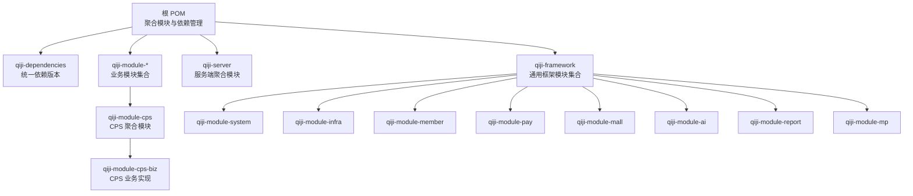
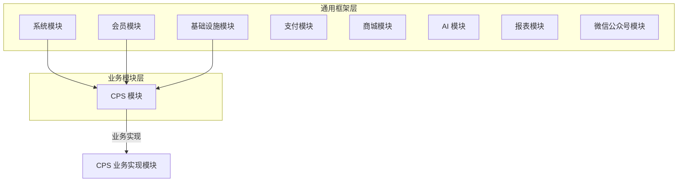
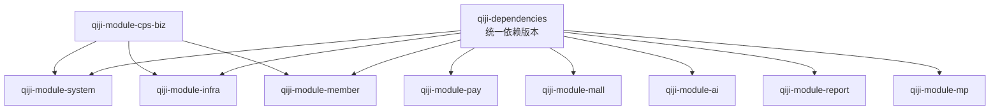

# 许可证与开源协议

<cite>
**本文引用的文件**
- [LICENSE](file://LICENSE)
- [README.md](file://README.md)
- [pom.xml](file://pom.xml)
- [qiji-dependencies/pom.xml](file://qiji-dependencies/pom.xml)
- [qiji-module-cps/pom.xml](file://qiji-module-cps/pom.xml)
- [qiji-module-cps/qiji-module-cps-biz/pom.xml](file://qiji-module-cps/qiji-module-cps-biz/pom.xml)
</cite>

## 目录
1. [引言](#引言)
2. [项目结构](#项目结构)
3. [核心组件](#核心组件)
4. [架构总览](#架构总览)
5. [详细组件分析](#详细组件分析)
6. [依赖分析](#依赖分析)
7. [性能考量](#性能考量)
8. [故障排查指南](#故障排查指南)
9. [结论](#结论)
10. [附录](#附录)

## 引言
本项目采用 MIT License（以下简称“MIT”）许可证，相较 Apache 2.0 许可证，MIT 更加宽松，允许在商业产品中自由使用、复制、修改、合并、出版发行、分发、再许可及销售软件及其文档，且无需保留原始版权声明与作者信息。本文件旨在帮助个人与企业用户全面理解 AgenticCPS 的开源协议优势、权利与义务边界、商业使用影响以及合规使用要点，并通过与其他开源项目的许可证差异对比，突出 AgenticCPS 在开源透明度方面的优势。

## 项目结构
AgenticCPS 为多模块 Maven 聚合工程，顶层 POM 定义了模块化结构与统一依赖管理。CPS 模块作为核心业务模块之一，包含业务实现与对外接口，复用系统、会员、基础设施等通用模块能力。

图表来源
- [pom.xml:10-25](file://pom.xml#L10-L25)
- [qiji-module-cps/pom.xml:20-22](file://qiji-module-cps/pom.xml#L20-L22)
- [qiji-module-cps/qiji-module-cps-biz/pom.xml:21-38](file://qiji-module-cps/qiji-module-cps-biz/pom.xml#L21-L38)

章节来源
- [pom.xml:10-25](file://pom.xml#L10-L25)
- [qiji-module-cps/pom.xml:20-22](file://qiji-module-cps/pom.xml#L20-L22)
- [qiji-module-cps/qiji-module-cps-biz/pom.xml:21-38](file://qiji-module-cps/qiji-module-cps-biz/pom.xml#L21-L38)

## 核心组件
- 许可证主体：项目整体受 MIT License 约束，详见 LICENSE 文件。
- 顶层聚合与依赖管理：通过根 POM 与 qiji-dependencies 统一版本与依赖范围，确保模块间一致性与可维护性。
- CPS 模块：提供多平台 CPS 接入、商品搜索比价、返利管理、提现等核心能力，依赖系统、会员、基础设施等模块。

章节来源
- [LICENSE:1-21](file://LICENSE#L1-L21)
- [README.md:34-45](file://README.md#L34-L45)
- [pom.xml:10-25](file://pom.xml#L10-L25)
- [qiji-dependencies/pom.xml:16-82](file://qiji-dependencies/pom.xml#L16-L82)
- [qiji-module-cps/pom.xml:14-18](file://qiji-module-cps/pom.xml#L14-L18)

## 架构总览
MIT 许可证对 AgenticCPS 的架构与使用没有额外限制，用户可在遵守 MIT 条款的前提下自由集成、修改与二次开发。下图展示了模块间的依赖关系与职责分工，便于理解如何在商业环境中合规地使用与扩展。

图表来源
- [qiji-module-cps/qiji-module-cps-biz/pom.xml:21-38](file://qiji-module-cps/qiji-module-cps-biz/pom.xml#L21-L38)

章节来源
- [qiji-module-cps/qiji-module-cps-biz/pom.xml:21-38](file://qiji-module-cps/qiji-module-cps-biz/pom.xml#L21-L38)

## 详细组件分析

### MIT 许可证条款解读与合规要点
- 允许范围：可自由使用、复制、修改、合并、出版发行、分发、再许可及销售软件及其文档。
- 限制条件：必须在软件副本中包含原始版权声明与许可声明；软件按“现状”提供，不提供任何明示或暗示担保。
- 商业使用：MIT 不要求保留作者信息或版权声明，亦不要求公开源代码，因此在商业产品中使用无需披露源码或标注作者信息。
- 免版权费用：MIT 不收取版权费用，用户可直接商用，无需向原作者支付许可费。
- 影响评估：MIT 的宽松性使得企业可快速集成并二次开发，降低合规成本与法律风险。

章节来源
- [LICENSE:1-21](file://LICENSE#L1-L21)
- [README.md:38-38](file://README.md#L38-L38)

### 与 Apache 2.0 的对比
- 共同点：两者均为宽松的开源许可证，允许商业使用与修改。
- 差异点：
  - Apache 2.0 要求在分发或再许可时保留版权声明与许可声明，并在修改文件中注明变更；还包含专利许可与商标保护条款。
  - MIT 更加简洁，仅要求保留版权声明与许可声明，且不要求在商业产品中标注作者信息。
- 结论：AgenticCPS 采用 MIT，相较 Apache 2.0 更加宽松，便于企业快速集成与商业化落地。

章节来源
- [README.md:38-38](file://README.md#L38-L38)

### 个人与企业用户的权利与义务
- 个人用户：
  - 权利：免费使用、学习、修改与二次开发；可私有化部署与内部使用。
  - 义务：在分发或再许可时保留版权声明与许可声明；软件按“现状”提供，不提供任何担保。
- 企业用户：
  - 权利：在产品中集成 AgenticCPS，无需公开源代码；可进行闭源二次开发与销售。
  - 义务：在分发或再许可时保留版权声明与许可声明；若修改文件，需在修改文件中注明变更；承担软件按“现状”提供的风险。
- 商业使用影响：
  - 免版权费用：无需向原作者支付许可费。
  - 无需保留作者信息：可在商业产品中标注“基于 AgenticCPS 构建”，但不必列出作者信息。
  - 无强制开源：可闭源使用，无需披露源代码。

章节来源
- [LICENSE:12-20](file://LICENSE#L12-L20)
- [README.md:38-38](file://README.md#L38-L38)

### 法律解读与合规使用指南
- 合规基线：
  - 保留版权声明与许可声明（MIT 要求）。
  - 若对文件进行了修改，应在修改文件中注明变更。
  - 软件按“现状”提供，不提供任何担保。
- 商业合规建议：
  - 在产品说明或文档中注明“本产品使用了 AgenticCPS”，并附上 LICENSE 链接。
  - 建议在内部建立开源合规审查流程，确保分发与再许可符合 MIT 要求。
  - 如涉及第三方组件，需同时遵循其许可证条款（本项目通过 qiji-dependencies 统一管理依赖版本与许可证兼容性）。
- 风险提示：
  - MIT 不提供专利许可与商标保护，如需专利或商标保护，应另行评估与约定。
  - 若二次开发涉及第三方组件，需确保其许可证与 MIT 兼容。

章节来源
- [LICENSE:12-20](file://LICENSE#L12-L20)
- [qiji-dependencies/pom.xml:84-686](file://qiji-dependencies/pom.xml#L84-L686)

### 开源透明度与项目对比
- AgenticCPS 采用 MIT，强调“代码全部开源，不会像其他项目一样，只开源部分代码”，有助于用户全面了解架构设计与实现细节。
- 通过对比国产开源项目，突出本项目的开源透明度优势，增强用户信任与采用意愿。

章节来源
- [README.md:40-41](file://README.md#L40-L41)
- [README.md:38-41](file://README.md#L38-L41)

## 依赖分析
AgenticCPS 通过 qiji-dependencies 统一管理依赖版本，确保模块间一致性与可维护性。CPS 模块依赖系统、会员、基础设施等通用模块，形成清晰的分层与职责边界。

图表来源
- [qiji-dependencies/pom.xml:84-686](file://qiji-dependencies/pom.xml#L84-L686)
- [qiji-module-cps/qiji-module-cps-biz/pom.xml:21-38](file://qiji-module-cps/qiji-module-cps-biz/pom.xml#L21-L38)

章节来源
- [qiji-dependencies/pom.xml:84-686](file://qiji-dependencies/pom.xml#L84-L686)
- [qiji-module-cps/qiji-module-cps-biz/pom.xml:21-38](file://qiji-module-cps/qiji-module-cps-biz/pom.xml#L21-L38)

## 性能考量
- 许可证本身不直接影响性能，但开源透明度与社区生态有助于持续优化与改进。
- 在商业使用中，建议结合自身业务场景进行性能评估与优化，确保满足 SLA 要求。

## 故障排查指南
- 许可证相关问题：
  - 确认分发或再许可时是否保留了版权声明与许可声明。
  - 若修改文件，确认是否在修改文件中注明变更。
- 依赖冲突排查：
  - 通过 qiji-dependencies 统一版本管理，避免依赖冲突。
  - 如遇第三方组件许可证冲突，需单独评估与处理。

章节来源
- [LICENSE:12-20](file://LICENSE#L12-L20)
- [qiji-dependencies/pom.xml:84-686](file://qiji-dependencies/pom.xml#L84-L686)

## 结论
AgenticCPS 采用 MIT 许可证，相较 Apache 2.0 更加宽松，允许在商业产品中自由使用、复制、修改、合并、出版发行、分发、再许可及销售软件及其文档，且无需保留原始版权声明与作者信息。本文件总结了个人与企业用户在使用本项目时的权利与义务、商业使用影响、法律解读与合规使用指南，并通过与其他开源项目的许可证差异对比，突出 AgenticCPS 在开源透明度方面的优势。建议在商业集成与分发过程中，严格遵守 MIT 的保留声明与“按现状”提供原则，并结合 qiji-dependencies 的统一依赖管理，确保合规与稳定。

## 附录
- 许可证全文与条款：参见 [LICENSE:1-21](file://LICENSE#L1-L21)。
- 项目 README 中关于 MIT 的说明与对比：参见 [README.md:34-45](file://README.md#L34-L45)。