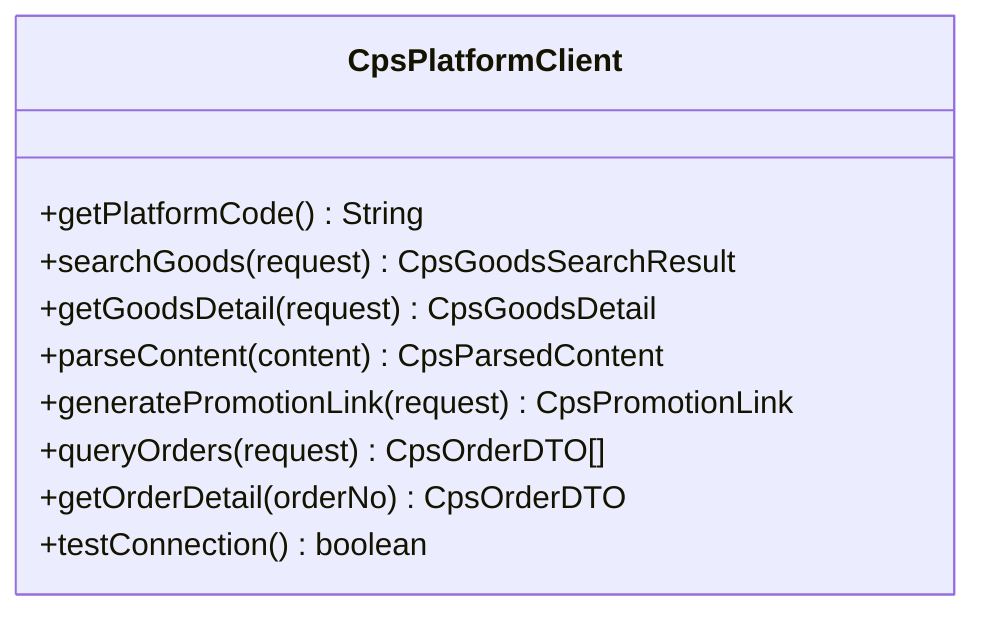
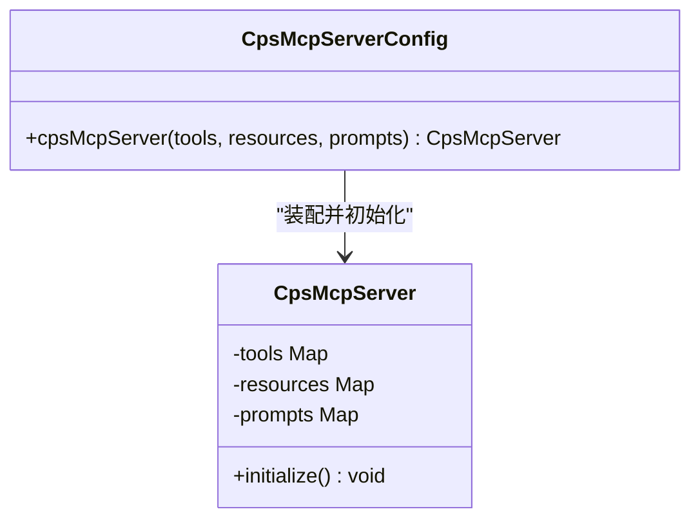
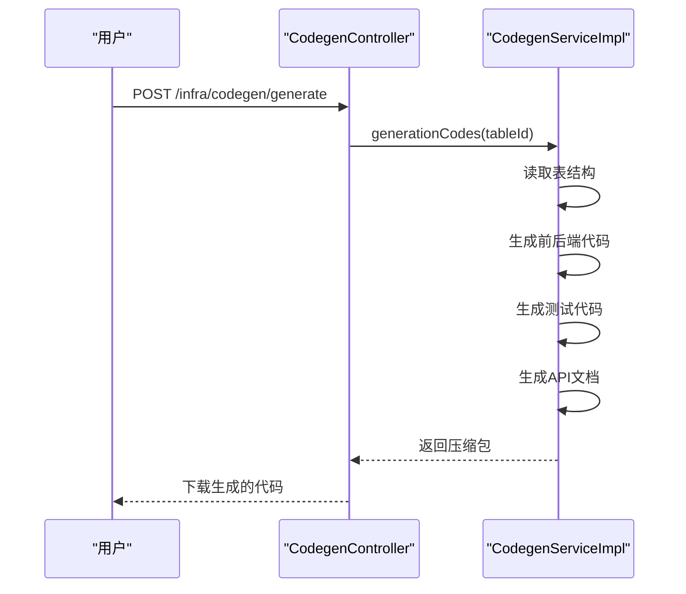
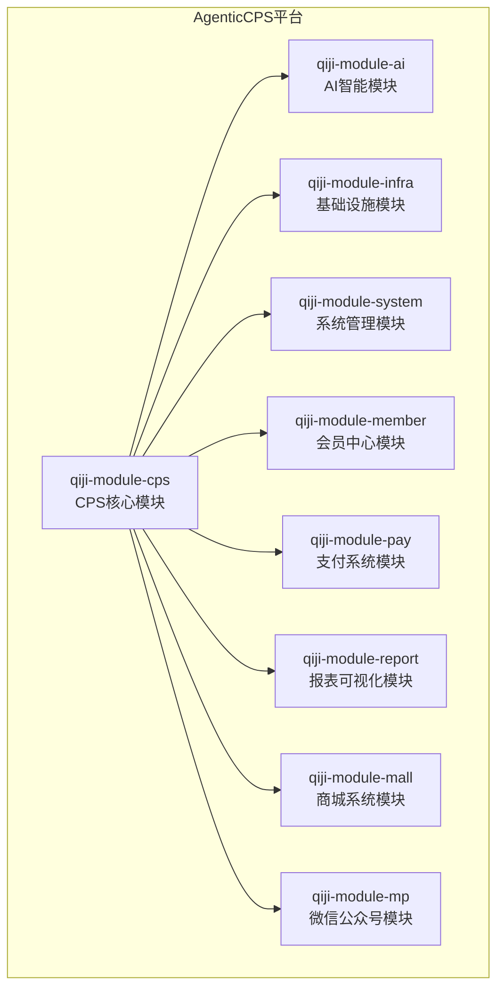
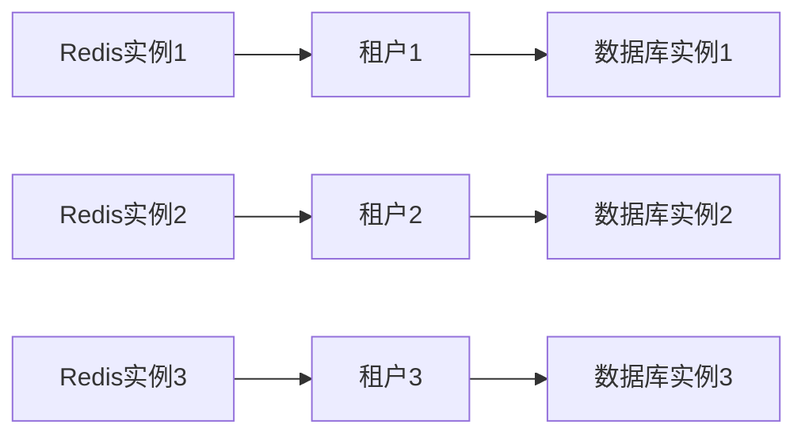

# 项目介绍

<cite>
**本文引用的文件**
- [README.md](file://README.md)
- [CPS系统PRD文档.md](file://docs/CPS系统PRD文档.md)
- [pom.xml](file://qiji-module-cps/pom.xml)
- [CpsPlatformClient.java](file://qiji-module-cps/qiji-module-cps-biz/src/main/java/cn/zhijian/cps/client/CpsPlatformClient.java)
- [AppCpsGoodsController.java](file://qiji-module-cps/qiji-module-cps-biz/src/main/java/cn/zhijian/cps/controller/app/AppCpsGoodsController.java)
- [CpsPlatformController.java](file://qiji-module-cps/qiji-module-cps-biz/src/main/java/cn/zhijian/cps/controller/admin/CpsPlatformController.java)
- [CpsGoodsSearchService.java](file://qiji-module-cps/qiji-module-cps-biz/src/main/java/cn/zhijian/cps/service/goods/CpsGoodsSearchService.java)
- [CpsMcpServerConfig.java](file://qiji-module-cps/qiji-module-cps-biz/src/main/java/cn/zhijian/cps/mcp/server/CpsMcpServerConfig.java)
- [CpsMcpServer.java](file://qiji-module-cps/qiji-module-cps-biz/src/main/java/cn/zhijian/cps/mcp/server/CpsMcpServer.java)
- [CpsMcpAutoConfiguration.java](file://qiji-module-cps/qiji-module-cps-biz/src/main/java/cn/zhijian/cps/mcp/CpsMcpAutoConfiguration.java)
- [CpsMcpTool.java](file://qiji-module-cps/qiji-module-cps-biz/src/main/java/cn/zhijian/cps/mcp/tool/CpsMcpTool.java)
- [CpsMcpPrompt.java](file://qiji-module-cps/qiji-module-cps-biz/src/main/java/cn/zhijian/cps/mcp/prompt/CpsMcpPrompt.java)
- [pom.xml](file://qiji-module-ai/pom.xml)
- [CodegenController.java](file://qiji-module-infra/src/main/java/com.qiji.cps/module/infra/controller/admin/codegen/CodegenController.java)
- [CodegenServiceImpl.java](file://qiji-module-infra/src/main/java/com.qiji.cps/module/infra/service/codegen/CodegenServiceImpl.java)
- [TenantContextHolder.java](file://qiji-framework/qiji-spring-boot-starter-biz-tenant/src/main/java/com.qiji.cps/framework/tenant/core/context/TenantContextHolder.java)
- [TenantIgnoreAspect.java](file://qiji-framework/qiji-spring-boot-starter-biz-tenant/src/main/java/com.qiji.cps/framework/tenant/core/aop/TenantIgnoreAspect.java)
- [pom.xml](file://qiji-module-report/pom.xml)
</cite>

## 更新摘要
**变更内容**
- 完全重构项目定位：从ruoyi-vue-pro框架介绍转变为AI-first开发平台
- 强调Vibe Coding、低代码和AI自主编程三大核心理念
- 新增Qoder AI编码助手和规范化AI编程工作流
- 更新技术架构以反映AI模块和低代码功能
- 重新组织章节结构以突出AI驱动的开发模式

## 目录
1. [引言](#引言)
2. [AI-first开发平台定位](#ai-first开发平台定位)
3. [Vibe Coding开发范式](#vibe-coding开发范式)
4. [低代码自动化能力](#低代码自动化能力)
5. [AI智能集成架构](#ai智能集成架构)
6. [核心技术组件](#核心技术组件)
7. [模块化架构设计](#模块化架构设计)
8. [性能与扩展性](#性能与扩展性)
9. [应用场景与价值](#应用场景与价值)
10. [总结](#总结)

## 引言

AgenticCPS是一个革命性的AI-first开发平台，基于ruoyi-vue-pro框架构建，但已完全超越了传统框架的概念。该项目不是简单地提供CPS返利功能，而是打造了一套**开箱即用**的智能开发平台，深度融合**Vibe Coding**（氛围编程）、**低代码**和**AI自主编程**三大核心理念。

在AgenticCPS中，用户不再需要编写代码，只需用自然语言描述需求，AI就会自动完成从编码到部署的全流程工作。这使得**一个人**就能拥有**一支技术团队**的战斗力，真正实现了"零代码启动、对话式开发、全自动运营"的目标。

## AI-first开发平台定位

### 核心价值主张

AgenticCPS的核心价值在于将复杂的软件开发过程完全自动化，让用户专注于业务需求的表达，而非技术实现的细节。平台通过以下方式重新定义了开发体验：

- **Vibe Coding（氛围编程）**：用户描述Vibe（氛围/意图/感觉），AI将其转化为可运行的软件
- **低代码自动化**：不仅是少写代码，而是完全不写代码
- **AI自主编程**：从需求到代码的全流程由AI自动完成

### 传统开发vs AgenticCPS对比

| 维度 | 传统CPS系统开发 | AgenticCPS |
|------|------------------|------------|
| **团队规模** | 5~10人技术团队 | **1人即可** |
| **开发周期** | 3~6个月 | **开箱即用，AI扩展按天计** |
| **技术门槛** | 需要全栈工程师 | **自然语言描述需求，AI自动实现** |
| **平台对接** | 每个平台单独开发 | **淘宝/京东/拼多多/抖音已内置** |
| **日常运维** | 专职运维团队 | **定时任务自动运行，异常自动告警** |
| **功能迭代** | 排期 → 开发 → 测试 → 上线 | **Vibe Coding：说一句话就上线** |
| **成本投入** | 人力30~100万/年 | **服务器+域名，年成本千元级** |

## Vibe Coding开发范式

### 什么是Vibe Coding？

Vibe Coding是一种全新的软件开发范式，它彻底改变了传统的"写代码→编译→调试"循环：

```
描述意图 → AI理解 → AI编码 → AI测试 → AI交付
   你             你审核                        你验收
```

在AgenticCPS中，这不是概念，而是**已经落地的工作方式**——项目的CPS核心模块（20,000+行代码）**100%由AI自主编程完成**，从数据库设计到API接口，从业务逻辑到单元测试，从定时任务到MCP AI接口层，全部由AI自主编写。

### Qoder AI编码助手

平台集成了**Qoder AI编码助手**，作为你的全栈AI程序员：

| 你说什么 | AI做什么 |
|---------|----------|
| 「加一个商品收藏功能」 | 自动生成Controller → Service → Mapper → 数据库表 → 前端页面 |
| 「接入唯品会联盟」 | 分析API → 生成适配器 → 注册平台 → 编写测试 → 更新文档 |
| 「返利规则加一个阶梯奖励」 | 设计方案 → 修改配置表 → 更新计算引擎 → 回归测试 |
| 「给我看看昨天的运营数据」 | 调用MCP Tool → 查询统计表 → 格式化输出运营报告 |
| 「把搜索性能优化一下」 | 分析慢查询 → 添加缓存策略 → 优化索引 → 压测验证 |

### 规范化AI编程工作流

不同于"让AI随便写"的粗放模式，AgenticCPS引入了**规范化AI编程工作流**：

```
.qoder/
├── specs/      # 编码规范：技术标准、架构约束、代码风格
├── plans/      # 实施计划：任务分解、验收标准、交付清单
├── agents/     # AI代理：角色定义、职责边界、协作流程
└── skills/     # 可复用技能：代码模板、最佳实践、经验沉淀
```

**工作流程**：
```
需求对齐           方案设计          自主编码           验收交付
┌─────────┐    ┌─────────┐    ┌──────────┐    ┌─────────┐
│ 读取Specs │ → │ 设计方案  │ → │ AI自主编码 │ → │ 自动测试  │
│ 解析Plans │    │ 生成计划  │    │ 生成测试代码 │    │ 验收报告  │
│ 用户确认   │    │ 用户确认  │    │ 规范遵循   │    │ 文档输出  │
└─────────┘    └─────────┘    └──────────┘    └─────────┘
      你参与             你参与          AI自动完成          你验收
```

## 低代码自动化能力

### 代码生成器

AgenticCPS的低代码能力体现在系统的每个层面，其中最核心的是**代码生成器**——一键生成CRUD：

**输入**：数据库表结构  
**输出**：
- ✅ Java Controller / Service / Mapper / DO / VO
- ✅ Vue3前端页面（列表+表单+详情）
- ✅ SQL建表脚本
- ✅ Swagger API文档
- ✅ 单元测试代码

支持**单表、树表、主子表**三种模式，覆盖80%的管理后台开发场景。

### 可视化工作流

基于Flowable工作流引擎，在线拖拽设计审批流程：
- 提现审核流程
- 返利结算审批
- 平台接入流程
- 任何自定义业务流程

### 报表与大屏

| 能力 | 说明 |
|------|------|
| 数据报表设计器 | 拖拽字段生成数据报表，支持导出Excel、PDF |
| 图形报表设计器 | 柱状图、折线图、饼图等数十种图表组件 |
| 大屏设计器 | 全屏数据大屏，内置几十种可视化组件 |
| 打印设计器 | 拖拽设计打印模板，支持条形码、二维码 |

## AI智能集成架构

### MCP（Model Context Protocol）AI接口层

AgenticCPS通过MCP协议实现与AI Agent的深度集成，提供**5个AI Tools开箱即用**：

```json
// AI Agent直接调用，无需任何开发
{
  "method": "tools/call",
  "params": {
    "name": "cps_search_goods",
    "arguments": { "keyword": "iPhone 16手机壳", "priceMax": 50 }
  }
}
```

**AI Tools矩阵**：
| Tool | 功能 | 一句话说明 |
|------|------|----------|
| `cps_search_goods` | 商品搜索 | 帮用户在淘宝/京东/拼多多搜商品 |
| `cps_compare_prices` | 多平台比价 | 自动比较各平台价格，推荐最优方案 |
| `cps_generate_link` | 推广链接生成 | 生成带返利追踪的购买链接 |
| `cps_query_orders` | 订单查询 | 查看用户的返利订单状态 |
| `cps_get_rebate_summary` | 返利汇总 | 查看余额、待结算、累计返利 |

### AI模块集成

AgenticCPS集成了强大的AI能力模块，支持多种大模型接入：
- 国内：通义千问、文心一言、讯飞星火、智谱GLM、DeepSeek
- 国外：OpenAI、Ollama、Midjourney、StableDiffusion、Suno

### 工作流AI化

通过TinyFlow AI工作流引擎，实现业务流程的智能化管理，支持复杂的业务逻辑自动化。

## 核心技术组件

### 统一CPS平台客户端接口

该接口定义了平台能力的最小集合，便于后续扩展新的联盟平台。核心方法包括：
- 平台编码获取
- 关键词搜索、详情查询、链接生成
- 订单增量查询与单笔详情
- 连通性测试



### MCP（Model Context Protocol）AI接口层

MCP层提供标准化的AI Agent接口，支持工具（Tools）与资源（Resources）两类能力，并通过配置类初始化服务。支持的传输方式包括Streamable HTTP与STDIO，便于生产与本地开发。



**章节来源**
- [CpsMcpAutoConfiguration.java:1-37](file://qiji-module-cps/qiji-module-cps-biz/src/main/java/cn/zhijian/cps/mcp/CpsMcpAutoConfiguration.java#L1-L37)
- [CpsMcpServer.java:1-126](file://qiji-module-cps/qiji-module-cps-biz/src/main/java/cn/zhijian/cps/mcp/server/CpsMcpServer.java#L1-L126)

### 低代码代码生成器

AgenticCPS的代码生成器实现了真正的"零代码"开发体验，支持多种模板类型和业务场景。



**章节来源**
- [CodegenController.java:1-52](file://qiji-module-infra/src/main/java/com.qiji.cps/module/infra/controller/admin/codegen/CodegenController.java#L1-L52)
- [CodegenServiceImpl.java:1-21](file://qiji-module-infra/src/main/java/com.qiji.cps/module/infra/service/codegen/CodegenServiceImpl.java#L1-L21)

## 模块化架构设计

AgenticCPS采用多模块分层设计，核心位于qiji-module-cps模块，包含API定义与业务实现两大子模块。其模块结构与职责如下：



**章节来源**
- [README.md:261-279](file://README.md#L261-L279)

### SaaS多租户架构

AgenticCPS内置了完整的SaaS多租户解决方案，支持：
- 数据库级别的多租户隔离
- Redis缓存的多租户隔离
- Web请求的多租户上下文管理
- 安全框架的多租户权限控制
- 定时任务的多租户并行执行
- 消息队列的多租户消息传递



**章节来源**
- [TenantContextHolder.java:1-68](file://qiji-framework/qiji-spring-boot-starter-biz-tenant/src/main/java/com.qiji.cps/framework/tenant/core/context/TenantContextHolder.java#L1-L68)
- [TenantIgnoreAspect.java:1-41](file://qiji-framework/qiji-spring-boot-starter-biz-tenant/src/main/java/com.qiji.cps/framework/tenant/core/aop/TenantIgnoreAspect.java#L1-L41)

## 性能与扩展性

### 性能指标

AgenticCPS在性能方面表现出色，满足高并发场景的需求：

| 指标 | 要求 |
|------|------|
| 单平台搜索 | < 2秒（P99） |
| 多平台比价 | < 5秒（P99） |
| 转链生成 | < 1秒 |
| 订单同步延迟 | < 30分钟 |
| 返利入账 | 平台结算后24小时内 |
| MCP Tool调用 | < 3秒（搜索类）/< 1秒（查询类） |

### 扩展性设计

- **模块化架构**：每个功能模块相对独立，便于单独扩展和维护
- **AI插件化**：通过MCP协议支持第三方AI Agent接入
- **低代码扩展**：通过代码生成器快速扩展新功能
- **多租户隔离**：支持不同租户的独立扩展和定制

## 应用场景与价值

### 典型应用场景

**场景1：一人公司CPS创业**
> **小张**，95后自由职业者，一个人运营返利公众号。  
> 以前：用Excel手动记录订单、手动计算返利、手动转账给用户。  
> 现在：AgenticCPS自动同步订单、自动计算返利、用户自助提现。  
> **每天多出4小时做推广，月收入翻3倍。**

**场景2：AI导购助手**
> **小李**，独立开发者，想做一个AI购物助手。  
> 以前：需要自己对接淘宝/京东/拼多多API，写搜索、比价、转链逻辑。  
> 现在：接入AgenticCPS的MCP接口，5个AI Tools开箱即用。  
> **1天完成原来2个月的工作量。**

**场景3：Vibe Coding快速扩展**
> **小王**，返利平台运营者，想接入唯品会联盟。  
> 以前：找外包开发，报价3万，工期3周。  
> 现在：对AI说「帮我接入唯品会联盟」，30分钟搞定。  
> **开发成本从3万降到0。**

### 核心价值

AgenticCPS为不同类型的用户提供了独特的价值：
- **个人开发者**：零成本快速搭建完整的返利SaaS
- **自由职业者**：打造被动收入管道，提高工作效率
- **小型工作室**：用3人的团队干30人的活
- **一人公司**：拥有完整的技术团队能力

## 总结

AgenticCPS代表了软件开发的未来方向——**AI驱动的自动化开发**。通过Vibe Coding、低代码和AI自主编程的完美结合，平台不仅提供了一套完整的CPS返利系统，更重要的是建立了一个**可持续发展的AI开发生态**。

在这个生态中，用户不再是技术的使用者，而是业务需求的提出者；AI不再是简单的工具，而是完整的开发伙伴。这种转变不仅提高了开发效率，更重要的是降低了技术门槛，让更多人能够参与到软件开发中来。

随着AI技术的不断发展，AgenticCPS将继续演进，为用户提供更加智能化、自动化的开发体验。无论是个人开发者还是企业团队，都可以通过这个平台实现自己的技术梦想，创造更大的商业价值。

**章节来源**
- [README.md:339-364](file://README.md#L339-L364)
- [README.md:407-420](file://README.md#L407-L420)