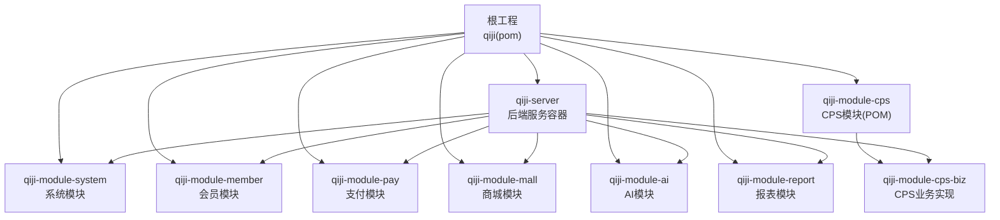
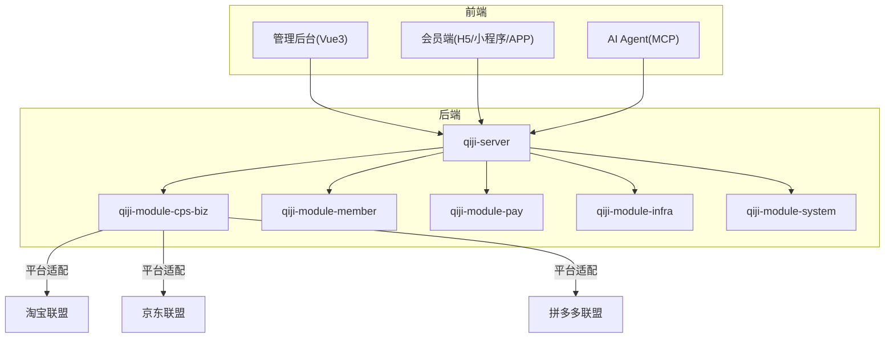
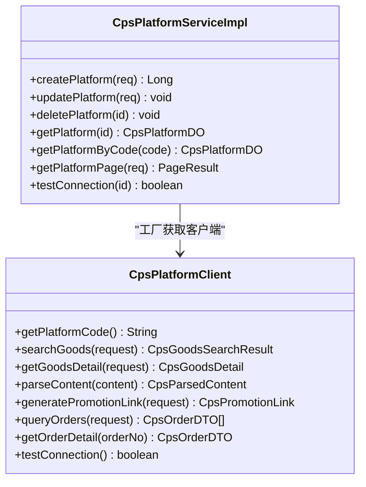
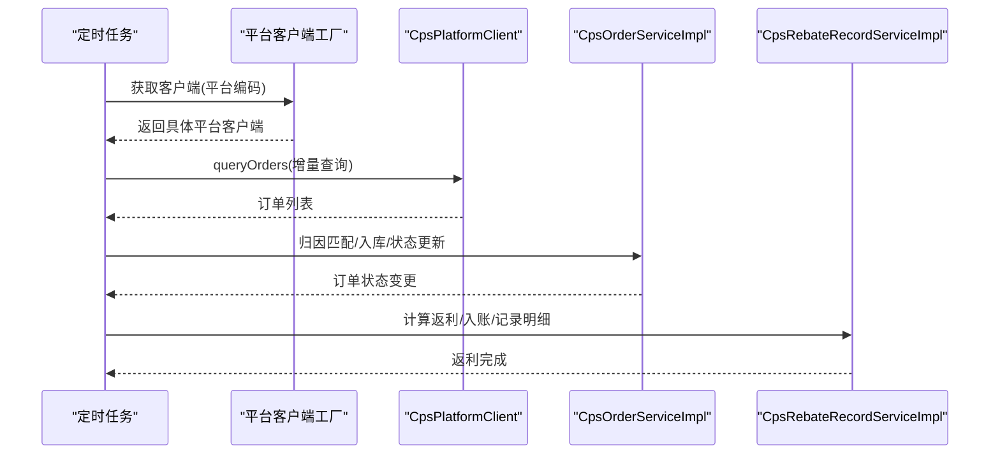
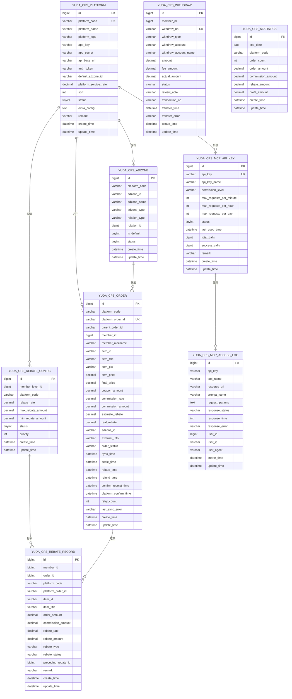
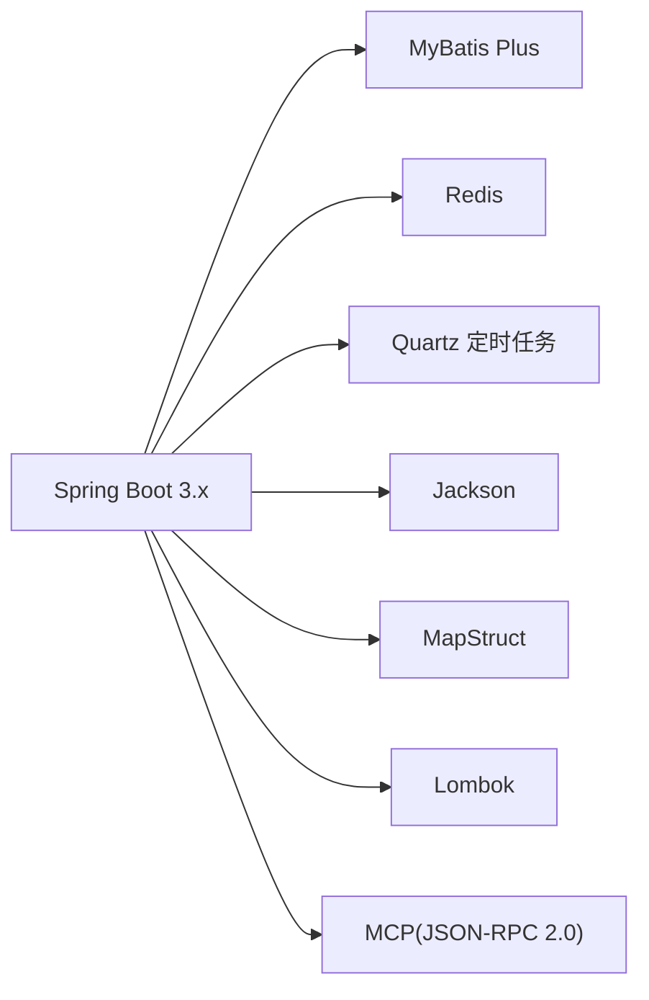

# 项目概述

<cite>
**本文引用的文件**
- [README.md](file://README.md)
- [CPS系统PRD文档.md](file://docs/CPS系统PRD文档.md)
- [pom.xml](file://pom.xml)
- [qiji-module-cps/pom.xml](file://qiji-module-cps/pom.xml)
- [qiji-server/pom.xml](file://qiji-server/pom.xml)
- [CpsPlatformClient.java](file://qiji-module-cps/qiji-module-cps-biz/src/main/java/cn/zhijian/cps/client/CpsPlatformClient.java)
- [CpsPlatformServiceImpl.java](file://qiji-module-cps/qiji-module-cps-biz/src/main/java/cn/zhijian/cps/service/CpsPlatformServiceImpl.java)
- [CpsOrderServiceImpl.java](file://qiji-module-cps/qiji-module-cps-biz/src/main/java/cn/zhijian/cps/service/CpsOrderServiceImpl.java)
- [CpsRebateRecordServiceImpl.java](file://qiji-module-cps/qiji-module-cps-biz/src/main/java/cn/zhijian/cps/service/CpsRebateRecordServiceImpl.java)
- [cps-schema.sql](file://sql/module/cps-schema.sql)
</cite>

## 目录
1. [引言](#引言)
2. [项目结构](#项目结构)
3. [核心组件](#核心组件)
4. [架构总览](#架构总览)
5. [详细组件分析](#详细组件分析)
6. [依赖分析](#依赖分析)
7. [性能考虑](#性能考虑)
8. [故障排查指南](#故障排查指南)
9. [结论](#结论)
10. [附录](#附录)

## 引言
AgenticCPS电商CPS返利系统是基于 ruoyi-vue-pro 框架构建的一站式多平台CPS返利查询与导购系统，面向消费者提供返利查询、跨平台比价、推广链接生成与返利提现等服务；面向运营者提供平台接入、返利规则配置、订单追踪、提现审核与运营看板等能力。系统通过统一接入淘宝联盟、京东联盟、拼多多联盟等主流CPS平台，结合会员返利体系、订单全链路追踪与MCP AI接口层，形成“查询—比价—转链—下单—结算—返利—提现”的完整闭环。

项目在 ruoyi-vue-pro 基础上进行了后端代码重构与前端界面美化，并引入了SaaS多租户、工作流、报表、AI大模型等能力，具备高扩展性与工程化实践价值。

## 项目结构
项目采用 Maven 多模块架构，顶层聚合工程统一管理版本与插件，核心模块包括 qiji-module-cps（CPS业务模块）、qiji-server（后端服务容器）、以及 qiji-module-system、qiji-module-member、qiji-module-pay、qiji-module-mall、qiji-module-ai、qiji-module-report 等通用模块。CPS模块进一步拆分为 qiji-module-cps-biz（业务实现）与 qiji-module-cps-api（接口定义），并通过 qiji-server 统一打包部署。

**图表来源**
- [pom.xml:10-25](file://pom.xml#L10-L25)
- [qiji-module-cps/pom.xml:20-22](file://qiji-module-cps/pom.xml#L20-L22)
- [qiji-server/pom.xml:23-99](file://qiji-server/pom.xml#L23-L99)

**章节来源**
- [pom.xml:10-25](file://pom.xml#L10-L25)
- [qiji-module-cps/pom.xml:20-22](file://qiji-module-cps/pom.xml#L20-L22)
- [qiji-server/pom.xml:23-99](file://qiji-server/pom.xml#L23-L99)

## 核心组件
- CPS平台适配层：统一接口定义与工厂模式，支持淘宝、京东、拼多多等平台的策略扩展。
- 商品与链接服务：提供关键词搜索、链接/口令解析、跨平台比价、推广链接生成与归因。
- 订单与返利服务：订单同步、状态追踪、佣金结算、返利计算与入账、返利记录管理。
- 提现服务：提现申请、审核、转账与异常处理、余额管理。
- MCP AI接口层：基于MCP协议提供AI Agent可调用工具与资源，覆盖搜索、比价、转链、订单、返利等能力。
- 运营看板与风控：订单量/佣金/返利/利润等指标统计，异常行为检测与黑名单管理。

**章节来源**
- [README.md:176-352](file://README.md#L176-L352)
- [CPS系统PRD文档.md:265-374](file://docs/CPS系统PRD文档.md#L265-L374)

## 架构总览
系统采用前后端分离与多模块解耦设计，后端通过 qiji-server 聚合并对外提供 RESTful API；CPS业务模块通过统一平台适配层对接各联盟平台，结合会员、支付、基础设施等模块能力，实现完整的CPS闭环。

**图表来源**
- [qiji-server/pom.xml:23-99](file://qiji-server/pom.xml#L23-L99)
- [CpsPlatformClient.java:11-66](file://qiji-module-cps/qiji-module-cps-biz/src/main/java/cn/zhijian/cps/client/CpsPlatformClient.java#L11-L66)

**章节来源**
- [qiji-server/pom.xml:23-99](file://qiji-server/pom.xml#L23-L99)
- [CpsPlatformClient.java:11-66](file://qiji-module-cps/qiji-module-cps-biz/src/main/java/cn/zhijian/cps/client/CpsPlatformClient.java#L11-L66)

## 详细组件分析

### 平台适配与工厂
- 统一接口：CpsPlatformClient 定义平台能力（搜索、详情、解析、转链、订单查询等）。
- 工厂模式：通过工厂根据平台编码获取具体客户端，便于扩展新平台。
- 连通性测试：平台配置模块提供测试连通性能力，确保API密钥与地址有效。

**图表来源**
- [CpsPlatformClient.java:11-66](file://qiji-module-cps/qiji-module-cps-biz/src/main/java/cn/zhijian/cps/client/CpsPlatformClient.java#L11-L66)
- [CpsPlatformServiceImpl.java:20-98](file://qiji-module-cps/qiji-module-cps-biz/src/main/java/cn/zhijian/cps/service/CpsPlatformServiceImpl.java#L20-L98)

**章节来源**
- [CpsPlatformClient.java:11-66](file://qiji-module-cps/qiji-module-cps-biz/src/main/java/cn/zhijian/cps/client/CpsPlatformClient.java#L11-L66)
- [CpsPlatformServiceImpl.java:20-98](file://qiji-module-cps/qiji-module-cps-biz/src/main/java/cn/zhijian/cps/service/CpsPlatformServiceImpl.java#L20-L98)

### 订单与返利流程
- 订单同步：定时任务触发，增量查询各平台订单，解析并入库，匹配会员归因。
- 结算与返利：平台结算后计算可分配佣金与返利比例，入账到会员钱包，记录返利明细。
- 提现流程：余额校验、限额与风控检查、审核（自动/人工）、转账与异常处理。

**图表来源**
- [CpsOrderServiceImpl.java:40-43](file://qiji-module-cps/qiji-module-cps-biz/src/main/java/cn/zhijian/cps/service/CpsOrderServiceImpl.java#L40-L43)
- [CpsRebateRecordServiceImpl.java:18-38](file://qiji-module-cps/qiji-module-cps-biz/src/main/java/cn/zhijian/cps/service/CpsRebateRecordServiceImpl.java#L18-L38)

**章节来源**
- [CpsOrderServiceImpl.java:40-43](file://qiji-module-cps/qiji-module-cps-biz/src/main/java/cn/zhijian/cps/service/CpsOrderServiceImpl.java#L40-L43)
- [CpsRebateRecordServiceImpl.java:18-38](file://qiji-module-cps/qiji-module-cps-biz/src/main/java/cn/zhijian/cps/service/CpsRebateRecordServiceImpl.java#L18-L38)

### 数据模型与表结构
CPS系统核心业务表包括平台配置、推广位、订单、返利配置、返利记录、提现、统计数据、MCP API Key与访问日志等，支撑平台接入、订单追踪、返利结算与运营分析。

**图表来源**
- [cps-schema.sql:8-31](file://sql/module/cps-schema.sql#L8-L31)
- [cps-schema.sql:36-55](file://sql/module/cps-schema.sql#L36-L55)
- [cps-schema.sql:60-100](file://sql/module/cps-schema.sql#L60-L100)
- [cps-schema.sql:105-123](file://sql/module/cps-schema.sql#L105-L123)
- [cps-schema.sql:129-157](file://sql/module/cps-schema.sql#L129-L157)
- [cps-schema.sql:162-188](file://sql/module/cps-schema.sql#L162-L188)
- [cps-schema.sql:193-210](file://sql/module/cps-schema.sql#L193-L210)
- [cps-schema.sql:215-236](file://sql/module/cps-schema.sql#L215-L236)
- [cps-schema.sql:241-264](file://sql/module/cps-schema.sql#L241-L264)

**章节来源**
- [cps-schema.sql:8-31](file://sql/module/cps-schema.sql#L8-L31)
- [cps-schema.sql:36-55](file://sql/module/cps-schema.sql#L36-L55)
- [cps-schema.sql:60-100](file://sql/module/cps-schema.sql#L60-L100)
- [cps-schema.sql:105-123](file://sql/module/cps-schema.sql#L105-L123)
- [cps-schema.sql:129-157](file://sql/module/cps-schema.sql#L129-L157)
- [cps-schema.sql:162-188](file://sql/module/cps-schema.sql#L162-L188)
- [cps-schema.sql:193-210](file://sql/module/cps-schema.sql#L193-L210)
- [cps-schema.sql:215-236](file://sql/module/cps-schema.sql#L215-L236)
- [cps-schema.sql:241-264](file://sql/module/cps-schema.sql#L241-L264)

### 接口概览与MCP能力
- 会员端接口：商品搜索、比价、详情、推荐、链接生成、订单与返利查询、提现申请与记录、搜索历史与热门词等。
- 管理端接口：平台配置、推广位、连通测试、订单管理、返利配置、提现审核、运营看板与统计、MCP API Key与访问日志等。
- MCP接口：基于MCP协议提供商品搜索、跨平台比价、推广链接生成、订单状态查询、返利汇总等工具与资源，支持HTTP/STDIO传输。

**章节来源**
- [README.md:235-291](file://README.md#L235-L291)
- [README.md:271-291](file://README.md#L271-L291)

## 依赖分析
- 技术栈：Spring Boot 3.x、MyBatis Plus、MySQL、Redis、定时任务、MCP(JSON-RPC 2.0)、MapStruct、Lombok、JUnit/Mockito 等。
- 复用模块：会员中心、支付模块、系统模块、基础设施等，降低重复开发成本。
- 多数据库与部署：支持MySQL、Oracle、PostgreSQL、SQL Server、达梦、金仓、openGauss、PostgreSQL等数据库与Docker部署。

**图表来源**
- [README.md:383-404](file://README.md#L383-L404)

**章节来源**
- [README.md:383-404](file://README.md#L383-L404)

## 性能考虑
- 搜索与比价：单平台搜索P99 < 2秒，多平台比价P99 < 5秒，转链生成P99 < 1秒。
- 订单同步：每5分钟增量同步，订单同步延迟 < 30分钟，返利入账在平台结算后24小时内。
- 并发与缓存：平台搜索采用并发查询，Redis缓存热点数据，提升响应速度与吞吐。

**章节来源**
- [README.md:306-315](file://README.md#L306-L315)

## 故障排查指南
- 平台连通性：通过平台配置模块的“连通测试”接口验证AppKey/Secret与API地址是否正确。
- 订单同步异常：检查平台返回状态、重试次数与最后错误信息，必要时手动触发同步或修复平台配置。
- 返利入账异常：核对佣金计算、平台服务费率与返利配置优先级，确认会员等级与平台规则匹配。
- 提现失败：检查余额、限额、黑名单与转账接口返回，失败时自动返还并记录异常。

**章节来源**
- [CpsPlatformServiceImpl.java:66-85](file://qiji-module-cps/qiji-module-cps-biz/src/main/java/cn/zhijian/cps/service/CpsPlatformServiceImpl.java#L66-L85)
- [CpsOrderServiceImpl.java:40-43](file://qiji-module-cps/qiji-module-cps-biz/src/main/java/cn/zhijian/cps/service/CpsOrderServiceImpl.java#L40-L43)
- [CPS系统PRD文档.md:760-800](file://docs/CPS系统PRD文档.md#L760-L800)

## 结论
AgenticCPS以 ruoyi-vue-pro 为基础，围绕CPS返利闭环构建了统一平台接入、智能比价、订单追踪、返利结算与提现的完整能力体系，并通过MCP AI接口层实现与Agent的深度集成。其多模块架构、SaaS多租户、丰富的基础设施与工程化实践，使其在电商CPS领域具备高度可扩展性与落地价值。

## 附录
- 演示地址与功能截图：详见项目 README 中的系统功能、工作流程、基础设施、支付系统、数据报表与移动端截图。
- 开源协议：采用 MIT License，相较 Apache 2.0 更宽松，个人与企业可 100% 免费使用。
- 对比分析：项目提供与国产开源项目的对比图与说明，强调代码全部开源与架构整洁性。

**章节来源**
- [README.md:34-46](file://README.md#L34-L46)
- [README.md:406-466](file://README.md#L406-L466)