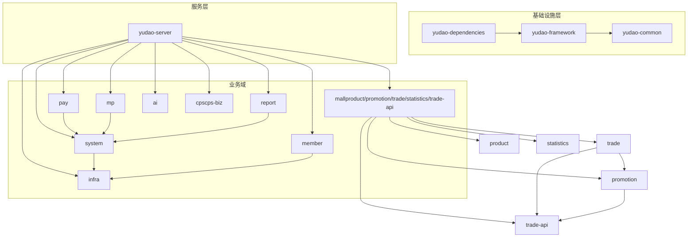
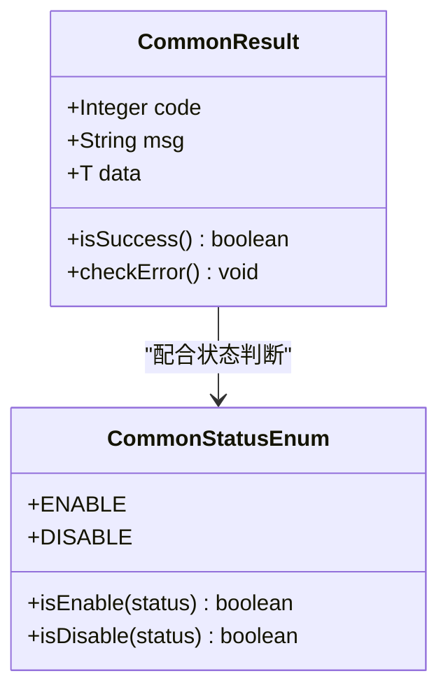
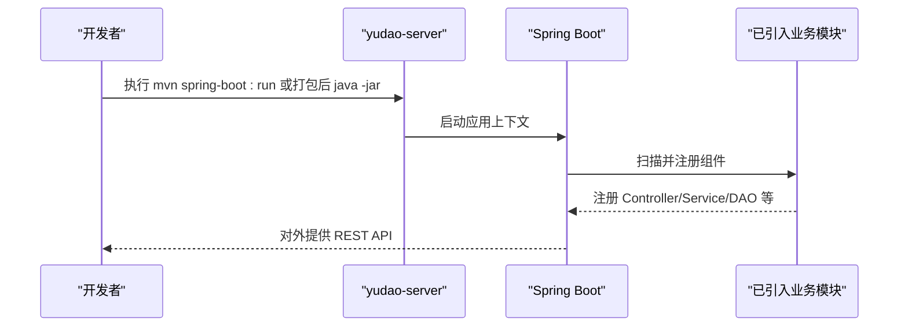
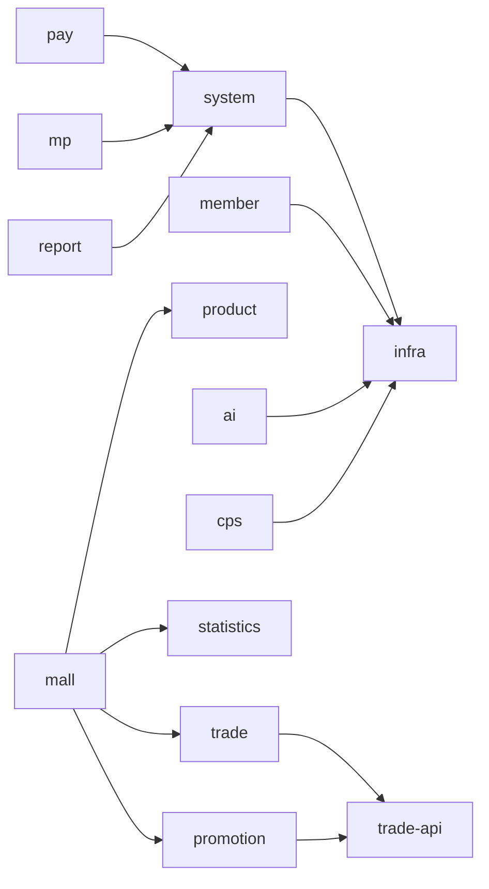

# 项目模块架构

<cite>
**本文引用的文件**
- [根 POM（聚合）](file://pom.xml)
- [依赖管理 BOM](file://yudao-dependencies/pom.xml)
- [框架聚合 POM](file://yudao-framework/pom.xml)
- [通用基础模块 POM](file://yudao-framework/yudao-common/pom.xml)
- [系统模块 POM](file://yudao-module-system/pom.xml)
- [基础设施模块 POM](file://yudao-module-infra/pom.xml)
- [会员模块 POM](file://yudao-module-member/pom.xml)
- [支付模块 POM](file://yudao-module-pay/pom.xml)
- [商城聚合模块 POM](file://yudao-module-mall/pom.xml)
- [AI 模块 POM](file://yudao-module-ai/pom.xml)
- [CPS 聚合模块 POM](file://yudao-module-cps/pom.xml)
- [微信公众号模块 POM](file://yudao-module-mp/pom.xml)
- [报表模块 POM](file://yudao-module-report/pom.xml)
- [后端主服务 POM](file://yudao-server/pom.xml)
- [后端主服务启动类](file://yudao-server/src/main/java/cn/iocoder/yudao/server/YudaoServerApplication.java)
- [通用返回体（CommonResult）](file://yudao-framework/yudao-common/src/main/java/cn/iocoder/yudao/framework/common/pojo/CommonResult.java)
- [通用状态枚举（CommonStatusEnum）](file://yudao-framework/yudao-common/src/main/java/cn/iocoder/yudao/framework/common/enums/CommonStatusEnum.java)
</cite>

## 目录
1. [引言](#引言)
2. [项目结构](#项目结构)
3. [核心组件](#核心组件)
4. [架构总览](#架构总览)
5. [详细组件分析](#详细组件分析)
6. [依赖分析](#依赖分析)
7. [性能考量](#性能考量)
8. [故障排查指南](#故障排查指南)
9. [结论](#结论)
10. [附录](#附录)

## 引言
本文件面向 AgenticCPS 项目，基于 ruoyi-vue-pro 框架重构后的 31 个核心模块，系统性梳理 yudao-dependencies 依赖管理、yudao-framework 框架组件、yudao-server 主服务，以及 10 个业务模块（system、member、infra、pay、mall、ai、cps、mp、report 等）的职责边界、功能定位与模块间依赖关系。文档同时阐述 Spring Boot 多模块架构的设计理念与优势，并提供模块架构图与交互流程，帮助开发者快速理解整体结构与开发规范。

## 项目结构
AgenticCPS 采用 Maven 聚合工程组织，顶层 POM 声明所有模块；yudao-dependencies 作为统一 BOM 管理依赖版本；yudao-framework 提供通用技术与业务组件；yudao-server 作为后端主服务容器，按需装配各业务模块；其余模块按领域拆分，形成清晰的分层与职责边界。

```mermaid
graph TB
Root["根 POM聚合<br/>yudao"] --> Deps["yudao-dependencies<br/>统一依赖版本"]
Root --> Fwk["yudao-framework<br/>框架组件聚合"]
Root --> Srv["yudao-server<br/>后端主服务"]
Root --> M1["yudao-module-system"]
Root --> M2["yudao-module-infra"]
Root --> M3["yudao-module-member"]
Root --> M4["yudao-module-report"]
Root --> M5["yudao-module-mp"]
Root --> M6["yudao-module-pay"]
Root --> M7["yudao-module-mall"]
Root --> M8["yudao-module-ai"]
Root --> M9["yudao-module-cps"]
Fwk --> F1["yudao-common"]
Fwk --> F2["mybatis 启动器"]
Fwk --> F3["redis 启动器"]
Fwk --> F4["web 启动器"]
Fwk --> F5["security 启动器"]
Fwk --> F6["websocket 启动器"]
Fwk --> F7["monitor 启动器"]
Fwk --> F8["protection 启动器"]
Fwk --> F9["job 启动器"]
Fwk --> F10["mq 启动器"]
Fwk --> F11["excel 启动器"]
Fwk --> F12["test 启动器"]
Fwk --> F13["biz-tenant 启动器"]
Fwk --> F14["biz-data-permission 启动器"]
Fwk --> F15["biz-ip 启动器"]
```

图表来源
- [根 POM（聚合）:10-25](file://pom.xml#L10-L25)
- [框架聚合 POM:12-31](file://yudao-framework/pom.xml#L12-L31)

章节来源
- [根 POM（聚合）:10-25](file://pom.xml#L10-L25)
- [依赖管理 BOM:47-57](file://yudao-dependencies/pom.xml#L47-L57)

## 核心组件
- yudao-dependencies：集中管理 Spring Boot、MyBatis、Redis、安全、监控、消息队列、Excel、工作流、第三方 SDK 等依赖版本，确保全仓库一致性与升级可控。
- yudao-framework：提供通用技术组件与业务组件，涵盖 MyBatis、Redis、Web、Security、WebSocket、Monitor、Protection、Job、MQ、Excel、Tenant、DataPermission、IP 等启动器与 yudao-common 基础 POJO/枚举/工具。
- yudao-server：后端主服务容器，按需引入各业务模块，打包为可执行 jar，对外提供 REST API。
- 业务模块：system、infra、member、report、mp、pay、mall（product/promotion/trade/statistics/trade-api）、ai、cps（cps-biz），按领域划分，复用框架组件，实现高内聚低耦合。

章节来源
- [依赖管理 BOM:84-687](file://yudao-dependencies/pom.xml#L84-L687)
- [框架聚合 POM:12-31](file://yudao-framework/pom.xml#L12-L31)
- [通用基础模块 POM:18-147](file://yudao-framework/yudao-common/pom.xml#L18-L147)
- [后端主服务 POM:23-115](file://yudao-server/pom.xml#L23-L115)

## 架构总览
AgenticCPS 采用“统一依赖 + 框架组件 + 主服务容器 + 业务模块”的分层架构。yudao-dependencies 作为 BOM，统一约束版本；yudao-framework 提供横切能力与通用模型；yudao-server 作为装配器，按需启用模块；业务模块聚焦各自领域，通过框架组件复用能力，降低重复开发成本。

图表来源
- [根 POM（聚合）:10-25](file://pom.xml#L10-L25)
- [后端主服务 POM:23-99](file://yudao-server/pom.xml#L23-L99)
- [系统模块 POM:20-81](file://yudao-module-system/pom.xml#L20-L81)
- [基础设施模块 POM:21-91](file://yudao-module-infra/pom.xml#L21-L91)
- [会员模块 POM:20-84](file://yudao-module-member/pom.xml#L20-L84)
- [支付模块 POM:21-81](file://yudao-module-pay/pom.xml#L21-L81)
- [商城聚合模块 POM:20-33](file://yudao-module-mall/pom.xml#L20-L33)
- [AI 模块 POM:28-262](file://yudao-module-ai/pom.xml#L28-L262)
- [CPS 聚合模块 POM:20-22](file://yudao-module-cps/pom.xml#L20-L22)

## 详细组件分析

### yudao-dependencies（依赖管理）
- 职责：集中管理 Spring Boot、数据库、缓存、安全、监控、消息队列、Excel、工作流、第三方 SDK 等版本，避免版本漂移与冲突。
- 关键点：通过 dependencyManagement 导入 spring-boot-dependencies 与自研组件，统一版本号，子模块仅需声明坐标即可继承版本。

章节来源
- [依赖管理 BOM:84-687](file://yudao-dependencies/pom.xml#L84-L687)

### yudao-framework（框架组件）
- 职责：提供横切能力与通用模型，分为“框架组件”（MyBatis、Redis、Web、Security、WebSocket、Monitor、Protection、Job、MQ、Excel）与“业务组件”（Tenant、DataPermission、IP）。
- yudao-common：提供通用 POJO、枚举、工具类、分页模型、统一返回体、异常体系等，被各模块广泛复用。

图表来源
- [通用返回体（CommonResult）:19-122](file://yudao-framework/yudao-common/src/main/java/cn/iocoder/yudao/framework/common/pojo/CommonResult.java#L19-L122)
- [通用状态枚举（CommonStatusEnum）:17-46](file://yudao-framework/yudao-common/src/main/java/cn/iocoder/yudao/framework/common/enums/CommonStatusEnum.java#L17-L46)

章节来源
- [框架聚合 POM:12-31](file://yudao-framework/pom.xml#L12-L31)
- [通用基础模块 POM:18-147](file://yudao-framework/yudao-common/pom.xml#L18-L147)
- [通用返回体（CommonResult）:19-122](file://yudao-framework/yudao-common/src/main/java/cn/iocoder/yudao/framework/common/pojo/CommonResult.java#L19-L122)
- [通用状态枚举（CommonStatusEnum）:17-46](file://yudao-framework/yudao-common/src/main/java/cn/iocoder/yudao/framework/common/enums/CommonStatusEnum.java#L17-L46)

### yudao-server（后端主服务）
- 职责：作为后端容器，按需引入业务模块，打包为可执行 jar，启动 Spring Boot 应用。
- 启动类：YudaoServerApplication 通过扫描属性装配 base-packages，启动时加载已引入的模块。

图表来源
- [后端主服务启动类:16-32](file://yudao-server/src/main/java/cn/iocoder/yudao/server/YudaoServerApplication.java#L16-L32)
- [后端主服务 POM:23-115](file://yudao-server/pom.xml#L23-L115)

章节来源
- [后端主服务 POM:23-115](file://yudao-server/pom.xml#L23-L115)
- [后端主服务启动类:16-32](file://yudao-server/src/main/java/cn/iocoder/yudao/server/YudaoServerApplication.java#L16-L32)

### system 模块（系统域）
- 职责：通用业务域，支撑上层核心业务，如用户、部门、权限、数据字典、操作日志、短信、OAuth2 登录等。
- 依赖：复用 yudao-framework 的安全、校验、MyBatis、Redis、Job、MQ、Excel、社交登录等组件。

章节来源
- [系统模块 POM:20-122](file://yudao-module-system/pom.xml#L20-L122)

### infra 模块（基础设施域）
- 职责：基础设施与研发工具，如定时任务、服务器信息、代码生成器、接口文档、文件上传、Spring Boot Admin、监控等。
- 依赖：MyBatis、Redis、Job、MQ、Excel、Velocity、Admin、Tika、FTP/SFTP/OSS 等。

章节来源
- [基础设施模块 POM:21-117](file://yudao-module-infra/pom.xml#L21-L117)

### member 模块（会员域）
- 职责：会员中心，如地址、等级、签到、积分、标签、用户等。
- 依赖：system、infra、Security、Validation、MyBatis、Redis、MQ、Excel、IP 组件。

章节来源
- [会员模块 POM:20-84](file://yudao-module-member/pom.xml#L20-L84)

### report 模块（报表域）
- 职责：数据可视化报表，基于积木报表实现设计与展示。
- 依赖：system、Web、Security、MyBatis、Excel、积木报表组件。

章节来源
- [报表模块 POM:20-71](file://yudao-module-report/pom.xml#L20-L71)

### mp 模块（微信公众号域）
- 职责：公众号账号、菜单、粉丝、标签、消息、自动回复、素材、模板通知、运营数据等。
- 依赖：system、infra、Security、Validation、MyBatis、Redis、MQ、Excel、微信公众号 SDK。

章节来源
- [微信公众号模块 POM:21-85](file://yudao-module-mp/pom.xml#L21-L85)

### pay 模块（支付域）
- 职责：支付能力，如商户、应用、支付单、退款、转账、钱包等。
- 依赖：system、Security、MyBatis、Redis、Job、Excel、支付宝、微信支付 SDK。

章节来源
- [支付模块 POM:21-81](file://yudao-module-pay/pom.xml#L21-L81)

### mall 模块（商城域）
- 职责：商品、营销、交易、统计等子模块聚合；trade 与 promotion 存在循环依赖风险，通过 trade-api 抽离解决。
- 依赖：product/promotion/trade/statistics 与 trade-api。

章节来源
- [商城聚合模块 POM:20-33](file://yudao-module-mall/pom.xml#L20-L33)

### ai 模块（AI 域）
- 职责：接入多种大模型与向量库，支持聊天、绘图、音乐、写作、思维导图、MCP、TinyFlow 工作流等。
- 依赖：system、infra、Security、MyBatis、Job、Excel、Spring AI、Qdrant/Milvus/Redis 向量库、Tika 文档解析。

章节来源
- [AI 模块 POM:28-262](file://yudao-module-ai/pom.xml#L28-L262)

### cps 模块（CPS 域）
- 职责：CPS 联盟返利系统，多平台接入、商品搜索比价、返利管理、提现等。
- 依赖：system、infra、Security、MyBatis、Job、Excel、Redis。

章节来源
- [CPS 聚合模块 POM:20-22](file://yudao-module-cps/pom.xml#L20-L22)

## 依赖分析
- 模块内聚：各业务模块围绕单一领域，内部职责清晰，减少跨域耦合。
- 横切复用：通过 yudao-framework 统一提供安全、数据访问、缓存、消息、作业、监控、Excel 等能力，避免重复造轮子。
- 版本统一：yudao-dependencies 统一版本，降低依赖冲突风险。
- 启动优化：yudao-server 默认按需引入模块，可通过注释控制编译速度与启动时间。

图表来源
- [系统模块 POM:20-81](file://yudao-module-system/pom.xml#L20-L81)
- [基础设施模块 POM:21-91](file://yudao-module-infra/pom.xml#L21-L91)
- [会员模块 POM:20-84](file://yudao-module-member/pom.xml#L20-L84)
- [支付模块 POM:21-81](file://yudao-module-pay/pom.xml#L21-L81)
- [微信公众号模块 POM:21-85](file://yudao-module-mp/pom.xml#L21-L85)
- [报表模块 POM:20-71](file://yudao-module-report/pom.xml#L20-L71)
- [商城聚合模块 POM:20-33](file://yudao-module-mall/pom.xml#L20-L33)
- [AI 模块 POM:28-262](file://yudao-module-ai/pom.xml#L28-L262)
- [CPS 聚合模块 POM:20-22](file://yudao-module-cps/pom.xml#L20-L22)

## 性能考量
- 启动时间：yudao-server 默认对部分模块采用注释依赖，避免不必要的编译与启动开销；上线时再按需放开。
- 依赖瘦身：通过 yudao-dependencies 统一版本，减少冗余依赖与冲突带来的额外类加载与内存占用。
- 横切能力：框架组件（如 Redis、MyBatis、MQ、Job、Monitor）按需启用，避免无用模块影响启动与运行时性能。
- 日志与链路：框架内置 SkyWalking、Admin 等监控组件，便于性能观测与问题定位。

## 故障排查指南
- 启动失败：检查 yudao-server 启动类扫描路径与模块依赖是否正确引入；确认 yudao-dependencies 版本与本地环境兼容。
- 依赖冲突：优先通过 yudao-dependencies 统一版本，避免子模块自行指定版本导致冲突。
- 统一返回与异常：使用 yudao-common 的 CommonResult 与异常体系，便于前后端约定与统一处理。
- 状态判断：通过 CommonStatusEnum 的 isEnable/isDisable 辅助状态校验，避免魔法数与逻辑分支散落。

章节来源
- [后端主服务启动类:16-32](file://yudao-server/src/main/java/cn/iocoder/yudao/server/YudaoServerApplication.java#L16-L32)
- [通用返回体（CommonResult）:19-122](file://yudao-framework/yudao-common/src/main/java/cn/iocoder/yudao/framework/common/pojo/CommonResult.java#L19-L122)
- [通用状态枚举（CommonStatusEnum）:17-46](file://yudao-framework/yudao-common/src/main/java/cn/iocoder/yudao/framework/common/enums/CommonStatusEnum.java#L17-L46)

## 结论
AgenticCPS 基于 ruoyi-vue-pro 重构后的模块架构，以 yudao-dependencies 统一版本、yudao-framework 提供横切能力、yudao-server 作为容器装配为核心，结合 10 个业务模块的领域拆分，实现了高内聚、低耦合、可扩展、易维护的多模块体系。该架构有利于团队协作、代码复用与持续演进。

## 附录
- 开发建议：新增模块遵循“先框架、后业务”的原则，尽量复用 yudao-framework 组件；模块间通信优先通过 API/DTO 与 MQ，避免直接耦合。
- 版本升级：通过 yudao-dependencies 统一升级，验证 yudao-server 全量模块启动与核心接口可用性。