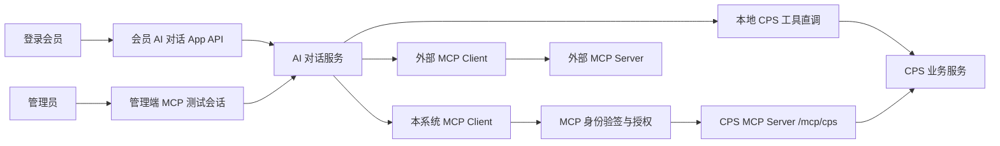

# AI 对话 MCP 会员身份与管理员测试设计

**日期：** 2026-07-10

**状态：** 已确认，待实施计划

**范围：** AgenticCPS AI 对话、MCP Client/Server、CPS MCP 工具、管理后台 AI 对话页

**不在范围：** `mall-uniapp` 会员聊天页面、外部 MCP 身份委托、跨租户会员模拟

## 1. 背景

当前 AI 对话已经能够按 AI 角色加载本地 Spring AI 工具和配置的 MCP Client 工具，但仍存在以下缺口：

1. AI 对话仅有管理端接口，没有面向登录会员的 App API。
2. CPS 工具依赖登录会员身份进行订单、返利和推广链接归因，但 AI 通用上下文写入的身份键与 CPS 工具读取的键不一致。
3. 管理员无法选择某个会员，以该会员的业务身份走完整 MCP Client -> MCP Server 链路进行验证。
4. 外部 MCP 与本系统 MCP 的身份可信边界、写操作授权和审计字段尚未明确。
5. 部分模型分支未挂载工具回调，可能造成角色已配置工具但实际不可调用。

本设计补齐会员 AI 对话 API、可信会员身份绑定、管理员 MCP 测试会话、工具风险控制和完整审计，同时保留现有角色驱动的工具配置方式。

## 2. 目标与非目标

### 2.1 目标

- 登录会员能够通过 App API 创建和使用自己的 AI 对话。
- 会员身份只来自登录态，不接受请求体中的 `memberId` 或 `userId`。
- 普通对话继续高效调用本地 CPS 工具，并可按角色调用外部 MCP 工具。
- 管理员可以选择当前租户的任一有效会员，创建身份固定的 MCP 测试会话。
- 管理员测试可走真实的本系统 MCP Client -> MCP Server 传输链路。
- 管理员测试默认只允许查询、搜索、比价等只读工具。
- 写操作需要额外权限、创建会话时明确勾选并二次确认，并由 MCP Server 再次校验。
- 所有身份敏感调用可关联会员、操作者、会话、客户端、调用来源和追踪编号。

### 2.2 非目标

- 本期不开发会员端聊天页面，只提供 App API。
- 本期不允许外部 MCP Server 接收 AgenticCPS 内部会员身份。
- 本期不实现管理员在已有会话中切换会员；切换会员必须新建会话。
- 本期不重构 CPS 结算、返利或 Token 兑换业务规则。
- 本期不为不支持工具调用的模型做本地模拟或静默降级。

## 3. 总体架构

采用混合调用方案：普通会员对话中的本地 CPS 工具直接调用，外部工具通过既有 MCP Client 调用；管理员专项测试通过延迟初始化的本系统 MCP Client 访问 `/mcp/cps`，验证真实 MCP 链路。



### 3.1 调用路径

#### 普通会员会话

1. 从登录态取得当前会员和租户。
2. 创建 `STANDARD` 会话并永久绑定该会员。
3. 根据角色装配本地工具和外部 MCP 工具。
4. 本地 CPS 工具从统一 `ToolContext` 获取可信会员身份。
5. 外部 MCP 默认不接收内部会员身份。

#### 管理员 MCP 测试会话

1. 校验管理员具有 MCP 测试权限。
2. 校验所选会员属于当前租户且有效。
3. 校验所选角色、模型和本系统 MCP 客户端可用。
4. 将管理员、会员、客户端、读写策略固定到会话。
5. 每次调用生成短期签名身份，通过 MCP `_meta` 传输。
6. MCP Server 验签并重建可信 `LOGIN_USER_ID`，再执行工具级授权。

Spring AI 的 MCP Client 支持将 `ToolContext` 转换为 MCP `_meta`。本实现不透传完整上下文，而是只发送经过签名的最小身份声明。

## 4. 身份与信任边界

### 4.1 统一本地工具上下文

本地工具统一使用以下键：

| 键 | 含义 |
| --- | --- |
| `LOGIN_USER_ID` | 当前生效会员 ID |
| `TENANT_ID` | 当前租户 ID |
| `ACTOR_USER_ID` | 实际操作者 ID |
| `ACTOR_USER_TYPE` | `MEMBER` 或 `ADMIN` |
| `CONVERSATION_ID` | AI 会话 ID |
| `CHAT_MODE` | `STANDARD` 或 `SELF_MCP_TEST` |
| `TRACE_ID` | 单次请求追踪 ID |

普通会员对话中，`LOGIN_USER_ID` 与 `ACTOR_USER_ID` 均为登录会员。管理员测试中，`LOGIN_USER_ID` 为被选择会员，`ACTOR_USER_ID` 为管理员。

### 4.2 MCP 签名身份

管理员自测调用的签名声明包含：

- `memberId`
- `tenantId`
- `actorUserId`
- `conversationId`
- `clientName`
- `allowMutation`
- `issuedAt`
- `expiresAt`
- `nonce`
- `traceId`

安全要求：

- 使用 HMAC-SHA256 和环境变量密钥签名。
- 默认有效期 60 秒。
- MCP Server 校验签名、时效、租户、目标客户端和字段完整性。
- Redis 使用 `SETNX` 消费 nonce，阻止有效期内重放。
- 任一校验失败均拒绝调用，不回退匿名身份或本地直调。
- 签名、API Key 和完整敏感参数不得写入访问日志。

### 4.3 外部 MCP

外部 MCP Client 默认只接收工具业务参数，不接收会员、租户、管理员或内部会话身份。未来若确需身份委托，必须新增可信客户端白名单、独立凭据和最小声明策略，不复用本系统自测配置。

## 5. 会话与角色模型

### 5.1 `ai_chat_conversation`

保留现有 `user_id` 作为会话所有者，并增加：

| 字段 | 类型建议 | 说明 |
| --- | --- | --- |
| `owner_user_type` | varchar(16) | `ADMIN` / `MEMBER` |
| `member_id` | bigint | 生效会员；管理员测试为被选择会员 |
| `chat_mode` | varchar(32) | `STANDARD` / `SELF_MCP_TEST` |
| `mcp_client_name` | varchar(128) | 自测使用的本系统 MCP 客户端 |
| `allow_mutation` | bit | 是否允许写工具，默认 0 |
| `identity_bound_time` | datetime | 身份绑定时间 |

约束：

- 会员会话：`owner_user_type=MEMBER`、`user_id=member_id=当前会员`。
- 普通管理会话：`owner_user_type=ADMIN`、`member_id` 可为空。
- 管理员测试：`owner_user_type=ADMIN`、`user_id=管理员`、`member_id=所选会员`、`chat_mode=SELF_MCP_TEST`。
- 会话创建后不得修改 `owner_user_type`、`member_id`、`chat_mode`、`mcp_client_name` 或 `allow_mutation`。
- 历史数据迁移为 `owner_user_type=ADMIN`、`chat_mode=STANDARD`，保持原管理员所有权。

`chat_mode` 描述整个会话模式，不用于描述每一次工具调用来源。普通 `STANDARD` 会话可以同时包含本地直调和外部 MCP 调用。

### 5.2 `ai_chat_role`

增加 `member_enabled bit not null default 0`：

- 只有已启用、公开且 `member_enabled=1` 的角色能被会员使用。
- 默认值为 0，避免历史管理角色自动暴露给会员。
- 管理端角色表单增加“允许会员对话”开关。
- 工具范围继续由 `toolIds` 和 `mcpClientNames` 控制。

## 6. 工具装配与风险控制

### 6.1 工具风险等级

所有 CPS MCP 工具注册风险等级：

| 等级 | 说明 | 示例 |
| --- | --- | --- |
| `READ_ONLY` | 查询、搜索、比价、状态读取 | 搜索商品、比价、查询订单、查询余额 |
| `ATTRIBUTION_WRITE` | 创建推广链接或改变归因记录 | 生成推广链接、批量转链 |
| `ASSET_WRITE` | 改变返利、Token 或其他资产状态 | 创建返利兑换订单 |

风险等级由服务端注册表维护，不能由前端或模型声明。

### 6.2 普通会员会话

普通会员不受“管理员测试默认只读”规则限制，但仍必须同时满足：

- 角色配置允许该工具。
- 工具自身业务权限和状态校验通过。
- 身份来自可信登录态。
- 资产写操作遵循现有幂等、事务和补偿机制。

### 6.3 管理员测试会话

默认只装配 `READ_ONLY` 工具。启用写操作必须同时满足：

1. 管理员具有 `ai:chat:mcp-test-mutate` 权限。
2. 创建会话时明确勾选“允许写操作”。
3. 前端展示风险提示并完成二次确认。
4. 会话持久化 `allow_mutation=1`。
5. MCP 签名声明包含 `allowMutation=true`。
6. MCP Server 根据工具风险等级再次授权。

任何一项不满足时，写工具不应暴露；即使绕过工具发现直接发起 JSON-RPC 调用，MCP Server 也必须拒绝。

### 6.4 失败策略

- 本系统 MCP 连接失败：测试会话调用失败，不回退本地直调。
- 工具发现失败：不暴露工具，并允许管理员手动刷新连接。
- 身份验签或重放校验失败：返回安全错误并记录脱敏审计。
- 外部 MCP 失败：仅影响对应工具，不影响本地工具。
- 不支持工具调用的模型：创建测试会话时直接拒绝。
- 资产写工具超时：复用业务层现有补偿机制，AI 聊天层不自动重试。

## 7. API 设计

### 7.1 会员 App API

```text
POST   /app-api/ai/chat/conversation/create
GET    /app-api/ai/chat/conversation/list
GET    /app-api/ai/chat/conversation/get
PUT    /app-api/ai/chat/conversation/update
DELETE /app-api/ai/chat/conversation/delete
POST   /app-api/ai/chat/message/send
POST   /app-api/ai/chat/message/send-stream
GET    /app-api/ai/chat/message/list
GET    /app-api/ai/chat/role/simple-list
```

所有会话和消息查询必须同时限定：

- `owner_user_type=MEMBER`
- `user_id=当前登录会员`
- 当前租户

会员请求 DTO 不提供 `memberId`、`userId`、`chatMode`、`mcpClientName` 或 `allowMutation` 字段。

### 7.2 管理端 MCP 测试 API

```text
POST /admin-api/ai/chat/conversation/create-mcp-test
GET  /admin-api/ai/chat/mcp-test/client-list
POST /admin-api/ai/chat/mcp-test/client-refresh
```

创建接口参数包含角色、会员、客户端和是否允许写操作。服务端负责全部权限、租户、模型能力和连接状态校验。

权限：

- `ai:chat:mcp-test`：查看客户端状态并创建只读测试会话。
- `ai:chat:mcp-test-mutate`：允许创建写操作测试会话。
- 会员选择同时复用 `member:user:query`。

## 8. 管理端交互

在现有 AI 对话页面增加“新建 MCP 测试会话”：

1. 选择当前租户会员。
2. 选择 AI 角色。
3. 选择可信的本系统 MCP 客户端。
4. 默认保持“仅允许只读工具”。
5. 勾选写操作时显示风险说明和二次确认框。

会话创建后，聊天区域持续展示：

- `MCP 测试` 标识。
- 固定会员姓名和 ID。
- MCP 客户端及连接状态。
- “只读”或“允许写操作”状态。
- 工具调用来源：`LOCAL_DIRECT`、`EXTERNAL_MCP` 或 `SELF_MCP`。

本期不修改 `mall-uniapp`，会员端通过 App API 接入。

## 9. MCP 客户端与配置

```yaml
spring:
  ai:
    mcp:
      self-test:
        enabled: true
        client-name: agentic-cps-self
        base-url: ${AI_MCP_SELF_BASE_URL:http://127.0.0.1:48080}
        endpoint: /mcp/cps
        connect-timeout: 5s
        request-timeout: 30s
        identity-ttl: 60s
        identity-secret: ${AI_MCP_IDENTITY_SECRET:}
```

要求：

- 本系统 MCP Client 延迟初始化，不作为应用启动成功的前置条件。
- 首次测试或主动刷新时连接，并缓存连接状态和工具发现结果。
- 未配置 `identity-secret` 时，管理员身份模拟功能不可用。
- 配置文件不得提交真实密钥。
- 自测客户端必须使用独立名称，不能与外部 MCP 客户端混用。

## 10. 服务组件边界

| 组件 | 职责 |
| --- | --- |
| `AiChatIdentityContextService` | 根据会话和登录态构建统一可信工具上下文 |
| `AiChatToolCallbackService` | 根据角色、会话模式、模型能力和风险策略装配工具 |
| `AiSelfMcpClientManager` | 延迟创建、刷新、探测和缓存本系统 MCP Client |
| `AiMcpIdentitySigner` | 生成短期签名身份声明 |
| `CpsMcpIdentityVerifier` | 在 MCP Server 验签、校验 nonce 并重建身份 |
| `CpsMcpToolRiskRegistry` | 注册工具风险等级 |
| `CpsMcpAuthorizationService` | 在工具执行前进行最终授权 |

模块依赖约束：

- AI 模块可以通过已有 Member API 校验会员，不直接依赖会员实现模块。
- CPS MCP Server 不依赖 AI 会话服务；它只验证自包含的签名声明。
- 公共身份声明 DTO 放在双方均可依赖的基础/API 层，避免 AI 与 CPS biz 循环依赖。

## 11. 模型工具能力

增加统一模型能力判断，集中决定某模型平台是否支持工具调用：

- 支持时，将本地和 MCP 工具回调附加到聊天选项。
- 不支持时，不允许创建 MCP 测试会话，并返回明确错误。
- 修正当前个别模型分支未挂载工具回调的问题；如果厂商或当前适配器确实不支持，则明确标记为不支持。
- 不通过“创建成功但工具永远不调用”的方式静默失败。

## 12. 审计设计

扩展 `cps_mcp_access_log`：

| 字段 | 说明 |
| --- | --- |
| `member_id` | 生效会员 |
| `actor_user_id` | 实际操作者 |
| `actor_user_type` | `MEMBER` / `ADMIN` / `API_KEY` |
| `conversation_id` | AI 会话 |
| `mcp_client_name` | MCP 客户端 |
| `invocation_source` | `LOCAL_DIRECT` / `EXTERNAL_MCP` / `SELF_MCP` |
| `trace_id` | 请求追踪编号 |

`invocation_source` 是单次工具调用属性，不存入会话表作为会话模式。访问日志不得记录签名、API Key、nonce 原文或完整敏感业务参数。

## 13. 数据库迁移

- CPS 审计表变更同时维护：
  - `backend/sql/module/cps-all-in-one.sql`
  - `backend/sql/module/cps-update.sql`
- `cps-update.sql` 新增带 2026-07-10 日期记录的增量块。
- AI 会话和角色字段通过独立的 AI 模块日期迁移脚本交付，不写入 CPS SQL 或基础 `ruoyi-vue-pro.sql`。
- 迁移需为历史会话填充 `owner_user_type=ADMIN`、`chat_mode=STANDARD`，并保证字段非空约束可安全建立。
- 对会员会话查询常用条件建立组合索引，至少覆盖租户、所有者类型、所有者和删除状态。

## 14. 测试与验收

### 14.1 后端测试

- 会员创建会话自动绑定当前登录会员。
- 会员 DTO 不接受或无法覆盖服务端身份。
- 跨会员、跨租户会话和消息访问被拒绝。
- 未开放给会员的角色不可使用。
- 管理员测试权限和会员查询权限均被校验。
- 管理员只能选择当前租户的有效会员。
- 会话创建后身份、客户端和读写策略不可修改。
- 本地 CPS 工具获得正确的 `LOGIN_USER_ID`。
- 外部 MCP 默认不接收内部身份 `_meta`。
- 签名正常往返；篡改、过期、错误租户、错误客户端和 nonce 重放均被拒绝。
- 默认只发现只读工具。
- 写工具缺少任一授权条件时均不发现且不可直接调用。
- 自测 MCP 失败时不回退本地工具。
- 工具发现失败后可刷新恢复。
- 审计字段完整且敏感信息已脱敏。
- 不支持工具调用的模型不能创建测试会话。
- 历史会话迁移后仍由原管理员查看。

### 14.2 前端测试

- MCP 测试入口受权限控制。
- 会员选择仅展示当前租户结果。
- 创建后持续展示固定身份和客户端状态。
- 写操作必须经过勾选和二次确认。
- 只读会话不会显示写工具可用状态。
- 连接失败和工具发现失败有明确状态及刷新入口。

### 14.3 验收场景

1. 会员登录后通过 App API 搜索商品、比价并查询自己的订单或返利信息。
2. 管理员选择会员 A 创建只读 MCP 测试会话，通过真实 `/mcp/cps` 链路查询会员 A 的信息。
3. 管理员无写权限时无法启用或直接调用写工具。
4. 有写权限的管理员经二次确认创建写测试会话，服务端仍对每个写工具执行授权和业务校验。
5. 修改签名会员、租户、客户端或重复 nonce 后调用被拒绝并留下脱敏审计。
6. 外部 MCP 调用中看不到 AgenticCPS 内部会员身份。

## 15. 参考资料

- [Spring AI MCP Client Boot Starter](https://docs.spring.io/spring-ai/reference/api/mcp/mcp-client-boot-starter-docs.html)
- [Model Context Protocol 2025-06-18 Schema](https://modelcontextprotocol.io/specification/2025-06-18/schema)

## 16. 已确认决策

- 使用混合方案，不强制普通会员的本地 CPS 工具绕行本系统 MCP。
- 管理员自测使用真实 MCP Client -> Server 链路。
- 被测试会员在创建会话时固定，切换会员需要新建会话。
- 会员端本期只提供 API，不开发 `mall-uniapp` 页面。
- 外部 MCP 默认不获得内部会员身份。
- 管理员测试默认只读；写操作需要额外权限、明确勾选和二次确认。
- 身份校验失败、自测连接失败和模型不支持时均快速失败，不进行不安全降级。
