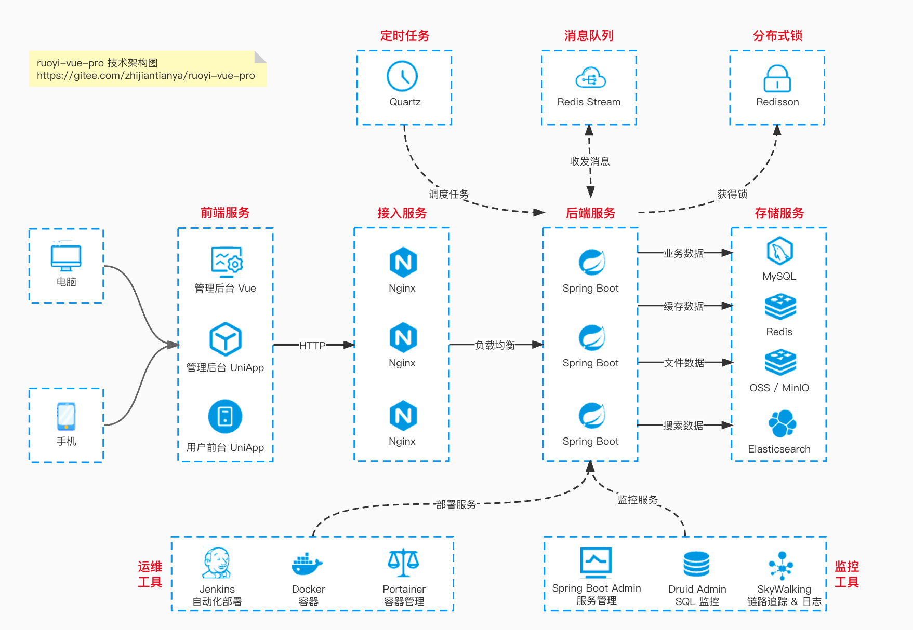
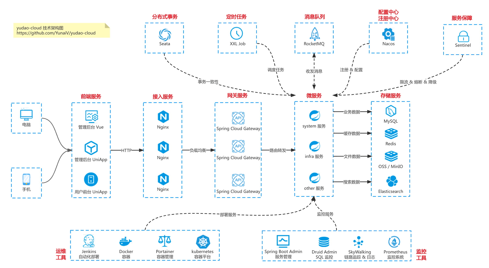

  

<h1 align="center">
  <a href="https://github.com/yudaocode/yudao-ui-admin-uniapp" target="_blank">AgenticCPS管理后台 · 移动端</a>
</h1>

---

**严肃声明：现在、未来都不会有商业版本，所有代码全部开源!！**

**「我喜欢写代码，乐此不疲」**  
**「我喜欢做开源，以此为乐」**

我 🐶 在上海艰苦奋斗，早中晚在 top3 大厂认真搬砖，夜里为开源做贡献。

如果这个项目让你有所收获，记得 Star 关注哦，这对我是非常不错的鼓励与支持。

---

## 🐶 新手必读

平台兼容性：

| H5 | iOS | Android | 微信小程序 | 支付宝小程序 | 字节小程序 | 百度小程序 | 钉钉小程序 | 快手小程序 | QQ 小程序 |
|:--:|:---:|:-------:|:-----:|:------:|:-----:|:-----:|:-----:|:-----:|:------:|
| ✅  |  ✅  |    ✅    |   ✅   |   ✅    |   ✅   |   ✅   |   ✅   |   ✅   |   ✅    |

* nodejs >= 20 && pnpm >= 9
* 启动文档：<https://doc.iocoder.cn/quick-start-front/>
* 视频教程：<https://doc.iocoder.cn/video/>

## 🐯 平台简介

**AgenticCPS**，以开发者为中心，打造中国第一流的快速开发平台，全部开源，个人与企业可 100% 免费使用。本项目是 **AgenticCPS管理后台的移动端**：

|               工作台                |               工作流                |               个人中心               |
|:--------------------------------:|:--------------------------------:|:--------------------------------:|
|  |  |  |

* 采用 `Vue3` + `TypeScript` + `Vite5` + `UnoCSS` + `wot-design-uni` + `z-paging` 构成，使用最新的前端技术栈，无需依赖 `HBuilderX`，通过命令行方式运行 `H5`、`小程序` 和 `App`。
* 内置了 `约定式路由`、`layout布局`、`请求封装`、`请求拦截`、`登录拦截`、`UnoCSS`、`i18n多语言` 等基础功能，提供了 `代码提示`、`自动格式化`、`统一配置`、`代码片段` 等辅助功能，让你编写 `uniapp` 拥有 `best` 体验。

## ⚙️ 技术栈

| 框架                                                  | 说明                | 版本     |
|-----------------------------------------------------|-------------------|--------|
| [Vue](https://vuejs.org/)                           | 渐进式 JavaScript 框架 | 3.4.x  |
| [uni-app](https://uniapp.dcloud.io/)                | 跨平台应用开发框架         | 3.0.x  |
| [TypeScript](https://www.typescriptlang.org/)       | JavaScript 的超集    | 5.8.x  |
| [Vite](https://vitejs.dev/)                         | 下一代前端构建工具         | 5.2.x  |
| [Pinia](https://pinia.vuejs.org/)                   | Vue 状态管理库         | 2.0.x  |
| [UnoCSS](https://unocss.dev/)                       | 即时原子化 CSS 引擎      | 66.x   |
| [unibest](https://github.com/feige996/unibest)      | 最好的 uniapp 框架     | 4.1.0  |
| [wot-design-uni](https://wot-design-uni.pages.dev/) | 高颜值、轻量化 UI 组件库    | 1.13.x |
| [z-paging](https://z-paging.zxlee.cn/)              | 高性能分页组件           | 2.8.x  |
| [vue-i18n](https://vue-i18n.intlify.dev/)           | 国际化解决方案           | 9.x    |

## ✨ 项目特性

| 特性                | 说明                                      |
|-------------------|-----------------------------------------|
| 🚀 **约定式路由**      | 基于文件系统自动生成路由，无需手动配置                     |
| 🎨 **Layout 布局**  | 内置多种布局方案，支持 Tabbar 自定义                  |
| 📦 **请求封装**       | 基于 uni.request 封装，支持拦截器、TypeScript 类型推导 |
| 🔐 **登录拦截**       | 内置完善的登录态管理与页面拦截机制                       |
| 🎯 **UnoCSS**     | 原子化 CSS，按需生成，极致性能                       |
| 🌍 **i18n 多语言**   | 内置国际化方案，轻松实现多语言切换                       |
| 📝 **代码规范**       | ESLint + Prettier + Husky，保证代码质量        |
| 🔧 **TypeScript** | 全面的 TypeScript 支持，类型安全                  |
| 📱 **多端适配**       | 一套代码，多端运行（H5、小程序、App）                   |

## 🔥 后端架构

支持 Spring Boot、Spring Cloud 两种架构：

### ① Spring Boot 单体架构

文档地址：<https://doc.iocoder.cn>

### ② Spring Cloud 微服务架构

文档地址：<https://cloud.iocoder.cn>

## 😎 开源协议

**为什么推荐使用本项目？**

① 本项目采用比 Apache 2.0 更宽松的 [MIT License](https://gitee.com/zhijiantianya/ruoyi-vue-pro/blob/master/LICENSE) 开源协议，个人与企业可 100% 免费使用，不用保留类作者、Copyright 信息。

② 代码全部开源，不会像其他项目一样，只开源部分代码，让你无法了解整个项目的架构设计。[国产开源项目对比](https://www.yuque.com/xiatian-bsgny/lm0ec1/wqf8mn)

③ 代码整洁、架构整洁，遵循《阿里巴巴 Java 开发手册》规范，代码注释详细，113770 行 Java 代码，42462 行代码注释。